# 如何在 Unity 中使用后处理—第二部分

> 原文：<https://medium.com/codex/how-to-use-post-processing-in-unity-part-ii-bf3bfccd0786?source=collection_archive---------4----------------------->

在本文的第一部分，我们在 Unity 中设置了后处理。本文的目的是展示一些后处理效果。这里，我们将使用简单的立方体来显示效果。因此，当玩家进入一个立方体游戏对象时，我们会看到效果，这意味着这里使用的后处理不是全局的。

## ***绽放:***

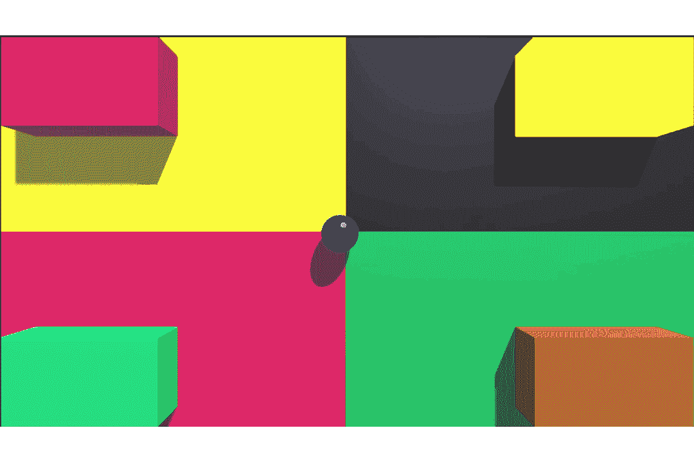

**Bloom** 大概是最受欢迎的后期处理效果之一。这种效果背后的想法是给你的场景添加辉光并吸引注意力。它增强了图像的亮/较亮部分，给玩家一种发光效果的错觉(在黑暗的场景中效果很好，也用于增加对比度)。

让我们首先为游戏对象创建一个材质。该材质的发射已打开。使材料看起来像光源，使我们能够使用这种材料发出光芒。

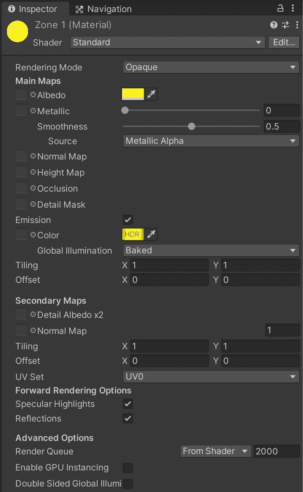

材料

完成后，我们可以将这个材质和前一篇文章中看到的**后处理体积**组件一起添加到游戏对象中。

我们现在需要将 bloom 效果添加到我们的体积组件中。

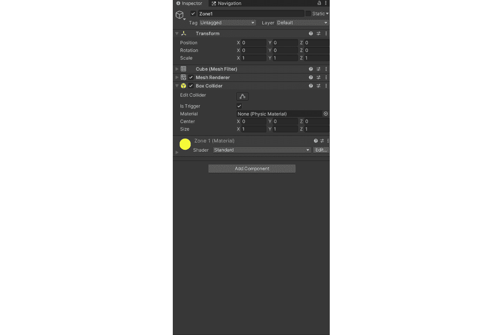

你可以随意改变设置来达到你想要的效果。这些是我用来得到我想要的输出的设置，

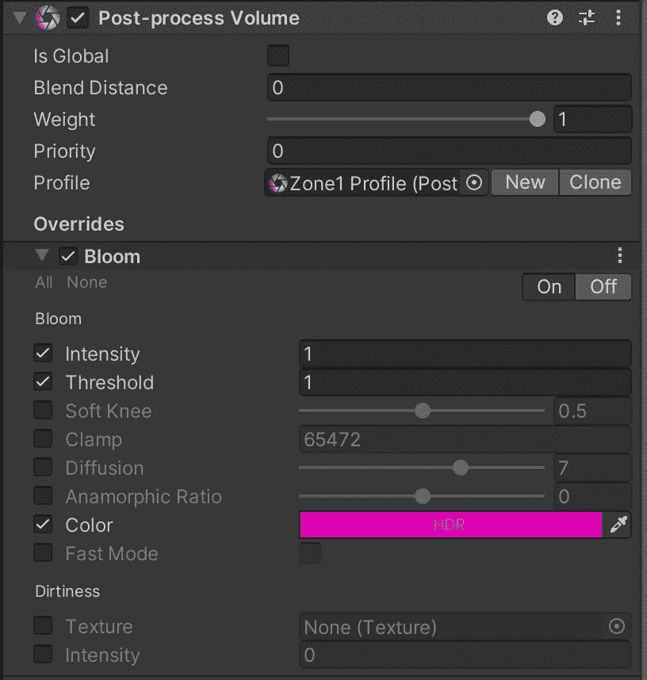

## ***镜头扭曲:***

下面这张 Gif 可能有点神游(失真过度)，所以你可以自行判断是否观看。

相机镜头被设计用来弯曲光线，这样做有各种原因，其中很少是为了聚焦在图像的单个点上，为了看到图像的更多部分(更宽的视野)，等等。后处理镜头扭曲效果通过扭曲渲染图像来模拟这些相机镜头，以匹配真实世界的相机镜头。

添加这个效果的过程和上面显示的添加 Bloom 效果的过程是一样的。

我用来达到这个效果的设置如下，

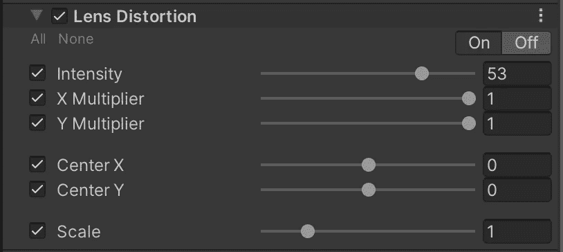

*在游戏中，环境光指的是游戏中存在的光量。它没有来源，是全球性的。但是，假设您希望通过人工创建阴影来区分较亮和较暗的区域，以增强差异，这是通过使用环境遮挡来实现的。环境遮挡在技术上是一种阴影技术，用于人为地使环境光达不到的区域变暗。这是用来使对象感觉更真实。*

*让我们以上面的例子为例。扭曲立方体使其看起来像附着到曲面(平面或曲面上的面片)的四边形。现在添加环境遮挡，看看它看起来怎么样。*

*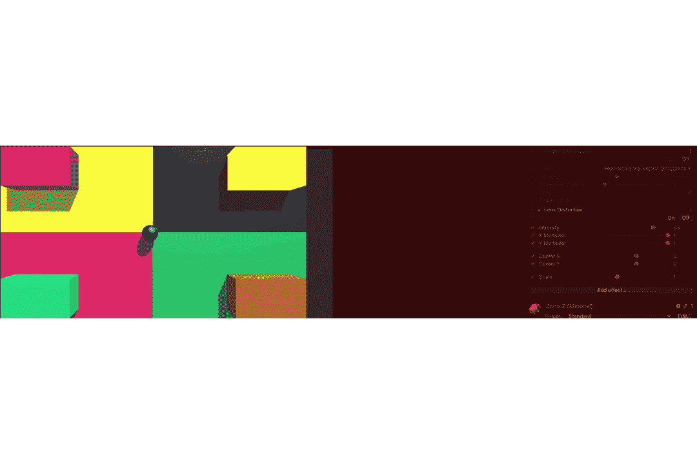*

*我们可以观察到，通过人为地使立方体周围的区域变暗，使用它给了我们一种模糊的深度感。让我们也来看看这个例子，从我们的场景中移除平行光。*

*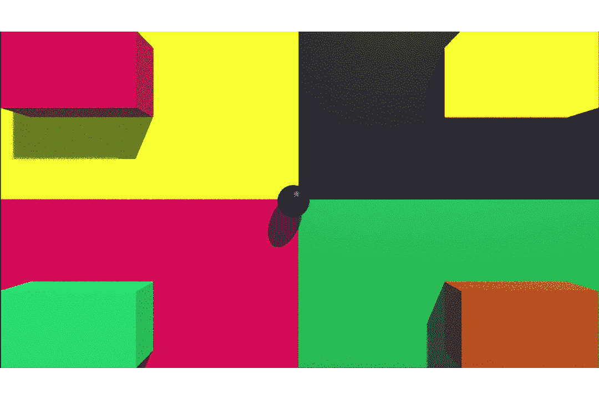*

*深度*

## ****小插曲:****

*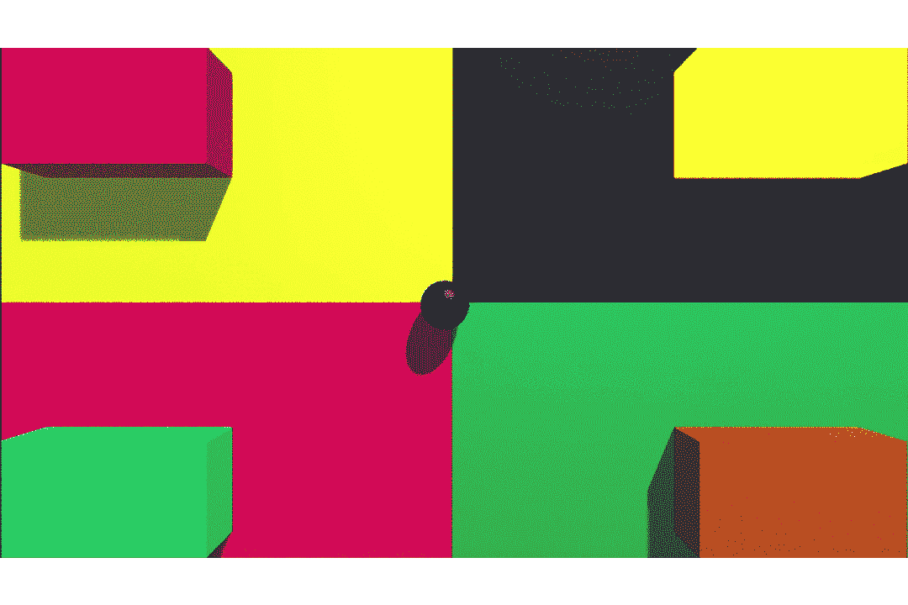*

*过度紧张*

*晕影也是一种处理给定场景中变暗区域的效果。但是与**环境遮挡相比，这是一个不同的概念。**将晕影视为一种创造隧道视觉的人工手段。使用这种效果背后的想法是在它的范围内吸引玩家的注意力。它也被用在游戏中来增加电影的感觉。它有许多用例，其中之一是将玩家的注意力吸引到屏幕的中心。*

*用于实现这种效果的设置如下:*

*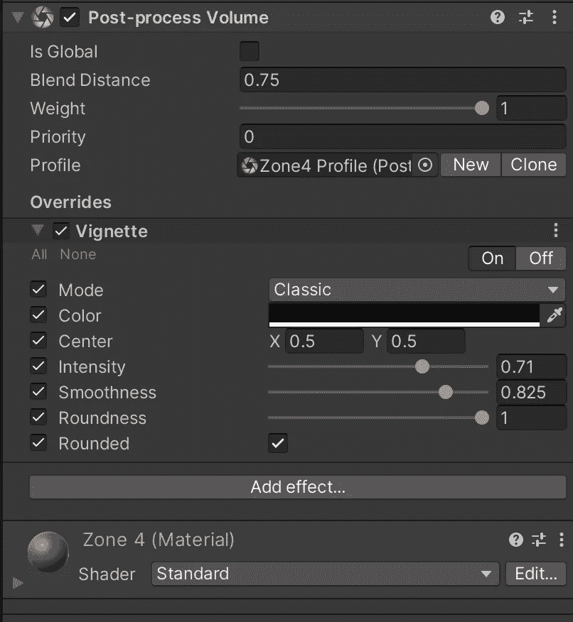*

*在后处理体积组件中，可以看到混合距离为 0.75 个单位。这样做是为了当我们靠近碰撞器时逐渐过渡到效果中，而不是当在碰撞器中时效果显示为 100%,当在外面时显示为 0%。当我靠近碰撞器 0.75 个单位时，这个效果就会触发。*

## ****颜色分级:****

*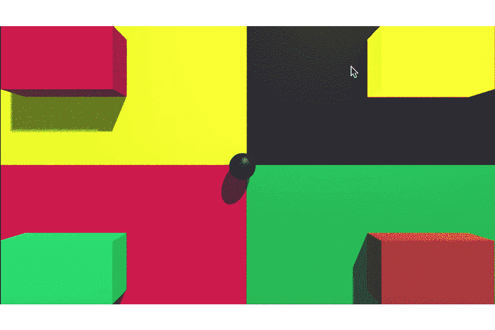*

*颜色是游戏中的一个重要因素，它不仅能帮助我们区分游戏中的物体，还能唤起情感。颜色分级是调整场景的颜色或光强度的行为。使用这个概念，我们可以改变场景的情绪(平静、冷静、明亮、暴力等)。*

*用于获得上述效果的设置如下:*

*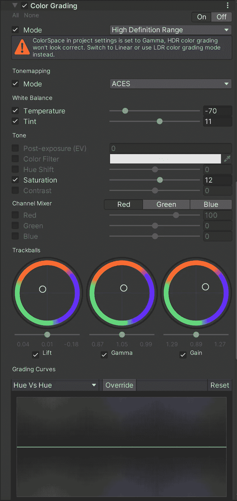*

*使用上面提到的所有效果，我们也可以创建类似的东西，*

*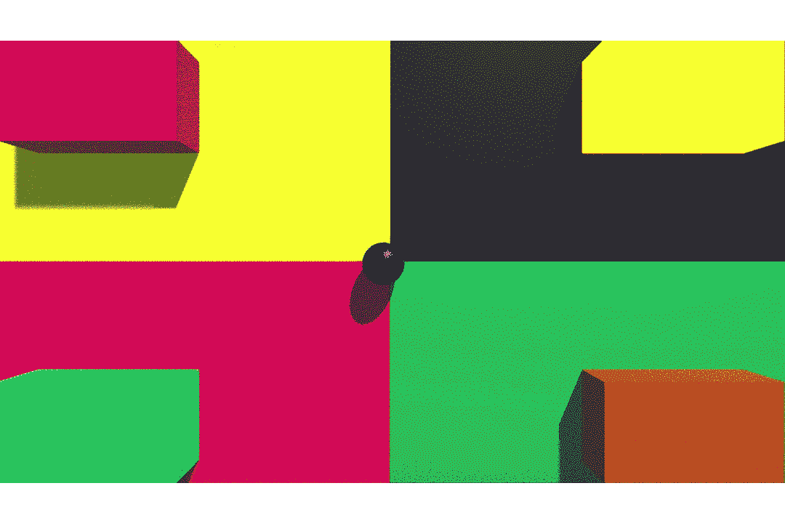*

*使用颜色分级、高光、晕影、环境光遮挡*

*统一也有一些影响，*

****自动曝光*** 处理模拟眼睛对场景中光照条件变化的反应。它影响主相机感知亮度的方式，以匹配数码相机或人眼的亮度。*

****色差*** 是相机镜头无法将所有颜色聚焦在一点的副作用。这将导致图像中出现轻微的模糊以及轻微的颜色渗色。这种效果主要用在我们想通过一个镜头刻画世界的时候(生化危机，Outlast 等)。*

****景深*** 是一种处理模糊背景中或对焦范围外事物的效果。该属性模拟真实世界的数码相机，因为它们只能聚焦于特定距离处的对象，而模糊了场景中的所有其他对象。*

**把它想象成一种效果，用来让你的游戏感觉像电影一样。这是通过添加小粒子到你的场景中来实现的，你可以把它们想象成噪音。像《我们最后的部分 2》这样的游戏也使用了这种效果。**

***运动模糊，用来使游戏感觉逼真的另一种效果。这种效果试图模仿人眼对快速移动的物体的反应，因为当快速移动时，人眼无法聚焦在单个点上，导致视觉模糊(基本上，快速移动的物体看起来模糊，因为我们无法聚焦它们)。顾名思义，这种效果会导致模糊，这取决于运动中的物体和主相机。***

******屏幕空间反射*** ，该效果用于计算场景中的反射。简单来说，这个过程通过将屏幕图像反射到自身上来工作。所有这些都是为了获得像水一样的细微反射。***

***感谢您的阅读。更多即将推出！！！***