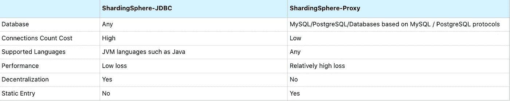

# 如何在实际生产场景中使用 sharding sphere-Proxy——快速入门指南

> 原文：<https://medium.com/codex/how-to-use-shardingsphere-proxy-in-real-scenarios-your-quick-start-guide-33d6e2595593?source=collection_archive---------8----------------------->

这篇文章分析了运营和维护解决方案，从真实的生产场景中获得了数据分片和 sharding sphere-Proxy 5 . 1 . 0 版提供的其他功能的经验。

> 除非另有说明，在下面的例子中，当我们说“数据库”时，我们指的是 [MySQL](https://www.mysql.com) 。

# ShardingSphere-Proxy 是做什么的？

ShardingSphere-Proxy 允许用户像使用本地数据库一样使用 Apache ShardingSphere。

为了更好地理解什么是 ShardingSphere-proxy，让我们来看看由 [Apache ShardingSphere 官方网站](https://shardingsphere.apache.org)提供的定义:

> *ShardingSphere-Proxy 是一个透明的数据库代理，它提供了一个包含数据库二进制协议的数据库服务器，该协议旨在支持异构语言。*
> 
> *目前支持 MySQL 和*[*PostgreSQL*](https://www.postgresql.org)*(以及基于 PostgreSQL 的数据库，如*[*open gauss*](https://shardingsphere.medium.com/apache-shardingsphere-opengauss-breaking-the-distributed-database-performance-record-with-10-b8ced05daa37)*)以及任何相关终端(如* [*MySQL 命令客户端*](https://blog.devart.com/mysql-command-line-client.html) *，* [*MySQL 工作台*](https://en.wikipedia.org/wiki/MySQL_Workbench) *))兼容 MySQL 或 PostgreSQL 协议来操作数据。这是一个 DBA 友好的工具。*


值得注意的是，ShardingSphere-Proxy 是一个服务流程。就客户端程序连接而言，它类似于一个 MySQL 数据库。

# 为什么需要 sharing sphere-Proxy

在以下情况下，ShardingSphere-Proxy 是一个不错的选择:

*   使用分片规则或其他规则；因为数据将分布在多个数据库实例中，不可避免地给管理带来不便。
*   非 Java 开发人员需要利用 ShardingSphere 功能。

## 1.应用场景

在很多情况下，使用 sharing sphere-JDBC 进行数据分片。如果您有一个用户表，并且需要使用用户 ID 属性的散列来执行水平缩放，则客户端连接到数据库的方式如下:


下面是三个真实的生产场景:

1.  一名测试工程师想要查看数据库和表中用户 ID 为 123456 的信息，您需要告诉工程师该用户在哪个子表中。
2.  你需要找出 2022 年的总用户增长和总体用户信息，以便起草年度报告。
3.  您的公司将举办 8 周年纪念活动，您需要提供一份注册超过 8 年的活跃用户列表。

由于数据分布在数据库分片和表分片中，所以完成上述任务并不容易。如果你每次都开发代码来满足这些临时需求，至少可以说是低效的。ShardingSphere-Proxy 非常适合这些场景。

ShardingSphere-Proxy 隐藏了实际的后端数据库，因此用户可以像操作数据库一样操作客户端。

例如， `t_user`被分割成几个数据库级的真实表，也就是从`t_user_0` 到`t_user_9` 。在客户端操作 ShardingSphere-Proxy 时，用户只需要知道一个逻辑表`t_user,`，并且路由到真实表是在 ShardingSphere-Proxy 内部执行的。

**1。逻辑表:**具有相同结构的横向扩展数据库/表的逻辑名称。逻辑表是 SQL 中表的逻辑标识符。比如将用户数据按照主键的有效位数，即`t_user_0` 到`t_user_9` 分片成 10 个表，它们的公共逻辑表命名为`t_user`。

**2。实际表:**横向扩展后数据库中实际存在的物理表，也就是上面提到的`t_user_0` 到`t_user_9` 。


## 2.sharing sphere-JDBC 和 sharing sphere-Proxy 的区别

看完上面的描述，你可能会觉得 ShardingSphere-Proxy 和 ShardingSphere-JDBC 是如此的相似。那么两者有什么区别呢？



请查看以下两者之间的更多差异:

1.JDBC 是一个`.jar` 包。它的底层通过重写 JDBC 组件来完成 SQL 解析、路由、重写、执行等过程。您应该添加配置文件来实现项目中的相应功能，使其成为应用程序的干扰。

2.ShardingSphere-Proxy 是一个流程服务。在大多数情况下，它被定位为辅助运营的生产力工具。它将自己伪装成一个数据库，使自己不被应用程序侵入。ShardingSphere-Proxy 中的 SQL 执行逻辑与 ShardingSphere-JDBC 中的相同，因为它们共享相同的内核。

**既然 ShardingSphere-Proxy 对应用程序来说是非侵入性的，并且它与 ShardingSphere-JDBC 共享同一个内核——那么我们为什么还需要 ShardingSphere-JDBC 呢？**

1.当应用程序通过 ShardingSphere-JDBC 直接操作数据库时，只有一个网络 I/O。然而，当应用程序连接到 ShardingSphere-Proxy 时，一个网络 I/O，然后 ShardingSphere-Proxy 操作数据库，另一个网络 I/O 发生，总共两个网络 I/O 请求。

2.还有一层应用层叫做 link，更容易造成数据流量瓶颈，给应用带来潜在风险。一般来说，建议应用程序应该与 ShardingSphere-JDBC 一起使用。

当然，ShardingSphere-JDBC 和 ShardingSphere-Proxy 可以用混合架构同时部署。ShardingSphere-JDBC 适用于用 Java 开发的高性能轻量级在线事务处理(OLTP)应用程序，而 ShardingSphere-Proxy 则非常适合用于管理和操作分片数据库的在线分析处理(OLAP)应用程序和场景。


# 快速入门指南

安装 ShardingSphere-Proxy 有三种设置方法:二进制包、Docker 和 Helm。还提供独立部署和集群部署。这里，我们以独立二进制包为例:

1.在此链接获取 ShardingSphere-Proxy 二进制安装包[；](https://shardingsphere.apache.org/document/current/en/downloads/)

2.解压后修改`conf/server.yaml` 和以`config-` 前缀开头的文件，配置分片、读写拆分等功能；

3.如果您使用 Linux 作为操作系统，请运行`bin/start.sh.`对于 Windows 操作系统，请运行`bin/start.bat` 来启动 ShardingSphere-Proxy。

文件目录如下所示:

```
├── LICENSE├── NOTICE├── README.txt0009 ─ ─ bin #Start/stop script0009 ─ ─ conf #service configuration, data sharding, read/write splitting, data encryption, and other function configuration files├── lib # Jar package└── licenses
```

## 1.将 MySQL Java 连接器复制到 ext-lib 包中

将`driver mysql-connector-java-5.1.47.jar` ( [点击链接下载](https://repo1.maven.org/maven2/mysql/mysql-connector-java/5.1.47/mysql-connector-java-5.1.47.jar))或 `mysql-connector-java-8.0.11.jar` ( [点击链接下载](https://repo1.maven.org/maven2/mysql/mysql-connector-java/8.0.11/mysql-connector-java-8.0.11.jar))下载到`ext-lib` 包中。注意:初始目录中没有`ext-lib`包，需要自己创建一个。

## 2.修改`conf/server.yaml` 配置文件

对于`server.yaml` ，默认操作模式是`Cluster Mode`。以下是如何配置独立运行模式。

```
mode:Type: Standalone *#Standalone mode*repository:type: Fileprops:Path: /Users/xxx/software/apache-shardingsphere-5.1.0-shardingsphere-proxy/file *#persistent file paths such as metadata configuration*Overwrite: false *#Overwrite the existing metadata？*Rules: *#Verification Info*- !AUTHORITYUsers: *#Init user*- root@%:root- sharding@:shardingprovider:type: ALL_PRIVILEGES_PERMITTED- !TRANSACTIONdefaultType: XAprovider Type: Atomikos- !SQL_PARSERsqlCommentParseEnabled: truesqlStatementCache:initialCapacity: 2000maximum Size: 65535concurrencyLevel: 4parseTreeCache:initialCapacity: 128maximum Size: 1024concurrencyLevel: 4Props: *#public configuration*max-connections-size-per-query: 1kernel-executor-size: 16  *# Infinite by default.*proxy-frontend-flush-threshold: 128  *# The default value is 128.*proxy-opentracing-enabled: falseproxy-hint-enabled: falsesql-show: falsecheck-table-metadata-enabled: falseshow-process-list-enabled: false*# Proxy backend query fetch size. A larger value may increase the memory usage of ShardingSphere Proxy.**# The default value is -1, which means set the minimum value for different JDBC drivers.*proxy-backend-query-fetch-size: -1check-duplicate-table-enabled: falseproxy-frontend-executor-size: 0 *# Proxy frontend executor size. The default value is 0, which means let Netty decide.**# Available options of proxy backend executor suitable: OLAP(default), OLTP. The OLTP option may reduce time cost of writing packets to client, but it may increase the latency of SQL execution**# and block other clients if client connections are more than `proxy-frontend-executor-size`, especially executing slow SQL.*proxy-backend-executor-suitable: OLAPproxy-frontend-max-connections: 0 *# Less than or equal to 0 means no limitation.*sql-federation-enabled: false*# Available proxy backend driver type: JDBC (default), ExperimentalVertx*proxy-backend-driver-type: JDBC
```

> *注意:如果您启动了一个独立的 ShardingSphere-Proxy，然后需要更改代理配置，您需要将* `*mode.overwrite*` *设置为* `*true*` *。通过这样做，ShardingSphere-Proxy 将在启动后重新加载元数据。*

## 3.开始共享球体代理

执行启动命令:`sh bin/start.sh`。默认端口`is 3307`，可以通过在启动脚本命令中添加参数来替换:`sh bin/start.sh 3308` 。

要检查 ShardingSphere-Proxy 是否成功启动，请执行 check log 命令:`tail -100f logs/stdout.log` 。

最后一行的以下信息表示启动成功:

```
[INFO ] xxx-xx-xx xx:xx:xx.xxx [main] o.a.s.p.frontend.ShardingSphereProxy - ShardingSphere-Proxy Standalone mode started successfully
```

# 场景和应用

基于实际的生产场景，我们将向您展示如何利用 ShardingSphere-Proxy 来满足您的期望。


**1。初始化数据库&表**

```
*# CREATE DATABASE*CREATE DATABASE user_sharding_0;CREATE DATABASE user_sharding_1; *# CREATE TABLE*use user_sharding_0;CREATE TABLE `t_user_0` (`id` bigint (20) NOT NULL,`user_id` bigint (20) NOT NULL,`create_date` datetime DEFAULT NULL,PRIMARY KEY (`id`)) ENGINE = InnoDB DEFAULT CHARSET = latin1;CREATE TABLE `t_user_1` (`id` bigint (20) NOT NULL,`user_id` bigint (20) NOT NULL,`create_date` datetime DEFAULT NULL,PRIMARY KEY (`id`)) ENGINE = InnoDB DEFAULT CHARSET = latin1;use user_sharding_1;CREATE TABLE `t_user_0` (`id` bigint (20) NOT NULL,`user_id` bigint (20) NOT NULL,`create_date` datetime DEFAULT NULL,PRIMARY KEY (`id`)) ENGINE = InnoDB DEFAULT CHARSET = latin1;CREATE TABLE `t_user_1` (`id` bigint (20) NOT NULL,`user_id` bigint (20) NOT NULL,`create_date` datetime DEFAULT NULL,PRIMARY KEY (`id`)) ENGINE = InnoDB DEFAULT CHARSET = latin1;
```

**2。初始化代理**中的分片配置

```
schemaName: sharding_dbdataSources:ds_0:url: jdbc:mysql://127.0.0.1:3306/user_sharding_0?serverTimezone=UTC&useSSL=falseusername: rootpassword: rootconnectionTimeoutMilliseconds: 30000idleTimeoutMilliseconds: 60000maxLifetimeMilliseconds: 1800000maxPoolSize: 50minPoolSize: 1ds_1:url: jdbc:mysql://127.0.0.1:3306/user_sharding_1?serverTimezone=UTC&useSSL=falseusername: rootpassword: rootconnectionTimeoutMilliseconds: 30000idleTimeoutMilliseconds: 60000maxLifetimeMilliseconds: 1800000maxPoolSize: 50minPoolSize: 1rules:- !SHARDINGtables:t_user:actualDataNodes: ds_${0..1}.t_user_${0..1}tableStrategy:standard:shardingColumn: user_idshardingAlgorithmName: t_user_inlinekeyGenerateStrategy:column: user_idkeyGeneratorName: snowflakebindingTables:- t_userdefaultDatabaseStrategy:standard:shardingColumn: user_idshardingAlgorithmName: database_inlinedefaultTableStrategy:none:shardingAlgorithms:database_inline:type: INLINEprops:algorithm-expression: ds_${user_id % 2}t_user_inline:type: INLINEprops:algorithm-expression: t_user_${user_id % 2}KeyGenerators:snowflake:type: SNOWFLAKE
```

**3。测试分片配置**

使用 MySQL 终端命令连接到 ShardingSphere-Proxy 服务器。

如果在 Docker 容器中部署数据库，需要添加`-h`原生 `ip`。因为访问容器中的 127.0.0.1 被阻止。

```
*#replace {xx} with actual parameter*mysql -h {ip} -u {username} -p{password} -P 3307*#example command*mysql -h 127.0.0.1 -u root -proot -P 3307
```

> ShardingSphere-Proxy 支持 [Navicat MySQL](https://www.navicat.com/en/products/navicat-for-mysql) 、 [DataGrip](https://www.jetbrains.com/datagrip/) 、 [WorkBench](https://www.mysql.com/products/workbench/) 、 [TablePlus](https://tableplus.com) 等数据库管理连接器。

确认连接成功后，查询数据库并确保它们与配置文件中的一致。

```
mysql> show databases;+*-------------+*| schema_name |+*-------------+*| sharding_db |+*-------------+*1 row in set (0.02 sec)
```

执行新的 `t_user` 语句，插入 6 条用户数据(2021 年 3 条，2022 年 3 条)。

```
mysql> use sharding_db;mysql> INSERT INTO t_user (id, user_id, create_date) values(1, 1, '2021-01-01 00:00:00'), (2, 2, '2021-01-01 00:00:00'), (3, 3, '2021-01-01 00:00:00'), (4, 4, '2022-01-01 00:00:00'), (5, 5, '2022-02-01 00:00:00'), (6, 6, '2022-03-01 00:00:00');Query OK, 6 rows affected (0.16 sec)mysql> select * from t_user;+*----+---------+---------------------+*| id | user_id | create_date         |+*----+---------+---------------------+*|  2 |       2 | 2021-01-01 00:00:00 ||  4 |       4 | 2022-01-01 00:00:00 ||  6 |       6 | 2022-03-01 00:00:00 ||  1 |       1 | 2021-01-01 00:00:00 ||  3 |       3 | 2021-01-01 00:00:00 ||  5 |       5 | 2022-02-01 00:00:00 |+*----+---------+---------------------+*
```

此时，数据分别在`user_sharding_0` 和`user_sharding_1` 数据库中。

**场景一:如何定位数据信息？**

因为 ShardingSphere-Proxy 已经在逻辑上聚合了这些表，所以您可以直接查询它们。

```
mysql> select * from t_user where user_id = 1;+*----+---------+---------------------+*| id | user_id | create_date         |+*----+---------+---------------------+*|  1 |       1 | 2021-01-01 00:00:00 |+*----+---------+---------------------+*1 row in set (0.01 sec)
```

**场景二:如何查看 2022 年用户增长和用户信息？**

```
mysql> select count(*) from t_user where create_date > '2022-00-00 00:00:00';+*----------+*| count(*) |+*----------+*|        3 |+*----------+*1 row in set (0.10 sec)mysql> select * from t_user where create_date > '2022-00-00 00:00:00';+*----+---------+---------------------+*| id | user_id | create_date         |+*----+---------+---------------------+*|  4 |       4 | 2022-01-01 00:00:00 ||  6 |       6 | 2022-01-01 00:00:00 ||  5 |       5 | 2022-01-01 00:00:00 |+*----+---------+---------------------+*3 rows in set (0.02 sec)
```

**场景三:如何获取注册超过 8 年的活跃用户列表？**

参考上面的代码，你就知道怎么应对了。

# 结论

这篇文章基于实际的数据分片生产场景总结了 ShardingSphere-Proxy 的基本概念，并演示了 ShardingSphere-Proxy 如何面对这些场景。

阅读完本文后，您应该能够:

1.  理解为什么 ShardingSphere-Proxy 是在 DevOps 中帮助开发者的优秀产品。
2.  了解 sharing sphere-JDBC 和 sharing sphere-Proxy 之间的区别，它们的优缺点，以及它们是如何实现的。

我们相信，既然您现在对 ShardingSphere-Proxy 有了更好的理解，那么研究它的源代码将会更加容易。要了解更多关于 ShardingSphere 的信息，请访问 [Apache ShardingSphere 的官方网站](https://shardingsphere.apache.org/)或我们社区以前的博客如[创建基于 PostgreSQL/openGauss 的分布式数据库解决方案](/codex/create-a-distributed-database-solution-based-on-postgresql-opengauss-b30d0e1ced2c)。

# Apache ShardingSphere 项目链接:

[ShardingSphere Github](https://github.com/apache/shardingsphere/issues?page=1&q=is%3Aopen+is%3Aissue+label%3A%22project%3A+OpenForce+2022%22)

[ShardingSphere Twitter](https://twitter.com/ShardingSphere)

[切割球松弛度](https://join.slack.com/t/apacheshardingsphere/shared_invite/zt-sbdde7ie-SjDqo9~I4rYcR18bq0SYTg)

[投稿指南](https://shardingsphere.apache.org/community/cn/contribute/)

# 参考

[1]Apache ShardingSphere 下载页面:[https://sharding sphere . Apache . org/document/current/en/downloads/](https://shardingsphere.apache.org/document/current/en/downloads/)

[2]MySQL-connector-Java-5 . 1 . 47 . jar:[https://repo 1 . maven . org/maven 2/MySQL/MySQL-connector-Java/5 . 1 . 47/MySQL-connector-Java-5 . 1 . 47 . jar](https://repo1.maven.org/maven2/mysql/mysql-connector-java/5.1.47/mysql-connector-java-5.1.47.jar)

[3]MySQL-connector-Java-8 . 0 . 11 . jar:[https://repo 1 . maven . org/maven 2/MySQL/MySQL-connector-Java/8 . 0 . 11/MySQL-connector-Java-8 . 0 . 11 . jar](https://repo1.maven.org/maven2/mysql/mysql-connector-java/8.0.11/mysql-connector-java-8.0.11.jar)

[4] Apache ShardingSphere 官网:[https://shardingsphere.apache.org/](https://shardingsphere.apache.org/)

[5]基于 PostgreSQL/openGauss 构建分布式数据库解决方案:[https://sharding sphere . Apache . org/blog/en/material/Jan _ 28 _ blog _ pg _ create _ a _ Distributed _ Database _ Solution _ based _ on _ PostgreSQL _ _ open gauss/](https://shardingsphere.apache.org/blog/en/material/jan_28_blog_pg_create_a_distributed_database_solution_based_on_postgresql__opengauss/)