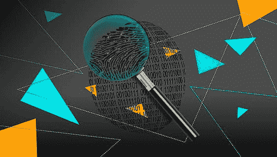

# 如何使用 SMOTE 检测 Python 中的欺诈行为

> 原文：<https://medium.com/codex/how-to-use-smote-to-detect-fraud-in-python-7c5d9988da6?source=collection_archive---------3----------------------->

因为我一直在参加 Kaggle 的每月表格竞赛，试图提高我的编程技能，所以我最近在 2021 年 5 月的表格竞赛中获得了一枚铜牌，因为我使用了 SMOTE 来纠正班级失衡。链接到我的帖子，关于我如何在一场卡格尔比赛中赢得铜牌，可以在:-[https://medium . com/codex/how-I-won-a-bronze-medal-on-a-a-ka ggle-competition-4 Abd 0424 c 479](/codex/how-i-won-a-bronze-medal-on-a-kaggle-competition-4abd0424c479)