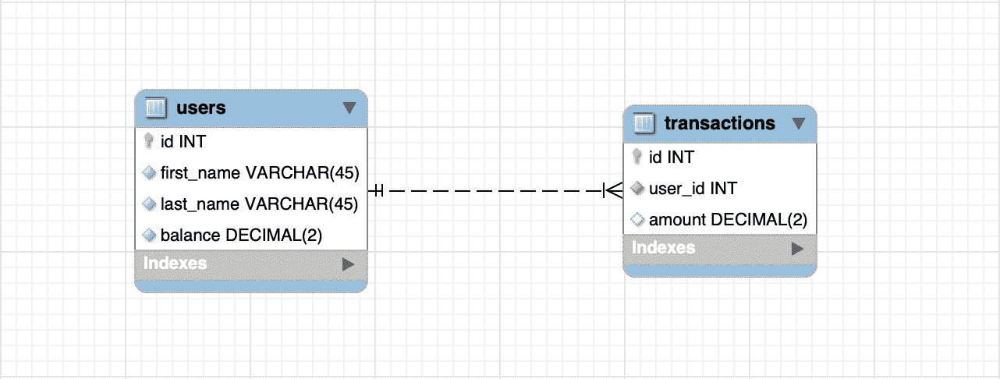
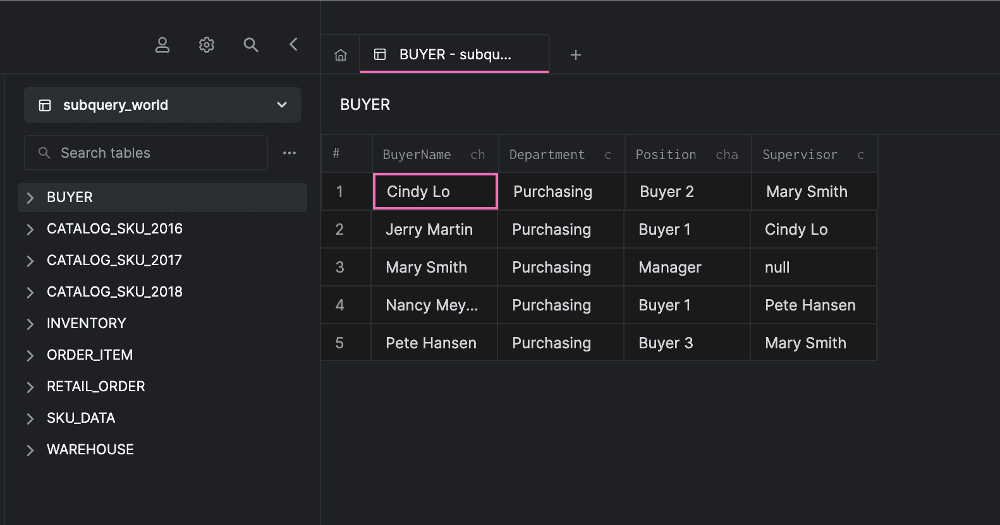
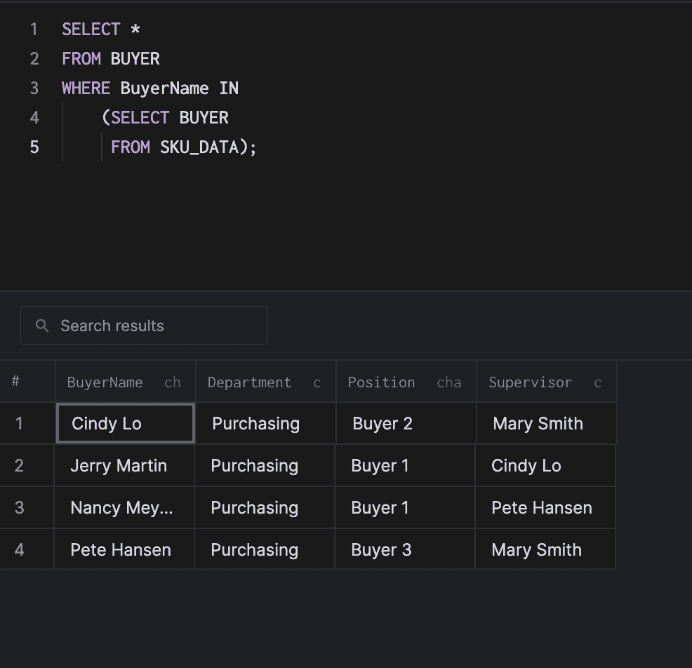
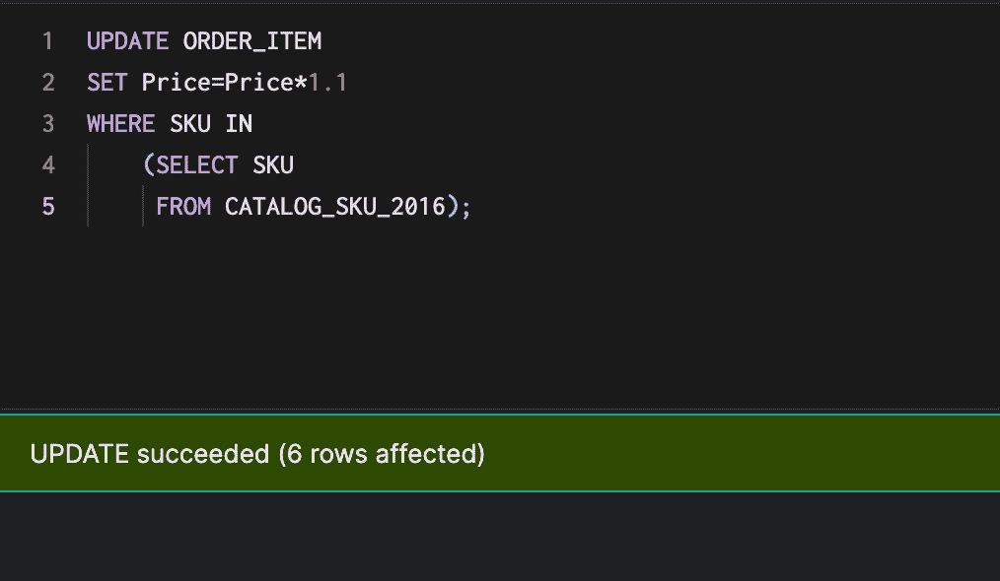
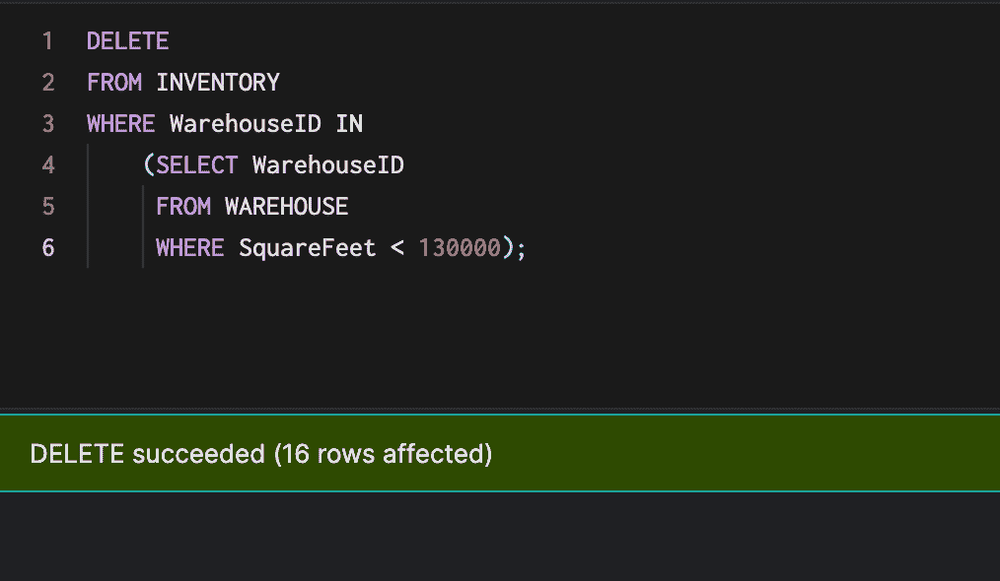
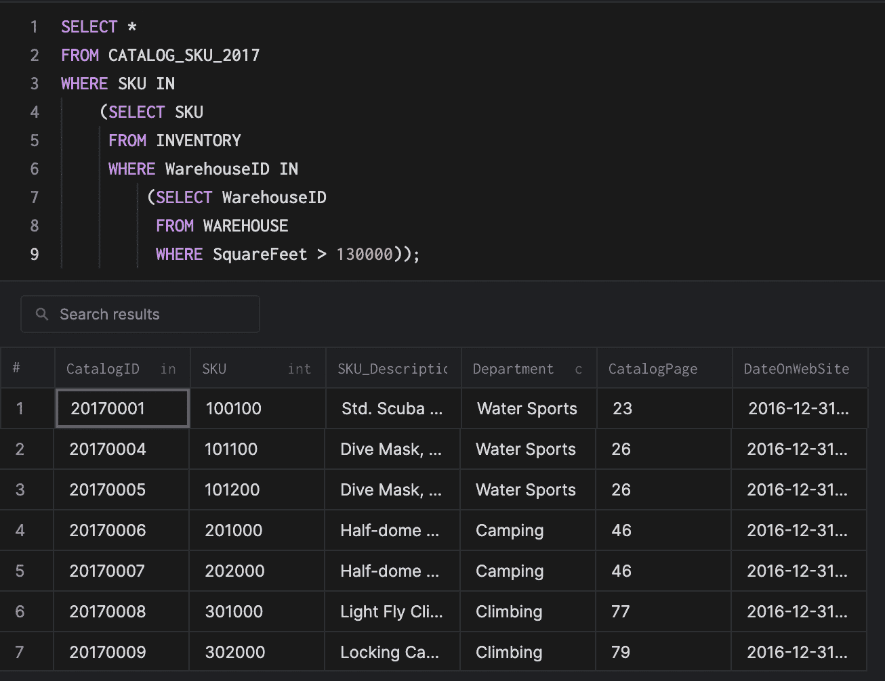

# 如何使用 SQL 子查询

> 原文：<https://medium.com/codex/how-to-use-sql-subqueries-ea702d899126?source=collection_archive---------15----------------------->

## 先决条件

要遵循并完全理解本教程，您需要具备以下条件:

*   [Arctype](https://arctype.com)
*   SQL 的基础知识

# 什么是子查询？

子查询是嵌套在另一个 SQL 查询中的 SQL 查询。它们帮助查询为一个`WHERE`子句创建条件来过滤行并对它们执行操作。子查询可以与`SELECT`、`INSERT`、`UPDATE`和`DELETE`语句一起使用。

## WHERE 子句中的子查询示例

我们希望从数据库中获取交易金额大于 1000 美元的用户。对于我们的例子，我们将有两个表，即`users`和`transactions`，它们存储用户和交易信息。



我们可以编写一个查询，从`transactions`表中获取金额超过$1，000 的所有行，然后使用它作为另一个查询的条件，该查询将基于第一个查询的结果从`users`表中获取行。

该查询将如下所示:

```
SELECT *
FROM users
WHERE id IN
    (SELECT user_id
     FROM transactions
     WHERE amount > 1000);
```

# 子查询的优势

*   与联接相比，子查询通过将它们组织成独立的部分来提高查询的可读性。
*   很容易理解和维护子查询。
*   子查询可以取代复杂的连接和联合。

# 子查询的缺点

*   子查询不能在同一个 SQL 语句中修改表并从同一个表中进行选择。
*   子查询是一项开销很大的任务，所以使用连接操作会更快。

# 运行子查询练习

我们将使用 [Arctype](https://arctype.com) 探索几个例子，其中我们将展示子查询，并了解它们是如何在应用程序中构造和使用的。

我们需要创建一个数据库，我们将在本教程中工作。为了方便起见，我创建了一个包含 SQL 文件的 [GitHub Gist](https://gist.github.com/LordGhostX/13792039bd92d2120084100a3ab13b4b) 来构建我们的数据库模式并向其中插入虚拟数据。要使用它，我们需要执行以下操作:

*   使用 Arctype 连接到我们的数据库
*   导航到 Arctype 中的查询选项卡，然后创建一个新查询
*   粘贴并运行 Gist 中的 [create.sql 文件](https://gist.github.com/LordGhostX/13792039bd92d2120084100a3ab13b4b#file-create-sql)来创建模式
*   再次导航到“查询”选项卡以创建新的查询
*   粘贴并运行 Gist 中的 [insert.sql 文件](https://gist.github.com/LordGhostX/13792039bd92d2120084100a3ab13b4b#file-insert-sql)，用虚拟数据填充数据库。



## 使用子查询选择数据

让我们编写一个查询，从`SKU_DATA`表中引用的`BUYER`表中选择所有行。在 Arctype 中创建新查询，并执行以下代码:

```
SELECT *
FROM BUYER
WHERE BuyerName IN
    (SELECT BUYER
     FROM SKU_DATA);
```



在上面的代码中，我们创建了一个内部查询，它从`SKU_DATA`表中选择`BUYER`列，然后使用它作为条件从`BUYER`表中选择具有相同`BuyerName`列值的行。

## 用子查询更新数据

让我们编写一个查询，将 2016 年销售的所有商品的`ORDER_ITEM`表中的`Price`列的值增加 10%。在 Arctype 中创建新查询，并执行以下代码:

```
UPDATE ORDER_ITEM
SET Price=Price*1.1
WHERE SKU IN
    (SELECT SKU
     FROM CATALOG_SKU_2016);
```



在上面的代码中，我们创建了一个内部查询，该查询从`CATALOG_SKU_2016`表中选择`SKU`列，以过滤我们应该在`ORDER_ITEM`表中更新的行。

## 删除带有子查询的数据

我们将编写一个子查询，删除存储在小于 130，000 平方英尺的仓库中的`INVENTORY`表中的所有记录。该查询将如下所示:

```
DELETE
FROM INVENTORY
WHERE WarehouseID IN
    (SELECT WarehouseID
     FROM WAREHOUSE
     WHERE SquareFeet < 130000);
```



# 使用嵌套子查询

也可能在另一个子查询中包含子查询。这里有一个例子:

```
SELECT *
FROM CATALOG_SKU_2017
WHERE SKU IN
	(
		SELECT SKU
		FROM INVENTORY
		WHERE WarehouseID IN
		(
			SELECT WarehouseID
			FROM WAREHOUSE
			WHERE SquareFeet > 130000
		)
	);
```



在本例中，我们选择了存储在面积大于 130，000 平方英尺的仓库中的`CATALOG_SKU_2017`表中的所有行。

# 结论

在本文中，我们学习了子查询，这是一种在查询中运行查询的方式。我们还了解了它们的工作原理、优点和局限性，并使用 [Arctype](https://arctype.com) 运行了数据示例。