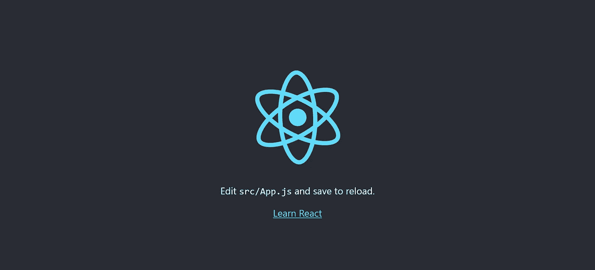
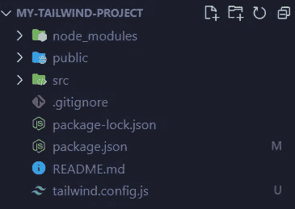
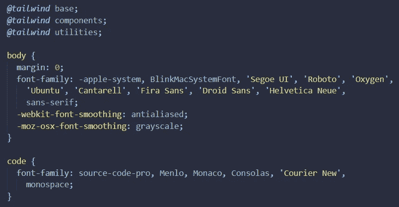
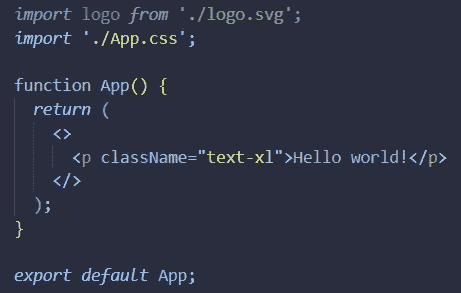
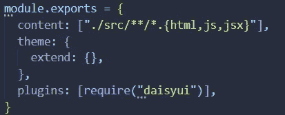
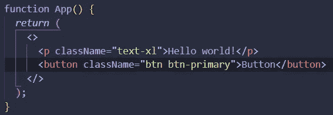

# 如何用 Create-React-App 使用 Tailwind CSS？

> 原文：<https://medium.com/codex/how-to-use-tailwind-css-with-create-react-app-4addccdc1cba?source=collection_archive---------5----------------------->


米哈伊尔·尼洛夫摄于 [Pexels](https://www.pexels.com/photo/a-man-sitting-in-front-of-the-computer-while-working-7988087/)

如果你做过前端开发，很有可能你至少听说过 [Tailwind CSS](https://tailwindcss.com/) 。这几乎是目前的前沿趋势。但是对于那些不知道的人来说，它是一个 CSS 框架，允许你不用离开你的 HTML 文件就可以构建组件。您可能已经看到有人抱怨 Tailwind 在 HTML 文件中留给开发人员非常长的类，但是这已经超出了本文的范围。我不会讨论为什么顺风很棒或者为什么它不好，我会简单的告诉你如何使用顺风 CSS 和 CRA。您可能会使用不同的模板，比如 [ViteJS](https://vitejs.dev/) ，但是对于本文，我们将使用 CRA。这篇文章假设你至少对 CRA 有基本的了解。让我们从创建项目文件夹开始。为此，我将简单地运行 npx 命令，一旦完成，我将进入该文件夹并像这样启动它:

```
npx create-react-app my-tailwind-project
cd my-tailwind-project
npm start
```



如果您使用了我提供的代码，那么在撰写本文时，您应该会看到这个页面。你可以使用不同的模板，如 redux 模板，并获得不同的页面，但这个想法是，你应该得到某种形式的主页。这意味着我们成功地安装了 React，并可以进入下一步，即集成我们的 CSS 框架 Tailwind CSS。Tailwind 的工作方式是扫描 HTML、Javascript 或任何其他模板中的类名，并根据类名生成样式。为了快速安装 Tailwind，我们将使用 CLI 方法，但是如果合适的话，您可以自由使用任何其他方法。如果您正在跟进，我推荐您使用 NPM(节点包管理器)，但是您也可以使用 yarn。要使用 NPM 安装 Tailwind CSS，只需运行以下命令:

`npm i -D tailwindcss`

`-D`是安装 Tailwind 作为开发依赖项所需的选项。安装完成后，您应该像这样创建配置文件:

`npx tailwindcss init`

一旦您运行该命令并且它完成了它的工作，您应该会在您的根目录中看到一个名为`tailwind.config.js`的新文件。这意味着目前一切进展顺利。



好了，现在我们需要修改我们的 tailwind 配置文件，并添加我们希望 Tailwind 扫描样式类的路径。如果你像我一样使用默认的 CRA 模板，你的组件应该在你的 src 文件夹中，所以我们将像这样添加 src 中的每个子文件夹和文件:

`"./src/**/*.{html,js,jsx}"`

这将搜索我们的 src 文件夹，包括任何带有 HTML，JS 或 JSX 扩展名的文件的子文件夹。现在，Tailwind 将为我们的构建编译一个 CSS，这就是为什么我们需要将 Tailwind 指令添加到我们的**主** CSS 文件中，在我们的例子中，它是 src 文件夹中的 index.css 文件。顺风指令如下:

```
@tailwind base;
@tailwind components;
@tailwind utilities;
```

您需要将这些内容添加到主 CSS 文件的顶部，结果如下所示:



完美！现在我们需要运行 CLI 工具来扫描模板文件并构建 CSS。该命令如下所示:

`npx tailwindcss -i ./src/index.css -o ./dist/output.css --watch`

这将扫描我们的 index.css，这是我们的主 css 文件，并将我们的 CSS 文件构建到我们的 output.css 文件中，该文件位于 Tailwind 将为您创建的 dist 文件夹下。你根本不需要创建文件夹。完成后，您可能希望在控制台中按 CTRL+C 退出该过程。现在，让我们删除 App.js 文件中的所有内容，并尝试使用 Tailwind。



如果您运行 npm start now 并对我们刚刚添加的段落使用 inspect element，您会看到它有一个 text-xl 类，并且它自动具有一些 CSS 样式。这都要感谢 Tailwind CSS，但这还没有结束。你知道有围绕顺风 CSS 设计的组件库吗？嗯， [DaisyUI](https://daisyui.com/) 就是其中之一！安装它非常容易。我们也这么做吧！简单地安装它使用 NPM 像这样:

`npm i daisyui`

很简单，对吧？嗯，你还需要在你的顺风配置文件中包含 DaisyUI。如果你导航到你的顺风配置文件，你会看到一个叫做插件的东西。如果你查看 [Tailwind 官方文档](https://tailwindcss.com/docs/plugins)，一个插件可以很好地帮助你将不同的样式注入用户的样式表。你只需要一个插件，它就会立即开始工作，就像这样:



好吧，那很简单，不是吗？让我们看看它是否有效。我将添加一个简单的主按钮。

`<button className="btn btn-primary">Button</button>`



如你所见，它成功了！


这是我今天的全部。顺风可以帮助你快速创建惊人的网站，你只需要用它进行一些实践。如果你有任何问题，请在下面给我留言，我们下次再见。