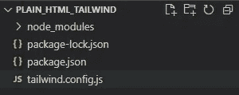
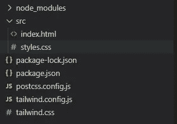

# 如何在纯 HTML 中使用 TailwindCSS 3

> 原文：<https://medium.com/codex/how-to-use-tailwindcss-3-with-plain-html-39a5950232a4?source=collection_archive---------13----------------------->


最终产品

L 长话短说每次我搜索“如何在 html 中使用 tailwindcss”或“如何在简单的 html 中安装 tailwind”时，我都会发现一篇旧文章，因此说明不再适用，这导致我每次尝试时都失去了兴趣。

今天我决定更深入地搜索一下，试着改变我从 npm/npx 得到的一些生成文件，我终于让它工作了🎉

所以让我们把手弄脏，好吗？

先决条件:

*   NPM 安装
*   代码编辑器(可选)
*   对终端的访问
*   互联网接入

首先，我们需要做的是创建一个包含所有项目文件的新文件夹。

我们可以通过执行以下命令(Windows/Mac)来做到这一点

```
mkdir plain_html_tailwind
```

创建我们的根文件夹后，我们需要在里面导航，并开始安装我们的依赖项。

Windows/Mac

```
cd plain_html_tailwind
```

现在我们已经准备好开始了，让我们打开 PostCSS 的 [tailwindcss](https://tailwindcss.com/docs/installation/using-postcss) 文档。我们需要做的第一件事是安装 tailwindcss、postcss 和 autoprefixer，感谢 tailwindcss 团队为我们提供了复制/粘贴命令。

```
npm install -D tailwindcss postcss autoprefixer
```

然后，我们需要通过运行以下命令来初始化 tailwindcss

```
npx tailwindcss init
```

当这两个完成执行时，我们可以使用代码编辑器打开我们的项目文件夹，对我来说，这是[对代码](https://code.visualstudio.com/)，所以我只是运行

```
code .
```

此时，你的文件夹结构应该是这样的。



接下来，您需要创建一个`postcss.config.js`文件，并添加以下内容

保存并关闭`postcss.config.js`后，你需要打开`tailwind.config.js`，看起来应该是这样的

并将 2 号线从`content: [],`改为`content: ["./src/**/*.{html,js}"],`

保存文件，然后创建一个名为`tailwind.css`的文件，并添加以下 3 行代码

现在创建一个名为`src`的文件夹，在其中创建两个文件，一个名为`index.html`，另一个名为`styles.css`，这两个文件将是空的，`index.html`应该包含以下内容

如果您在浏览器中打开该文件，它将如下所示


这就是有趣的地方，首先你的文件夹结构应该是这样的



我保证我们快完成了，有些事情我们需要先做。首先，您需要打开`package.json`并在`"devDependancies"`后添加以下行

保存文件并在您的终端上运行

```
npm run buildTailwind
```

我们就快到了，只要打开`index.html`并在`<title>TailwindCSS Works</title>`之前添加

你的`index.html`应该是这样的

我们结束了🎉只要在你的浏览器中打开这个文件，你就会看到类似的东西


请记住，每次添加/删除/更改与 tailwindcss 相关的 html 类时，您都需要从上面重新运行 build 命令。

这是我的第一篇中帖，希望你觉得有用！

> **感谢你坚持到现在。关注我了解更多！**

# 参考

1.  [https://tailwindcss.com/docs/installation/using-postcss](https://tailwindcss.com/docs/installation/using-postcss)