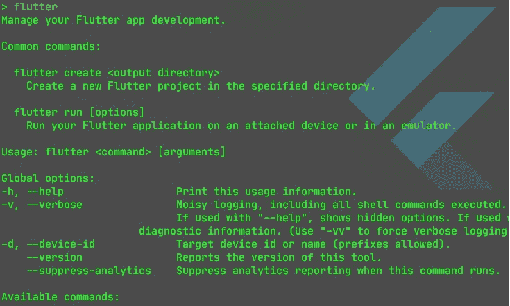

# 如何使用 Flutter 命令行界面

> 原文：<https://medium.com/codex/how-to-use-the-flutter-command-line-interface-8c43f3bb8425?source=collection_archive---------5----------------------->

## 颤振 CLI 解释

## 在本文中，我们将关注 Flutter CLI 及其在构建、测试、部署和运行 Flutter 应用程序中最常见的用例。

颤振 CLI 的输出