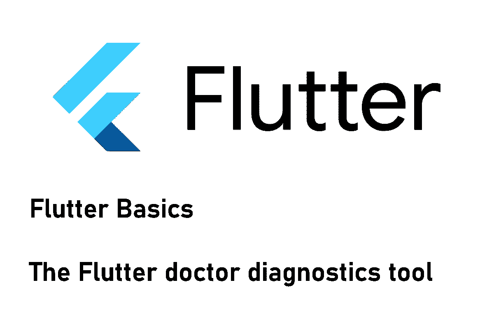

# 如何正确使用 Flutter doctor 诊断工具

> 原文：<https://medium.com/codex/how-to-use-the-flutter-doctor-diagnostics-tool-in-the-right-way-51fbe05c2b92?source=collection_archive---------13----------------------->

## 叫救护车…但不是为我！

## 如果你感觉不舒服，就去看医生。颤振也是如此。

颤振诊断工具帮助您识别可能阻碍成功开发工作流程的配置问题。作为输出…