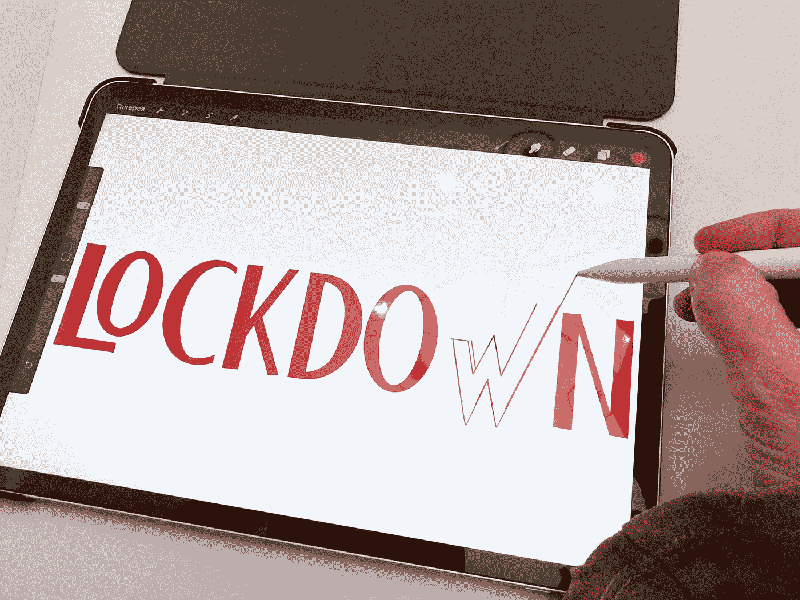

# 创作者如何使用 iPad Pro？

> 原文：<https://medium.com/codex/how-to-use-the-ipad-pro-for-creators-c7c8c921dcd4?source=collection_archive---------10----------------------->

Elena Mozhvilo 在 [Unsplash](https://unsplash.com?utm_source=medium&utm_medium=referral) 上的照片

iPad 对我来说一直有点神秘。这看起来可能很棒，但我从来不明白 iPad 的目标。自从开始增加 M1 芯片和现在的 M2 芯片以来，这个问题变得更加明显。在如此小的设备中有如此大的能力，但它似乎被软件所阻碍。在做了一些研究后，我意识到 iPad 非常适合内容创作者！它很轻，而且…