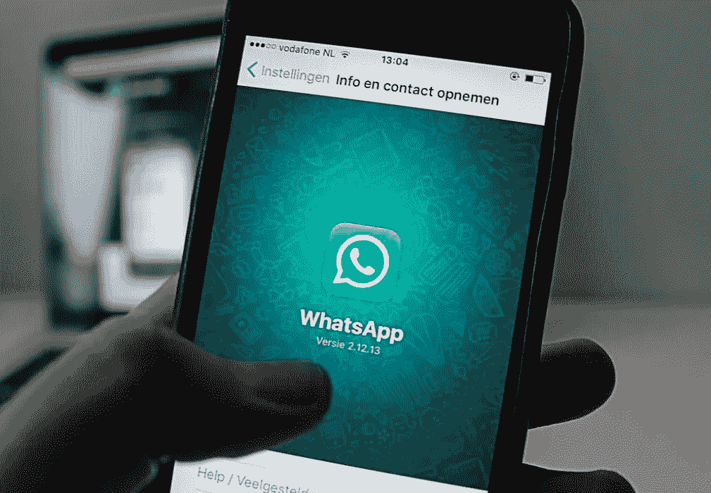
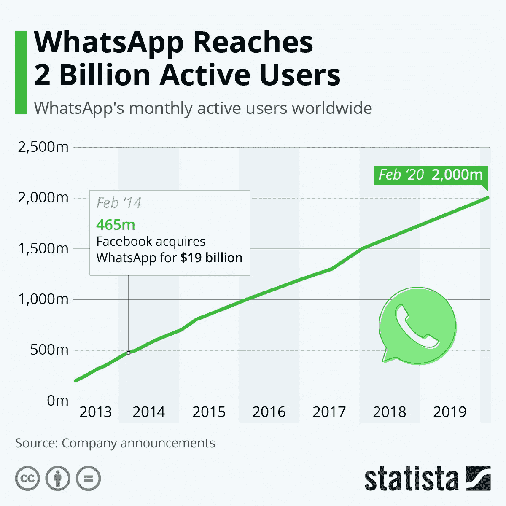

# 如何使用 Whatsapp 商业应用编程接口

> 原文：<https://medium.com/codex/how-to-use-the-whatsapp-business-api-418409b16b78?source=collection_archive---------4----------------------->

## 聊天机器人和对话设计

## Whatsapp Business API 入门指南

除了设计和构建聊天机器人，你的平台还需要一个渠道来赋予你的聊天机器人生命力。

更重要的是，顾客正在选择他们想在哪里接触你的品牌。

安东·佩克斯的照片

这个故事的重点是 WhatsApp 及其 API，因为它是最常见和最受欢迎的应用之一。

拥有超过 20 亿用户的 WhatsApp 不仅是最受欢迎的与朋友和家人交谈的即时通讯应用，而且企业也越来越多地转向 WhatsApp，以便与他们的客户和消费者联系。

# WhatsApp 商业应用编程接口

[**WhatsApp 商业 API**](https://business.whatsapp.com/) 是开发者的 API，公开其所有功能，作为沟通和商业的渠道。正是这种 API 使您能够利用其复杂的消息平台，让您能够在世界上最受欢迎的消息应用程序上提供客户服务、发送消息、与客户聊天和发送通知。

从我和许多其他人的经验来看，对于客户群相对较小的小商店来说，这是正确的选择，在那里你可以单独回应所有的客户。它支持 Android 和 iPhone 客户端，并带有快速回复、标签和商业简介的基本功能。

现在，最大的*缺点*是 WhatsApp 商业 API 是为处理个人对话而构建的。客户的请求需要在安装了该应用程序的一部手机上得到答复，并且只能添加四台设备，所有设备都在同一个帐户名下工作。

还有一个缺点是，你看不到谁真正回复了与你的账户相关的这四个设备的信息。

它在数据隐私方面也有争议，并且不符合 GDPR，这是一个问题，尤其是对欧洲企业来说。即使你是一家总部设在美国的公司，如果你在有问题的地区经营，你显然会有问题。

为了给大型企业提供一个安全、可扩展的解决方案，以满足他们的需求，脸书在 2018 年 8 月推出了 [**WhatsApp 商业 API**](https://www.whatsapp.com/business/api) 。这个[应用编程接口](https://en.wikipedia.org/wiki/Application_programming_interface) (API)允许企业接收和回复来自客户的无限量 WhatsApp 消息。

这意味着，您将使用一个供应商(很可能)来为您提供与 API、聊天机器人和云联络中心的现成集成。这是 CPaaS 的常用技术/产品堆栈，一个通信平台即服务。

随着业务的发展，对提供全渠道体验的平台的需求也在上升，尤其是在最近的疫情期间开始增长。每个企业都需要一种方法来响应他们的客户，这是非常困难的，因为他们中的大多数都有一个内部呼叫中心，这要求他们的代理部署在办公室内。

# 活跃用户群

在进入如何开始的细节之前，这里只是简单概述一下 WhatsApp 的活跃用户群在过去几年中增长了多少。

来源: [Statista](https://www.statista.com/chart/4245/whatsapp-user-growth/)

这里需要注意的主要一点是，随着 WhatsApp 活跃用户群的增长，你的潜在市场也在一起增长。

在为您的服务选择正确的渠道时，一定要记住这一点。

# 入门指南

WhatsApp 提供了极好的指南，所以我强烈建议查看他们的官方文档以及入门视频，如下所示。

作为世界上最受欢迎的 messenger 应用程序和端到端加密，WhatsApp 正在成为最强大的客户沟通渠道。

# **谁可以使用 WhatsApp 业务**

为了保护用户并防止其平台上的任何恶意活动，WhatsApp 遵循严格的 [**商业政策**](https://www.whatsapp.com/legal/commerce-policy/) 和 [**商业政策**](https://www.whatsapp.com/legal/business-policy) 。

您可以仔细检查列表，确保您的产品或服务符合要求，但通常情况下，您的供应商会帮助您并解释所有程序。

以下是让您开始运行的步骤。

## **1。选择商业解决方案提供商**

可以通过各种[商业解决方案提供商](https://www.facebook.com/business/partner-directory/search?solution_type=messaging&sort_by=alpha) (BSP)申请接入 WhatsApp 商业 API。

确保您找到一个能够为您提供完整平台，满足您业务需求的 BSP。请注意以下几点:

*   应该通过 bsp 的官方链接找到供应商，
*   供应商的产品应该包括多渠道体验，因为你需要发展更多的渠道，接触更多的客户，
*   供应商的产品应该包括一个易于使用的聊天机器人构建平台和一个云联络中心，这样您的代理就可以响应所有更复杂的查询，
*   供应商应该提供咨询服务来加快入职流程

## **2。创建业务经理**

如果你还没有的话。

在你决定了一个解决方案提供商后，你需要[创建一个业务经理](https://www.facebook.com/business/help/1710077379203657)并在那里连接你的脸书页面。

之后，您将获得一个业务经理 ID，您需要与 BSP 共享该 ID，BSP 将依次向您发送代表脸书业务经理的*请求和 [*验证您的业务*](https://www.facebook.com/business/help/2058515294227817?id=180505742745347) 请求的**消息。***

**你可以在这里找到如何操作的分步指南。**

## **3.准备一个将在 WhatsApp 上注册的电话号码**

**WhatsApp 商业 API 和*个人* WhatsApp 的基数一样。**

**您需要准备一个与您的业务相关的号码。这个号码必须有效，因为 WhatsApp 会在注册过程中触发一个呼叫来验证它。**

**通常，企业会选择一个呼叫中心号码，因为这是众所周知的，客户已经习惯了。**

## **3.获得一个经过验证的帐户——绿色勾号**

**BSP 将向 WhatsApp 发送请求，以验证您的业务，从而获得一个*绿色勾号*。**

**不是所有的企业都能收到这封信，因为这关系到你的客户群、全球业务、收入和一般品牌。但是，即使 WhatsApp 拒绝了你的业务，你也可以毫无问题地使用 WhatsApp Business API。**

## **4.准备一个聊天机器人来回答顾客的询问**

**我之前写过关于聊天机器人的好处，以及为什么你需要聊天机器人。我建议查看下面文章中的细节。**

** [## 为什么您的企业需要聊天机器人

### 在当今世界，聊天机器人不是奢侈品，如果你想让你的客户开心，聊天机器人是必需品。

be-ja.medium.com](https://be-ja.medium.com/why-your-company-needs-a-chatbot-1bd9e4bb7c53) 

## 5.让你的客户知道他们可以通过 WhatsApp 联系到你

营销活动完全取决于你，但让客户知道他们可以在 WhatsApp 上联系到你会有很大帮助。

你也可以使用 WhatsApp 的功能 [*“点击到 WhatsApp”*](https://www.facebook.com/business/help/447934475640650?id=371525583593535)。

这使得客户在点击你的脸书或 Instagram 广告上的“*发送消息*”按钮后，可以在 WhatsApp 上与你的企业建立联系。

通过二维码链接到 WhatsApp 也能让人们快速便捷地联系到你。

你可以在自己的网站上创建一个 WhatsApp 按钮，或者分享你的[https://wa.me/number](https://wa.me/number)链接，这样他们就能很容易地联系到你。** 

**我希望你喜欢这篇文章！希望你能得到一个高层次的概述，以及开始使用 WhatsApp 需要做些什么的想法。**

***过去几年，我一直在与聊天机器人和 WhatsApp 合作，我期待着在 Medium 上分享更多关于这个主题的信息。敬请关注，感谢阅读！*🎉**