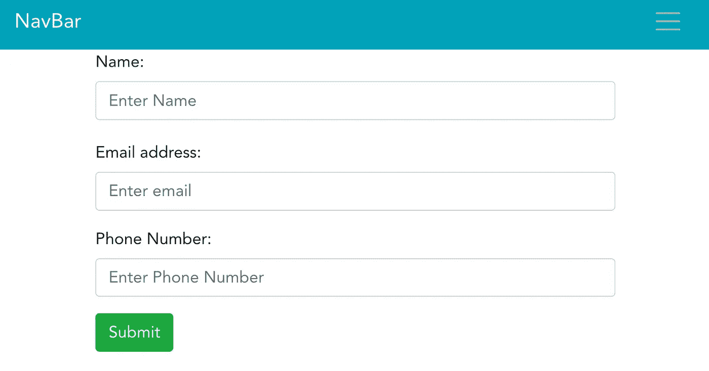
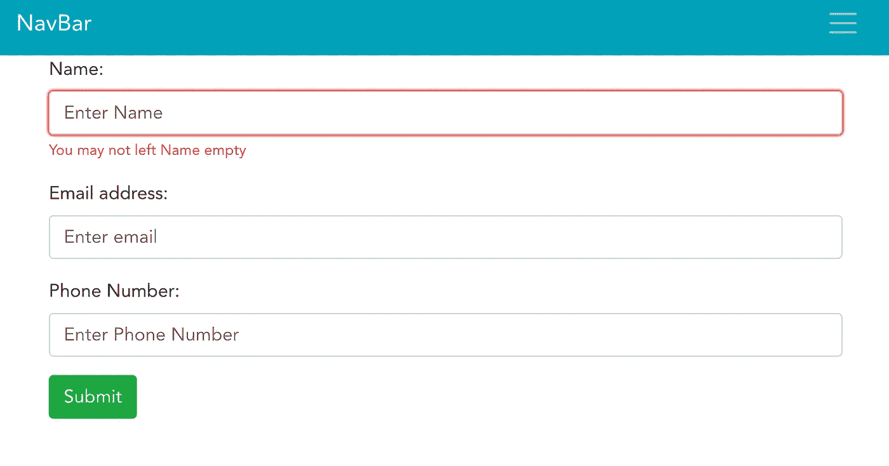
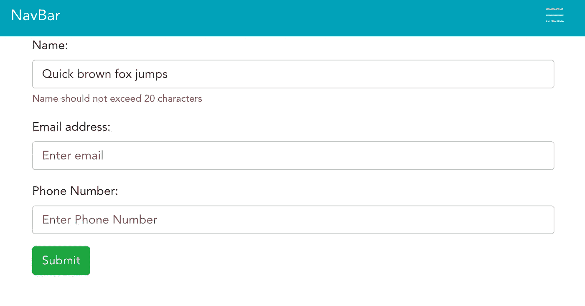
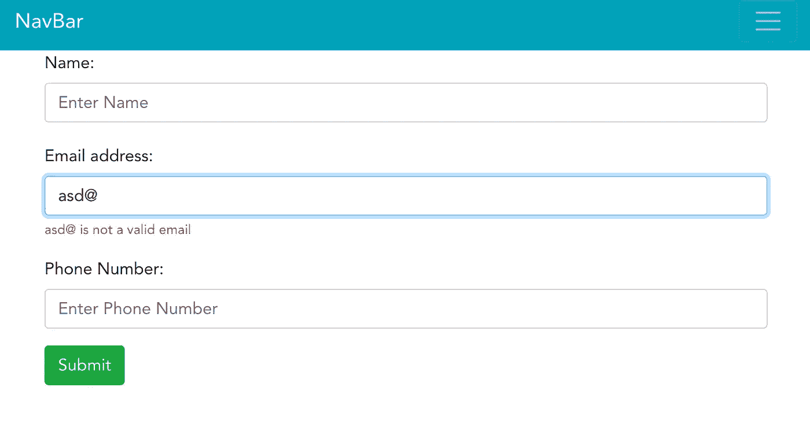
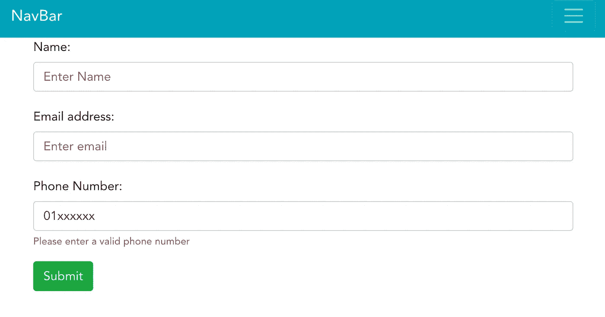
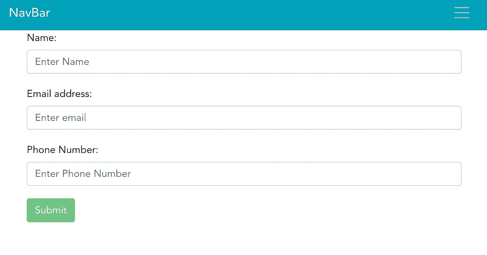
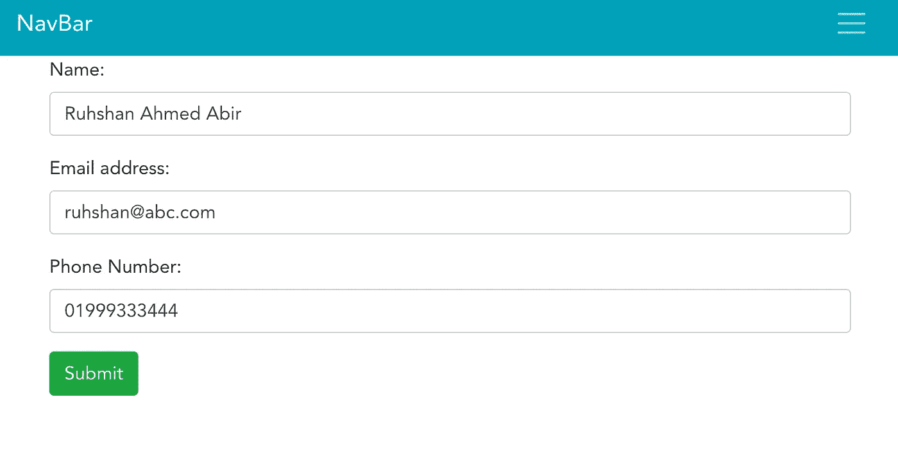

# 如何通过 bootstrap-vue 和 TypeScript 使用 vee-validate？

> 原文：<https://medium.com/codex/how-to-use-vee-validate-with-bootstrap-vue-and-typescript-26312e89be0a?source=collection_archive---------0----------------------->

## [抄本](http://medium.com/codex)


照片由[西格蒙德](https://unsplash.com/@sigmund?utm_source=unsplash&utm_medium=referral&utm_content=creditCopyText)在 [Unsplash](https://unsplash.com/s/photos/format?utm_source=unsplash&utm_medium=referral&utm_content=creditCopyText) 上拍摄

在 web 应用程序中，表单是获取用户输入的最简单也是最广为人知的方式。但是有了表单，就有了验证。有许多方法可以将验证与表单结合起来。这里我们将看到如何在一个 [VueJS](https://vuejs.org/) 项目中使用 [vee-validate](https://vee-validate.logaretm.com/v3/) ，其中 [bootsrap-vue](https://bootstrap-vue.org/) 被用作 ui 框架。

首先，让我们创建一个包含 3 个字段的表单布局:姓名，电子邮件，电话号码。

```
<b-form>
  <b-form-group>
      <b-form-input
        placeholder="Enter Name"
        required
        type="text"
      ></b-form-input>
     </b-form-group>
  <b-form-group
    label="Email address:"
  >
    <b-form-input
      placeholder="Enter email"
      required
      type="email"
    ></b-form-input>
  </b-form-group>
  <b-form-group
    label="Phone Number:"
  >
    <b-form-input
      placeholder="Enter Phone Number"
      required
      type="text"
    ></b-form-input>
  </b-form-group>
<b-button variant="success">Submit</b-button>
</b-form> 
```

很基本，对吧？我们没有使用纯 html 标签、div 和 bootstrap 特定的类，而是利用 bootstrap-vue 提供的组件来实现我们的目标。使用`npm run serve`运行后，它应该是这样的:



表单的初始外观

现在我们将逐个添加验证。让我们从名称字段开始。为了启用验证，我们将使用验证提供程序包装`b-form-group`组件，如下所示:

```
<validation-provider v-slot="{ errors, valid }" name="Name" rules="required">
  <b-form-group
    label="Name: "
  >
    <b-form-input
      v-model="name"
      placeholder="Enter Name"
      required
      type="text"
    ></b-form-input>
  </b-form-group>
</validation-provider>
```

这里，**验证提供者**包装了输入，并使用[作用域槽](https://vuejs.org/v2/guide/components-slots.html#Scoped-Slots)提供验证。有许多作用域槽[道具](https://vee-validate.logaretm.com/v3/api/validation-provider.html#scoped-slot-props)，但是对于这个例子，我们只选择了**错误**和**有效。**前一个包含错误信息列表，后一个是表示输入是否有效的标志。使用 *name* 属性，我们指定了字段的名称，该名称将在错误消息中显示；使用*规则*，我们指定了应该在验证期间应用的规则。首先，我们只需要一条规则**。**

**但是，这个模板还不完整。我们没有添加任何显示错误消息的地方。为此，我们必须在**验证提供者的范围内添加以下代码:****

```
<b-form-invalid-feedback :state="valid">
  <span v-for="(error, index) in errors" :key="index">{{ error }}</span>
</b-form-invalid-feedback>
```

**该组件将基于**有效**的值显示，因为我们已经将其与**b-表单-无效-反馈**组件的**状态**属性绑定。所以完整的模板现在看起来像这样:**

```
<b-form-group
  label="Name: "
>
  <b-form-input
    v-model="name"
    placeholder="Enter Name"
    required
    type="text"
  ></b-form-input>
  <b-form-invalid-feedback :state="valid">
    <span v-for="(error, index) in errors" :key="index">{{ error }}</span>
  </b-form-invalid-feedback>
</b-form-group>
```

**我们已经完成了模板化。现在只要在剧本上写几行字，我们就可以了。目前该脚本看起来是这样的:**

```
<script lang="ts">

import { *Component*, Vue } from 'vue-property-decorator'

import { *extend*, setInteractionMode, ValidationProvider } from 'vee-validate'
import { required } from 'vee-validate/dist/rules'

setInteractionMode('eager')

*extend*('required', {
  ...required,
  message: '{_field_} can not be empty'
})

@Component({ components: { ValidationProvider } })
export default class SampleForm extends Vue {
  private name = ''
}

</script>
```

**让我们看看它是什么样子的:**

****

**必需的规则在起作用**

**如果我们想改变错误信息，这很容易。只需在我们扩展所需规则的块中更改消息属性，如下所示:**

```
*extend*('required', {
  ...required,
  message: 'You may not left {_field_} empty'
})
```

**现在它应该是这样的:**

****

**已更改错误消息**

**让我们添加另一个验证。我们希望确保名称不超过 40 个字符。为此，我们将导入规则:**

```
import { required, max } from 'vee-validate/dist/rules'
```

**然后使用所需的错误消息进行扩展:**

```
*extend*('max', {
  ...max,
  message: '{_field_} should not exceed {length} characters'
})
```

**然后我们在模板中添加规则:**

```
<validation-provider v-slot="{ errors, valid }" name="Name" rules="required|max:20">
```

**这里我们为规则 **max** 指定了 **length** 参数，即 20。现在，如果我们输入超过 20 个字符，它将看起来像这样:**

****

**已启用名称的字符长度验证**

**现在让我们为电子邮件字段添加验证。首先，我们导入规则并扩展它:**

```
 import { required, max, email } from 'vee-validate/dist/rules'/extend the rule
*extend*('email', {
  ...email,
  message: '{_value_} is not a valid email'
})
```

**现在我们将更新模板。我们将用**验证提供者**包装电子邮件输入，并为验证规则和呈现错误消息插入必要的代码:**

```
<validation-provider v-slot="{ errors, valid }" name="Email" rules="required|email">
<b-form-group
  label="Email address:"
>
  <b-form-input
    placeholder="Enter email"
    v-model="email"
    required
    type="email"
  ></b-form-input>
  <b-form-invalid-feedback :state="valid">
    <span v-for="(error, index) in errors" :key="index">{{ error }}</span>
  </b-form-invalid-feedback>
</b-form-group>
</validation-provider>
```

**现在，如果我们输入无效的电子邮件，它将看起来像这样:**

****

**无效电子邮件显示错误**

**Vee-valdiate 提供了许多验证规则，可以满足几乎所有的验证情况。但是有时您可能需要编写自己的验证规则。在这种情况下，您可以使用正则表达式。例如，在我们的电话号码字段中，我们希望它遵循这种模式:9 位数字，然后以 01 开头。在正则表达式中，它看起来像这样:`/^(01)([0-9]{9})$/`。为了堵住这个漏洞，首先我们导入规则，并用适当的消息扩展它:**

```
import { required, max, email, regex as phoneNumber } from 'vee-validate/dist/rules'
```

**可能会出现这样一种情况，您希望使用相同规则来验证多个字段，但却有不同的错误消息。在这种情况下，您可以使用 typescript 的类型断言来导入具有不同名称的规则。就像我们在这里将 regex 作为 phoneNumber 导入一样。让我们扩展一下:**

```
*extend*('phoneNumber', {
  ...phoneNumber,
  message: 'Please enter a valid phone number'
})
```

**现在需要将这个正则表达式插入到模板中。带有验证提供程序的电话号码字段的模板如下所示:**

```
<validation-provider v-slot="{ errors, valid }" name="Phone Number" :rules="{required: true, phoneNumber: /^(01)([0-9]{9})$/ }">
<b-form-group
  label="Phone Number:"
>
  <b-form-input
    placeholder="Enter Phone Number"
    v-model="phone"
    required
    type="text"
  ></b-form-input>
  <b-form-invalid-feedback :state="valid">
    <span v-for="(error, index) in errors" :key="index">{{ error }}</span>
  </b-form-invalid-feedback>
</b-form-group>
</validation-provider>
```

**注意，在这种情况下，我们对规则的定义有点不同。我们没有将规则指定为管道(' | ')分隔的字符串，而是传递了一个对象。这就是 vee-validated 对安全性的建议。因为您正则表达式可能包含管道本身，这可能会产生意外的结果。**

****

**显示无效电话号码的错误消息**

**我们必须添加最后一块拼图。请注意，尽管我们输入了无效的输入，但提交按钮仍然处于启用状态。如果一个或多个字段包含无效输入，我们希望禁用它。为此，我们需要将整个表单包装在另一个名为 **validation-observer 的组件中。**首先，让我们将它导入脚本并插入组件部分。**

```
import { *extend*, setInteractionMode, ValidationProvider, ValidationObserver } from 'vee-validate'/** other imports and declaration@Component({ components: { ValidationProvider, ValidationObserver } })
export default class SampleForm extends Vue {
  private name = ''
  private email = ''
  private phone = ''
}
```

**现在让我们将表单包装在验证观察器中**

```
<validation-observer v-slot="{ invalid }">
<b-form>*** other fields **</b-form>
</validation-observer>
```

**像验证提供者一样，我们从 valdiation-observer 中选择了**无效**道具。现在，我们将把它与 submit 按钮绑定，这样，如果一个或多个字段无效，它将保持禁用状态。**

```
<b-button variant="success" :disabled="invalid">Submit</b-button>
```

****

**提交按钮无效**

****

**当所有字段都有效时，提交按钮处于活动状态**

**现在整个 vue 组件看起来像这样:**

**如果你想看看整个项目，这里是:**

**【https://github.com/Ruhshan/vee-validate-bootstrap-ts **

**如果你发现任何错误或对我有任何建议，请随时告诉我。快乐编码。**