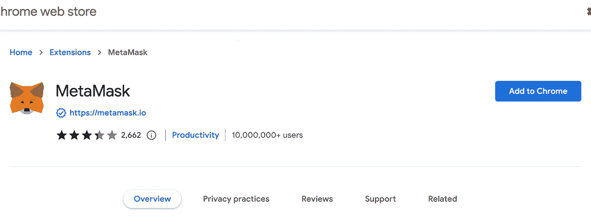
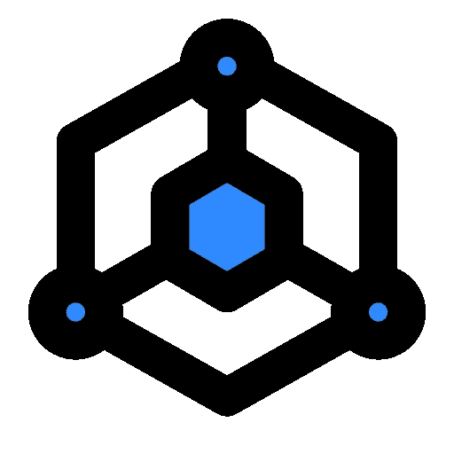

# 如何使用 Web3 pt？1 |网站 3 解释

> 原文：<https://medium.com/codex/how-to-use-web3-pt-1-web3-explained-321957d97a2?source=collection_archive---------26----------------------->

区块链是这个，加密是那个，Web3 是另一个，但是你如何获得这些术语的实际经验呢？我们已经介绍了[什么是区块链](/codex/blockchains-web3-explained-cc1e8e5a2e20)，谁和[是什么驱动了他们](/codex/how-blockchains-operate-web3-explained-ca1e6229580)，以及这项技术的一些[流行用例](/codex/ethereum-smart-contracts-web3-explained-fe2522195e2b)。通过阅读本文，您将创建一个*钱包*，您可以用它来安全地与 Web3 技术交互。

# Web3 钱包

分散式应用很少依赖于传统的用户名和密码组合，你可能习惯于在 Web2 平台上使用，如脸书、 [Twitter](https://twitter.com/dao_block) ，甚至 [Medium](/@block-ops.eth) 。相反，他们使用一种叫做钱包的东西来联系。钱包可以是运行在计算机上的软件，也可以是物理硬件。我们稍后将介绍软件钱包和硬件钱包之间的区别，但不管怎样，大多数 web3 钱包都由三样东西组成:

1.  **种子短语**
2.  **公钥**
3.  **私钥**

## 种子短语

种子短语是随机选择的一组单词(通常为 12-24 个单词)。创建新钱包时，种子短语是您应该保存在安全地方的东西，因为它通常用于在您失去访问权限时**找回**(想想*“忘记密码”*)您的钱包。然后，您的**种子短语被用于**创建您的公钥和私钥。

## 公开密钥

你可以像对待你的电子邮件地址一样对待你的公钥。您可以使用它来交流、支付或接收付款、与应用程序或网站交互等。如果你还记得上一篇文章中我们的夏季旅行的例子，我们的朋友将发送以太坊到彼此的钱包地址。这些**钱包地址只是我们朋友的**公钥**的散列版本**。

## 私人密钥

**永远不要分享你的私钥**。在任何情况下，没有人会需要它，我保证。再次强调，不要共享您的私钥。既然已经解决了这个问题，私钥通常是与公钥一起创建的一组随机字符，用于“签名”或授权 web3 交易。这意味着如果有人恶意获取你的私钥，他们可以授权发送你的所有资金，NFT 和 DeFi 资产出你的 web3 钱包。

# Web3 入门

MetaMask 是目前最受欢迎的 web3 钱包，理由很充分:它很容易在 iOS、Android 和流行的浏览器(Chrome、Firefox、Edge 和 Brave)上安装。出于这些原因，它将是我们在 Web3 解释系列剩余部分的首选钱包。首先，打开谷歌浏览器的[，前往 https://metamask.io/download/](https://www.google.com/chrome/)的[，然后选择*为谷歌浏览器*安装 MetaMask](https://metamask.io/download/)

## 1.安装元掩码

这将把你带到 Chrome 网上商店，在那里你将点击“*添加到 Chrome* ”

此时，我们将开始按照屏幕上的提示进行操作。

## 2a。元掩码设置

点击*开始*进入流程。

接下来，您将被要求导入一个现有的秘密恢复短语(还记得上面的种子短语部分吗？)或**创建钱包**。由于我们是第一次来这里，我们将选择后者。

您将被问及一两个问题，关于您是否希望向 MetaMask 团队提供系统反馈。通常情况下，这只是系统崩溃日志和无害的监控指标，但如果你想格外小心，请随时拒绝该选项。

## 2b。元掩码密码

接下来，您将创建一个密码。这是**登录 MetaMask 本身的额外安全层**，而不是你的 web3 钱包。大多数软件钱包(也称为“*热钱包*”)都是这样操作的，以便于使用。另一种方法是，每次您希望使用元掩码时，您都要将您的公钥和私钥输入或存储到您的计算机中。**当我们讨论软件与硬件钱包时，我们将在文章末尾更详细地介绍这一点。**

## 2c。秘密恢复短语

这是设置过程中最重要的部分，MetaMask 提供了极好的指导。然而，要点是写下你的秘密恢复短语，并把它放在一个安全的地方。我知道有些人把它写在藏在家里的笔记本上，我还知道另一个人把它放在保险箱里。

像对待您的社会安全号码或护照一样对待您的秘密恢复短语。

## 3.包扎

按照屏幕上的说明操作几下后，您应该会到达 MetaMask 主屏幕，显示您新创建的钱包余额为 0 ETH 和$0！

你做到了！您的 MetaMask 帐户已设置好，并且您有一个 Web3 钱包，可以在大多数分散式应用程序中使用。在本文中，在我们开始购买加密货币和**与 NFT**和 **DeFi** 交互之前，**我还想介绍一些关于你的新钱包的事情。**

# 你的新钱包

在 MetaMask 主屏幕上需要注意的最重要的事情之一是你的**钱包地址**。你可以**随意与你想要的任何人分享这个**，因为没有你的同意资产只能存放而不能提取**。您可以在屏幕中上方的“帐户 1”下方找到您的钱包地址。纯粹为了美观，它通常用省略号来缩短，但是**你可以点击缩短版本**右边的“复制”图标**来获得完整的地址**。比如我上面的地址(显示为“ *0x650…c0CB* ”)是“**0x 650456561 c 7 e 7 BD 9 dbae 9e 741 b 23 a 79 a 511 fc 0 CB**”。我将在“如何使用 Web3 pt”中介绍如何使用这个地址做一些很酷的事情。2”(超链接即将推出！).**

你还会注意到屏幕正中间的购买、发送和交换选项。在《如何使用 Web3 pt。2”(再次，超链接即将推出！)，我将向您展示如何从比特币基地或 FTX 等交易所购买以太坊等加密货币，尽管我听说从 MetaMask 购买也是一个不错的选择。稍后我还会演示发送和交换按钮，现在你可以忽略它们。

最后，你的资产(*你一无所有。暂时的！)列在屏幕底部。每当你购买以太坊或者一个[基于以太坊的令牌](/codex/ethereum-smart-contracts-web3-explained-fe2522195e2b)，这些也会出现在这里。*

# 软件与硬件钱包

在本文中，我们使用 MetaMask 建立了一个全新的软件钱包，或者说**热钱包**。虽然我们使用元掩码来设置它，但重要的是要认识到**这不是一个** " **元掩码钱包**"，这是一个您正在使用元掩码与之交互的 Web3 钱包。还有其他的钱包应用程序，如 [Rainbow](https://rainbow.me/) ，你可以很容易地导入你的秘密恢复短语，并开始使用这些应用程序，如果你愿意的话。你现在开始看到 Web3 的一个美丽的功能，你的钱包保存着你的信息和资产，但是你可以自由地连接和断开你选择的任何 dApps。

像 [MetaMask](https://metamask.io/) 和 [Rainbow](https://rainbow.me/) 这样的工具提供了对热门钱包的访问。这些程序完全从您的计算机或移动设备上运行，并且通常保持与互联网的连接。这使得它们**非常方便**用于在朋友和智能合约之间发送金钱或任何其他资产，代价是**比冰冷的钱包更容易受到黑客攻击**。

冷钱包或硬件钱包是一种专用的物理设备，用于存储您的公钥和私钥。这些设备**出于安全目的没有连接到互联网**，并且**需要物理按钮按压**来完成交易。这可以防止计算机黑客登录您的 MetaMask 帐户并提取您的资金，代价是需要一个物理设备来发送 web3 中的资产。两种最常见的冷钱包由[莱杰](https://www.ledger.com/)和[特雷佐](https://trezor.io/)打造。我自己的分类账钱包运气很好，但还没有机会试用 Trezor 产品。

# 结论

在“如何使用 Web3”文章的第 1 部分中，我向您展示了如何使用非常流行的元掩码来设置 Web3 钱包。我们将在第 2 部分中使用这个钱包，通过与像 [Uniswap](https://uniswap.org/) 这样流行的 dApps 交互来接收、发送和交换加密货币。我还将向你展示如何获得免费以太坊在测试网上做所有这些实验！

# 社会

推特:[https://twitter.com/altozachmo](https://twitter.com/altozachmo)

领英:[https://www.linkedin.com/in/zachary-bloss/](https://www.linkedin.com/in/zachary-bloss/)

ETH/BTC/DOGE/LTC/SOL—[block-ops . ETH](https://metamask.app.link/send/pay-block-ops.eth@1?value=5e16)

block-ops . XYZ:[https://block-ops . XYZ](https://block-ops.xyz/)

