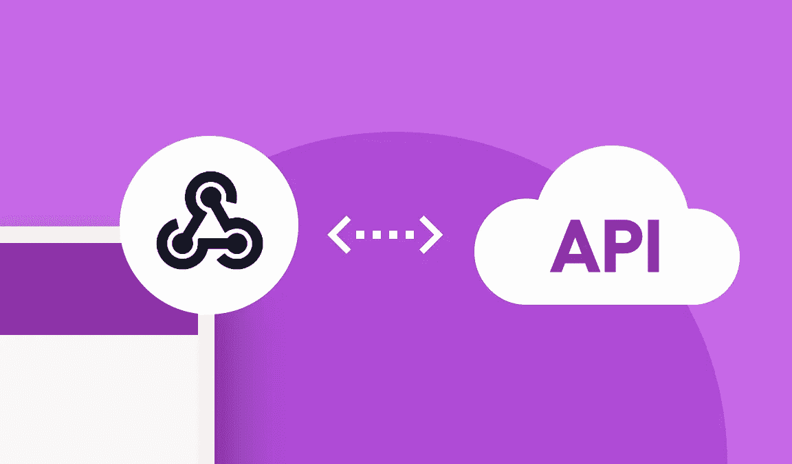
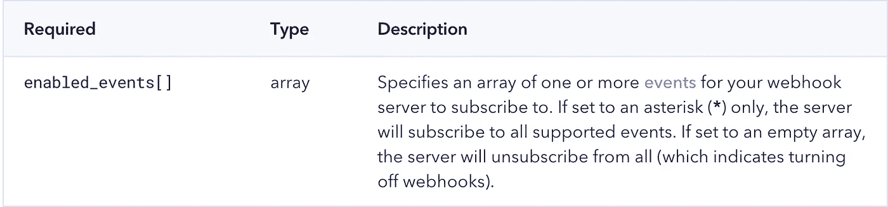
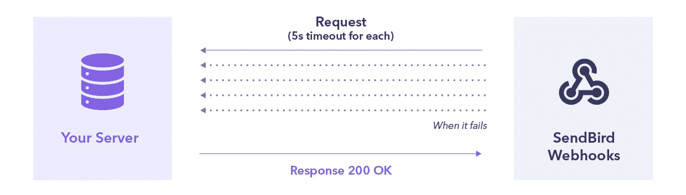
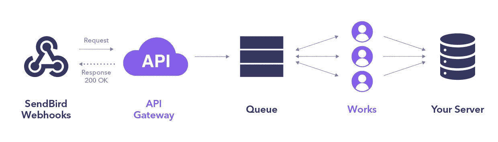

# 如何使用 webhooks 链接 API 服务和聊天事件

> 原文：<https://medium.com/codex/how-to-use-webhooks-to-link-api-services-with-chat-events-7854467628d5?source=collection_archive---------15----------------------->



仙鸟 2022

## 关于如何使用 webhooks 从你的聊天应用程序中触发实时动作的教程

由阿斯丁·崔
解决方案工程师| [森伯德](https://www.sendbird.com)

*您可能会发现参考* [*文档*](https://sendbird.com/docs/chat/v3/platform-api/guides/webhooks) *会有所帮助。您可能还想查看完全实现聊天的* [*演示*](https://sendbird.com/demos/in-app-chat) *。最后，别忘了查看一下* [*仙鸟聊天*](https://sendbird.com/features/chat-messaging) *的所有炫酷功能！*

# 介绍

使用 Sendbird Chat，您可以轻松地为您的应用程序设计、构建和定制完美的聊天消息解决方案。它安全、可靠且高度可扩展 Sendbird 平台 API 增加了服务器端的灵活性和功能。它非常容易接近，而且有[全面的文档](https://sendbird.com/docs/chat/v3/platform-api/getting-started/prepare-to-use-api)。要在应用程序中使用其他 API 服务构建响应性实时特性，首先需要启用 webhooks。在本文中，您将找到关于 webhooks 需要了解的一切，包括如何使用 Sendbird 构建对聊天事件的定制响应。

# 什么是 webhook？

webhook 用另一个 web 服务中的事件数据创建对一个服务器的 HTTP 回调。与轮询相比，webhooks 的效率要高得多，并且使您能够构建使用实时数据的特性。这是开发人员以编程方式创建 web 服务操作以响应另一个 web 服务上的事件的最佳方式。

# webhooks 如何支持定制实时特性和链接 API 服务

通常，开发人员会使用 webhooks 为支持 Sendbird 的应用程序中的事件创建一个定制的通知系统。

这里有一个例子。当有人在通道内发送消息时，您希望向通道成员发送通知。webhook 将通过发送一个包含消息和通道的特定数据的 HTTP POST，让您的服务器知道消息何时被发送到通道。如果收到消息的用户登录到您的应用程序，您现在可以触发推送通知来提醒他们该消息。如果收件人没有登录应用程序，无法接收推送，您可以使用 webhooks 来触发向某个电话号码、电子邮件地址或两者发送短信。

这是一个常见且重要的例子，因为不同行业的许多应用程序都需要通知用户新消息。使用案例包括:

*   医生、患者或医护人员在医疗保健应用程序中收到一条时间敏感的消息。
*   用户在按需应用程序中接收信息和更新。
*   用户需要在约会应用程序中看到新的匹配或消息。
*   用户表达了对产品的兴趣，并且卖方想要接收通知以联系市场中的买方。
*   用户向游戏应用中的频道发送关于 raid、公会或游戏事件的提醒。

webhooks 的其他用途包括触发支付 API、触发社交媒体或电子邮件 API 等等。

# 通过 Sendbird 使用 webhooks

在 Sendbird 中使用时，当 Sendbird 服务器上发生事件时，webhooks 会向您的服务器发送一个带有 JSON 有效负载的 HTTP POST 请求，例如:

*   用户在频道中“发送”、“删除”或“阅读”消息
*   一个用户“创建”或“离开”一个频道，或者“邀请”另一个用户进入一个频道
*   一个用户“阻止”或“解除阻止”另一个用户

请阅读我们平台 API [文档](https://docs.sendbird.com/platform/webhooks#3_webhook_events)中 Sendbird webhooks 支持的事件的完整列表。

# 如何为不同的事件启用 webhooks

通过为特定事件启用 webhooks，您可以控制收到的 HTTP 请求的数量和类型。

要启用 webhooks，请发出以下 HTTP 请求

```
PUT https://api-{application_id}.sendbird.com/v3/applications/settings/webhook
```

请求体只支持下面描述的属性 enabled_events[] **，**。



下面的请求体示例显示了用户打开 webhooks 来“创建”和“加入”频道(`group_channel:create`和`group_channel:join`)，以及“邀请”用户加入频道(`group_channel:invite`)。

如果成功，该请求将在响应正文中返回有关 webhook 配置的信息，如下所示。

要检索当前启用的 webhooks 列表，请使用以下请求:

```
GET [https://api-{application_id}.sendbird.com/v3/applications/settings/webhook](https://api-{application_id}.sendbird.com/v3/applications/settings/webhook)
```

# 正在验证来自 Sendbird 的 webhooks

验证未更改的 webhook 请求来自 Sendbird 对于维护安全性至关重要。因此，Sendbird 在 SHA-256 生成一个签名，并将其应用于 POST 请求正文和您的访问令牌。

来自 Sendbird 的每个 HTTP POST 请求将包含以下标头:

`x-signature`是一个关键特性，可以确保您收到的 HTTP POST 请求

1.  来自仙鸟
2.  未被第三方更改

`x-signature`将 SHA-256 应用于 POST 请求体和您的 API 令牌。要验证请求，请将 SHA-256 应用于请求体和 API 令牌。接下来，确认结果值等于`x-signature`。

# Sendbird 的 webhook 行为

有时，服务器不会收到请求。如果一个 webhook 请求失败，您可以预期 Sendbird 的 webhooks 会有以下行为。



*   每个请求的超时时间:5 秒
*   如果超时，Sendbird 会重试三次对服务器的请求
*   如果您的服务器不能在 15 秒内收到三次请求，它将不会收到请求

为了避免太多的请求，您应该实现您的端点，用 200 OK 响应立即响应服务器。

# 设置你的 webhook 架构

为了支持您的服务器的高流量(包括 webhook 请求)，我们建议您像下图这样设置您的架构。我们利用 AWS 技术堆栈(例如，API 网关)来创建高度可扩展的架构。



# 确保您的 webhook 端点满足这些要求

当您的 Sendbird 应用程序中发生特定事件时，Sendbird 将带有 JSON 有效负载的 HTTP POST 请求发送到您的 webhook 端点。您的 webhook 端点必须满足以下要求:

*   端点必须支持 HTTP/1.1 和保持活动状态。
*   端点必须响应 POST 请求。
*   端点必须解析 JSON 有效负载。

# 现有基础设施安全设置

如果您已经有了一个基础设施，并且您将在现有的基础设施中构建一个 webhook 接收服务，请考虑您当前基础设施的安全性和设置如何影响您从 Sendbird 接收 web hook 的能力。

例如:

*   防火墙可以阻止来自 Sendbird IP 地址的呼叫。
*   跨站点脚本可以检测用户生成的有效负载，并阻止 Sendbird webhooks。
*   带有 400 错误的不需要的/未使用的 webhooks，不会用 200 响应代码标记。

注意，如果返回 400 错误，Sendbird 将尝试自动重新发送通知。

# 用户“发送”消息时来自 Sendbird 的 webhook 请求示例

以下是发送到您的服务器的 webhook 通知的示例。当用户发送消息时，Sendbird webhooks 会发送这个通知。每当消息被发送到 Sendbird 客户端时，您可以使用 JSON 有效负载来实现其他服务器中的行为。

# 结论

由于 webhooks 的灵活性和强大功能，开发人员可以在他们的应用程序中实现新的定制功能，并将 Sendbird 平台 API 链接到许多其他 API 服务。

最终，webhooks 使得链接你的业务使用的所有 API 服务创造一些不可思议的体验成为可能。我们希望你能继续探索如何使用 webhooks 来引入你的用户会喜欢的特性。Sendbird 团队随时为您提供帮助。

开心聊楼！✌️

```
**Want to connect?**To be the first to know about new tutorials, developer-related chat/calls launches, and other important updates, [sign up](https://get.sendbird.com/dev-newsletter-subscription.html) for our developer newsletter.
```

# 资源

1.  [发送鸟文档](https://sendbird.com/docs/chat/v3/platform-api/guides/webhooks)
2.  [演示完全实现的应用内聊天](https://sendbird.com/demos/in-app-chat)
3.  [什么是 webhook](https://zapier.com/blog/what-are-webhooks/) ？作者:扎皮尔
4.  [API vs Webhooks](https://www.mparticle.com/blog/apis-vs-webhooks) 按文章
5.  [什么是 Webhook 以及如何使用它](https://www.geeksforgeeks.org/what-is-a-webhook-and-how-to-use-it/)