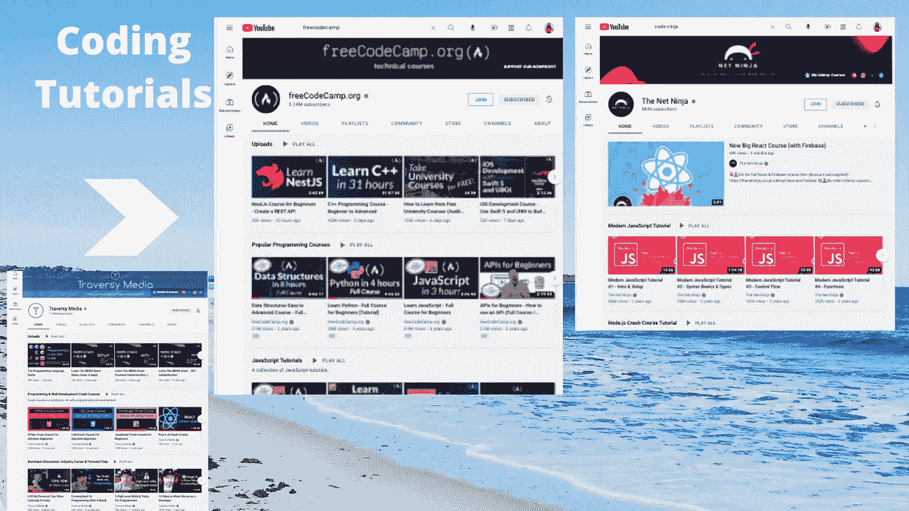

# 如何更好地利用编码教程，避免初学者陷入教程地狱

> 原文：<https://medium.com/codex/how-to-utilize-coding-tutorials-in-a-better-way-avoiding-tutorial-hell-as-a-beginner-4fb37e6f866?source=collection_archive---------6----------------------->

## 能够避免教程地狱将节省您的宝贵时间。

巧妙利用编码教程。截图来自网络。

编码教程很棒。当涉及到你观看他们的时间表时，他们是非常灵活的。所有的 YouTube 教程都是免费的。我也是通过跟随教程开始学习编码的。他们从…给了我很多帮助