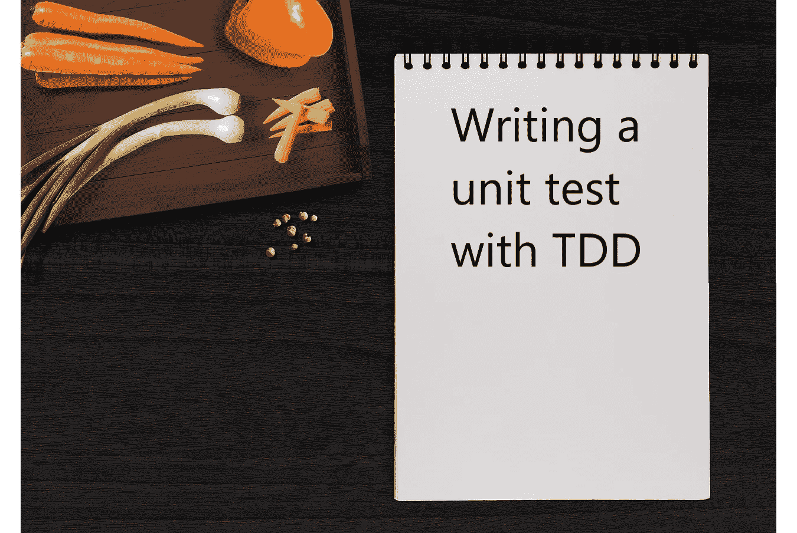

# 用 TDD 编写测试

> 原文：<https://medium.com/codex/how-to-write-a-test-using-tdd-b2828788d7ea?source=collection_archive---------1----------------------->

## [法典](http://medium.com/codex)

## 我看到一些人在努力编写单元测试。我记得前段时间的那种痛。这是我希望当时读过的文章。我将介绍一种编写单元测试的系统方法。

