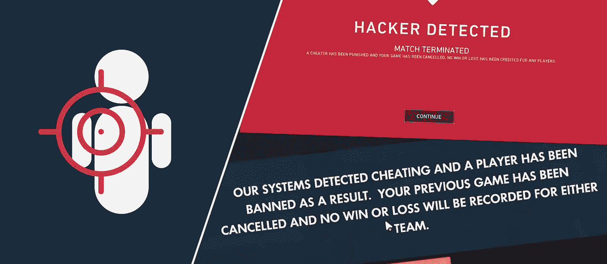
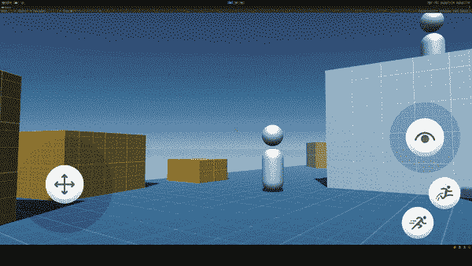
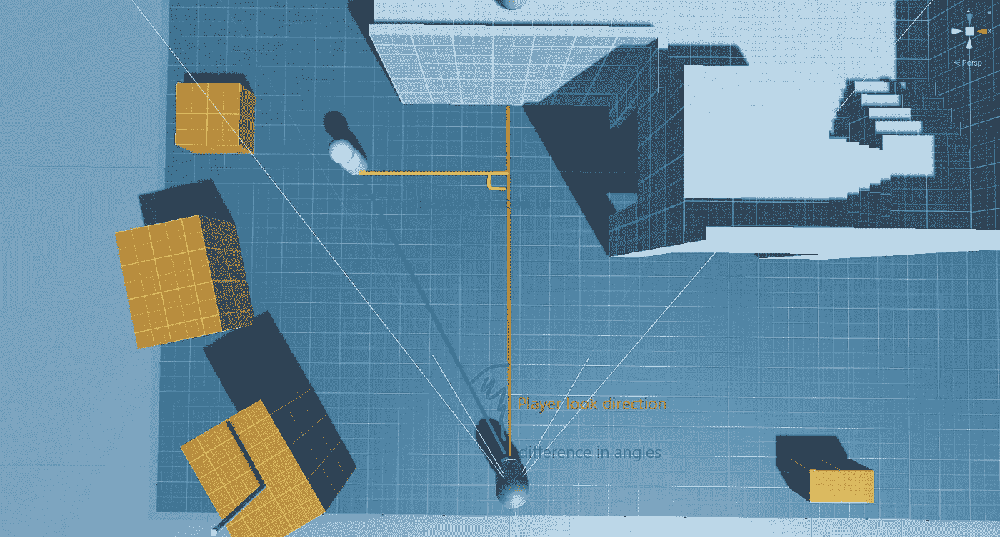
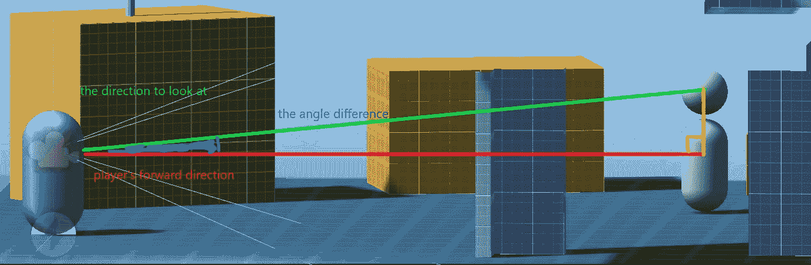
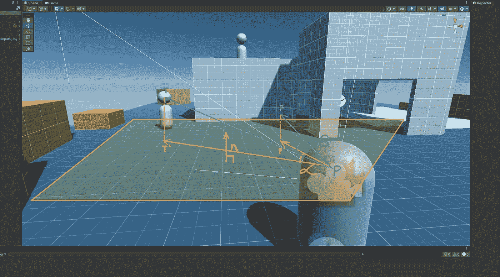

# 如何在 Unity 中编写 aimbot

> 原文：<https://medium.com/codex/how-to-write-an-aimbot-in-unity-b4aec0064889?source=collection_archive---------8----------------------->

如果你玩第一人称射击游戏，你很可能会遇到骗子，并想知道这样的骗子是如何制造的。在网络游戏中，作弊通过取消技能比赛来违背竞争力的本质，但在单人游戏中，精心实施的 aimbots 可以让玩家摆脱困境，并增强游戏的流动性。

在这个简单的教程中，我们将探索制作超越 Unity`transform.LookAt`的 aimbot 所需的数学和实现基础。在教程的最后，你将掌握在瞄准更具挑战性的平台上用瞄准机器人给你的玩家加电的基础知识。

> 在我的 [Github](https://github.com/agostonr/Aimbot-example) 上找到样本项目，或者如果你需要一个更加细致入微的 aim assist 解决方案，为你的项目提供类似于高端游戏的各种 Aim Assist，请查看我的资产 [Aim Assist Pro](https://assetstore.unity.com/packages/slug/226597) ！

我们*的目标是*实现如下目标:

Aimbot 在使用游戏手柄对付扫射目标时的动作

我用一个游戏手柄，只能左右扫射，我根本不调整我的样子。不过，aimbot 帮助我以更自然、更少机器人化的方式跟踪目标。

# 设置

为了帮助我们专注于编写与项目相关的代码，我使用了 Unity 的第一人称角色控制器作为基础。一个免费的资产，它为我们覆盖了移动和玩家输入，所以我们只需要编写 aimbot 本身。如果您想继续，将它添加到您的资产中，并导入到您的项目中。

在我们的例子中，我们将旋转播放器并改变 Cinemachine 摄像机的俯仰角度，以使播放器转动或向上看。

# 这个想法

要定义 aimbot，我们需要考虑以下几点:

> 发现目标后，在一定时间内将十字准线移动到某个点。

这使我们找到了解决以下问题的方法:

1.  *寻找目标启动 aimbot，但不要穿墙*
2.  *决定十字准线向哪个方向移动——向左或向右，向上或向下——移动到*
3.  *计算出每一帧要做多少调整*

幸运的是，Unity 已经为我们提供了 [SphereCast](https://docs.unity3d.com/ScriptReference/Physics.SphereCast.html) ，我们可以用它来确定 aimbot 的半径。如果它击中目标，我们就开始瞄准。

为了决定转向的方向，我们需要计算我们正在看的地方(玩家向前)和我们应该看的地方(目标的方向)之间的有符号的角度。我们需要分别对转弯和俯仰调整进行计算。

计算转弯角度

计算俯仰角

在单独的轴上，一旦我们找出期望的观察方向和我们当前的观察方向之间的差异，我们就知道将玩家转向哪个方向。在此之后，根据注视目标所需的时间和玩家到目标的距离，我们可以计算出一个角速度，该角速度使玩家在当前帧的时间内旋转。

# 实施

我们希望有如下内容:

我们的脚本需要玩家的第一人称相机，瞄准辅助半径和以秒为单位的旋转目标时间。
`TrackTarget`寻找并计算对一个目标一帧长时间的跟踪。它必须在每个玩家查看输入法调用后被控制器脚本调用。我们将返回以度为单位的俯仰增量和转弯增量的欧拉角——将这些分别添加到 Cinemachine 目标俯仰和玩家旋转将正确地对 aimbot 进行必要的外观调整。

第一步是射击`SphereCast`为我们找到一个 aimbot 攻击的目标。

用 SphereCast 寻找目标

我们把一个球体从相机投射到它的前进方向。如果我们没有发现任何东西或者我们发现的碰撞器不是敌人，返回 null，否则返回发现的目标的变换。

然后，我们需要计算每个轴的总角度。

计算独立轴上的旋转角度

这里需要对这些预测进行一些解释。我们投射到特定的平面( [*用它们的法向量*](https://en.wikipedia.org/wiki/Normal_(geometry)) 标记)来区分水平和垂直的观察轴。如果没有这个投影，Unity 的[sign angle](https://docs.unity3d.com/ScriptReference/Vector3.SignedAngle.html)会计算出一个对角线角度，这将导致抖动和不准确的旋转，除非水平或垂直方向上我们已经完美地看到了目标。

**PF** 矢量显示玩家的视线方向， **PT** 矢量显示从玩家到目标的方向，也就是我们应该看的方向。类似地，**PF’**表示投射到水平面的玩家的视线方向，**PT’**表示投射到水平面的目标方向。 **β** 表示未投影方向之间的角度，而 **α** 表示投影方向之间的角度——在这种情况下，它是水平轴上的角度，负责玩家的回合。

为了计算俯仰角，选择的投影平面是摄像机的右轴。

计算投影观察方向和目标方向之间的角度

计算出总旋转数后，我们需要计算在该帧中实际旋转的次数。

我们调整瞄准的时间，这样一个狭窄的瞄准机器人半径不会被踩得太快，同样，一个宽的也不会太慢。我们得到到目标的距离，然后根据我们离目标的距离计算角速度。的确:我们离得越近，aimbot 转弯的速度就越快，以满足时间标准；我们离得越远，它转弯的速度就越慢。我们把它转换成度数，然后除以时间，得到角速度。然后，我们选择最小的“帧下旋转”和所需的总旋转，否则当 aimbot 试图重新调整时，它将围绕目标的中心来回振荡。
最后，我们用 Unity 的`SignedAngle`乘以总角度计算得出的方向。

# 将 aimbot 集成到 Unity 的示例控制器中

aimbot 集成非常简单:

与示例代码处理播放器输入的方式类似，我们旋转播放器，然后设置并固定摄像机目标的俯仰，并将摄像机目标的局部旋转设置为该俯仰。

最终结果产生了您在教程开始时看到的结果，如 *gif* 所示。

如果你完成了数学和代码，恭喜你！希望你学到了有用的东西。当你路过我的社交网站时，一定要打个招呼，并与你的开发伙伴分享这篇文章。编码快乐！