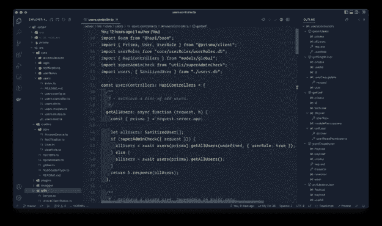

# 如何在 2023 年写出可维护的 JavaScript 代码

> 原文：<https://medium.com/codex/how-to-write-maintainable-javascript-code-in-2023-e389d4a8079f?source=collection_archive---------20----------------------->

2022 年，JavaScript 开发仍然混乱。这是因为计算机越来越快，我们可以为程序员写代码，而不是为机器写。JavaScript 的世界应该让程序员的事情变得更容易，而不是更难。为了方便程序员，我们需要一种标准的做事方式。我们需要能够共享代码，并且我们需要能够容易地找到和使用库。

