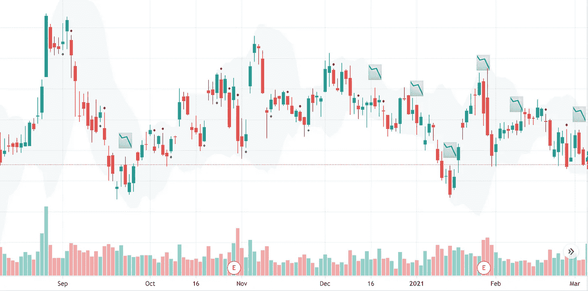

# 如何在 TradingView 中用 PineScript 编写自己的交易指标？

> 原文：<https://medium.com/codex/how-to-write-your-own-trading-indicators-with-pinescript-in-tradingview-b970285a95bc?source=collection_archive---------1----------------------->

## [法典](http://medium.com/codex)

## 价格和数量数据。趋势看涨还是看跌？交易你看到的。

图片来源:**自拍**

# **TradingView？**

TradingView 是一个平台，人们可以在这里发现投资想法，进行讨论、分享，并向众多参与者学习…