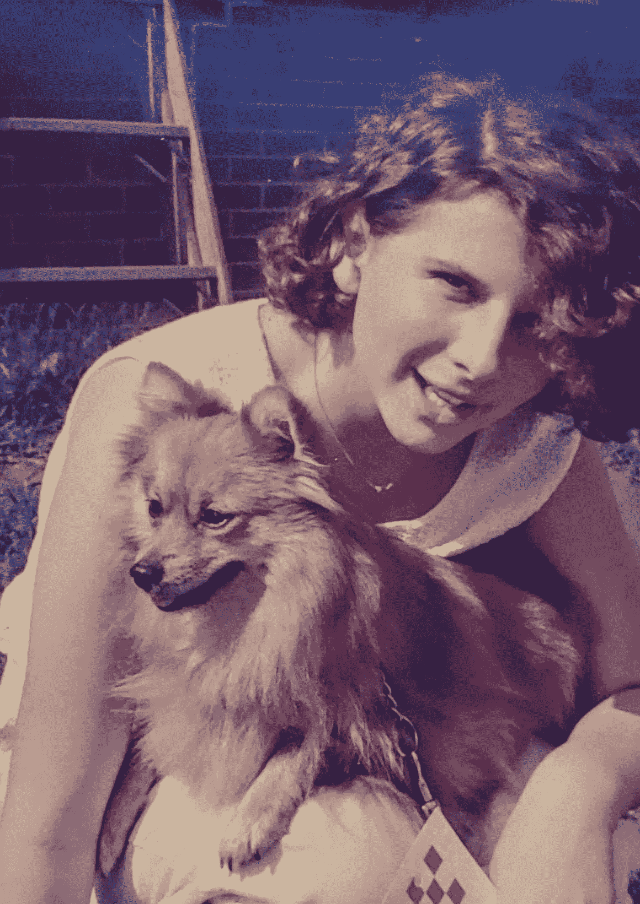

# 如何训练狗让我成为更好的前端领导

> 原文：<https://medium.com/codex/how-training-dogs-makes-me-a-better-front-end-lead-505d29603b54?source=collection_archive---------7----------------------->

## 行为合法

1986 年 4 月，我的第一只狗邦妮获得了她的伴侣犬顺从称号。查尔斯梅尔文布兰肯希普的照片。

*触发警告:包含行为心理学的讨论，我承认这项技术已经被一些人滥用。如果那是你，你可能想跳过这篇文章。*

从十五岁开始，我就断断续续地把训练狗作为一种爱好。在那段时间里，我变了很多，训狗也变了很多…