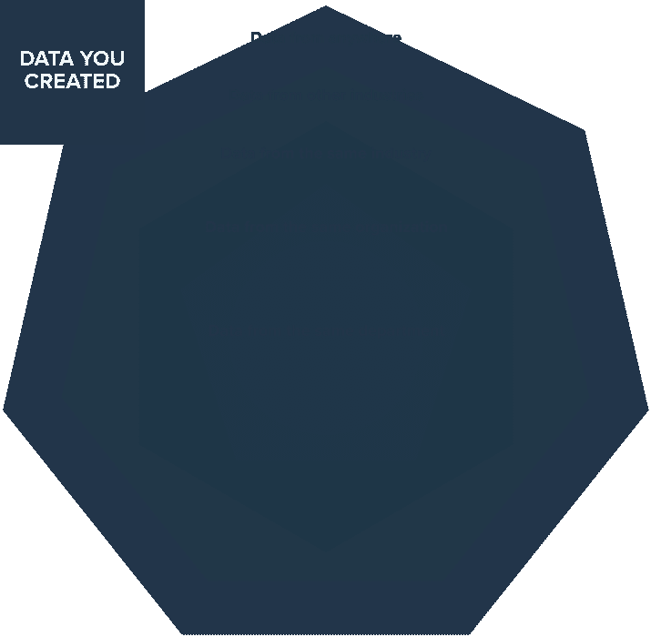
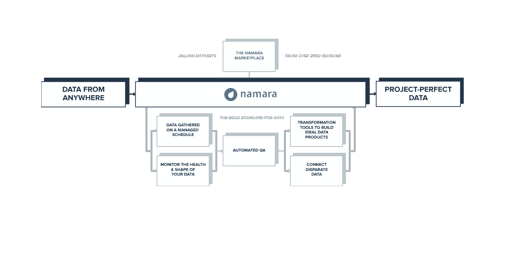

# 我们如何定义外部数据

> 原文：<https://medium.com/codex/how-we-define-external-data-8b82d4da47de?source=collection_archive---------18----------------------->

我们一直在谈论我们的产品，因为我们为合作组织提供的产品已经取得了令人难以置信的进步。从头到尾，我们正在改变 Namara 平台上的用户访问、丰富、管理和监控流经其环境的数据的方式。

但是底层的*东西*是什么呢？在高层次上，什么是外部数据，为什么它如此有价值？

## 什么是外部数据？

在我们看来，这并不像大多数人认为的那样容易确定。似乎在您的组织之外创建的任何东西都可以算作外部数据，对吗？但这有个问题。

问题是，您并没有将数据作为一个组织来使用—组织中的个人或不同的业务部门使用数据。也就是说，除非你的公司有全面完善的标准，否则一个人或一个部门构建数据的方式不会与另一个完全相同。人和机器记录标签、地址、企业名称、日期、描述以及数据集中可能发现的任何其他内容的方式有很大差异。

因此，如果有人查看来自同一家公司两个不同部门的两个数据集，他们会认为它们是由同一个人用同一种方法生成的吗？否则，第二个数据集必须像外部数据一样对待；它不遵循与原始数据集相同的约定、结构和规则。要让这两者和谐运行，还有很多工作要做。

你离本土数据越远，你的控制力就越小，变化的机会就越大。

考虑到所有这些，我们 ThinkData 认为，在你的四面墙之外创建的任何数据都是外部的(尽管我们在大多数人在家工作之前就提出了这一点，所以你必须给我们一点余地)。如果它不遵循直接命令规定的完全相同的标准和方法，它就是外部数据。

## 来自内部来源的外部数据

将一个组织的数据生态系统捆绑在一起，对于成为数据驱动型至关重要，对于 [**将您的数据战略与您的业务战略**](https://blog.thinkdataworks.com/adapt-or-die-why-your-business-strategy-is-failing-your-data-strategy) 保持一致也至关重要。对于您的团队来说，这也是最可预测的数据，通过协调努力，它可以完全在公司自身的控制之下。此外，通过能够在您自己的屋顶下分析所有数据，您将受益于更好的流程标准、对您的客户/客户群 更深入的 [**了解，并有望为**](https://blog.thinkdataworks.com/the-new-reality-data-or-bust) **[**围绕数据**](https://blog.thinkdataworks.com/data-management-buy-vs-build) 连接您的整个团队奠定基础。**

知道从哪里开始并不容易。事实上，我们已经初步了解了在贵公司内部进行数据审计的主题**，这是一个包含许多活动部分的过程——您不会听到我们有其他说法。但是建立基线是至关重要的:它为新数据树立了一个先例；它揭示了数据策略中的缺口和重叠之处；它还强制实施了一些机制来查看组织内每个部门之间的数据使用和移动情况。强大的东西。**

## **开放、公共和高级数据**

**即使你还没有完全解决“内部外部”数据的难题，任何想要的人都可以获得整个宇宙的数据。此外，有比使用您的高技能团队来设置和管理用于数据收集的单个脚本更好的方法，更不用说将它加载到您的系统并转换它以满足您所需的模式的准备工作了，所有这些都是您甚至可以开始使用它之前所必需的步骤。**

**政府、非政府组织、私营企业和特殊利益集团每天都会发布大量数据。这些数据需要 [**准备、清理和转换**](https://blog.thinkdataworks.com/the-difference-between-data-cleansing-and-data-enrichment) ，但是俗话说，“山中有金子！”从 ThinkData 工作的第一天起，我们就知道了这一点。我们的专长是将我们的用户与任何来源的任何数据联系起来。我们处理繁重的工作，以便您的数据团队更快地产生更好的见解。**

****

**正如我们最初建立的那样，这些第三方提供商是外部数据的来源，即使它可能不特定于您自己的内部数据，但它同样或更有价值。**

## **留意数据隧道愿景**

**如果不深入了解已知-未知、未知-已知等等的语义，使用过于集中、分割或具体的数据会有很大的风险。分析这种数据会产生扭曲的结果，并且很容易陷入只知道“已知的”知道这些很重要，但这只是全局的一个小角落。**

**当新冠肺炎来袭时，各地的公司都不得不花很长时间认真审视他们的**供应链，看看薄弱环节在哪里，然后努力调整和适应以保持业务连续性。没有整个生态系统的图片，就不可能了解外面还有什么。外部数据不仅提供了关于缺点在哪里的见解，还提供了机会在哪里的见解。****

****如果你的组织只关注你眼前的事情，你将永远无法真正预测，因为你永远不会看到不断发生的更广泛的市场变化。****

## ****为什么外部数据意味着更丰富的洞察力****

****在上述论点的另一面，挖掘更广泛的信号将扩大和增强你的洞察力，即使是在与更细粒度的数据进行比较时。通过将信息生态系统作为一个整体来看，分析师和数据科学家能够看到的不仅仅是结果，他们还能够找到趋势以及转变、收益、损失和变化的原因。这种更深入、更广泛的知识使组织能够进行预测，并获得竞争优势。****

****举个例子:我们需要房子的真实价值。我们可以查看历史销售价格，但那可能是多年前的事了。我们可以将这个价格乘以通货膨胀率和全国房价上涨系数，得到一个稍微接近但不完美的结果。当然，任何对房子和地面的翻新都应该考虑在内。但仅凭这些东西能给我们一个清晰的画面还是一个大概的猜测？****

****现在，让我们开始对外部数据进行分层:****

*   ****该地区的犯罪统计数据会告诉你这个地区的情况；****
*   ****人口统计数据可能表明，在不到 5 年的时间里，这个地区会有更多的房子出售；****
*   ****小范围内的建筑许可让你感受到周围环境的变化；****
*   ****如果可再生能源是一个因素的话，历史天气模式给出了太阳能电池板的生存能力；****
*   ****该地区的新住宅开发是未来 10 年人口和商业增长的指标；和****
*   ****该地区的企业破产可以告诉你该地区是繁荣还是衰退。****

****这要完整得多，尽管它不是关于那栋房子的信息。如果您已经找到了一种可扩展的方式来将这些外部数据融入您的生态系统，那么这些数据也可以立即得到利用。如果你没有，你将会局限于你已知的知识，并且会被那些行动更快、提供更好、更丰富见解的人超越。****

## ****对外部数据采取全新的方法****

****如果你想认真对待引入外部数据，就从正确的方式开始。拥有可扩展的方法来引入新的数据资产，找到可靠的合作伙伴和数据市场来发现新的来源，并确保您的整个组织能够围绕一个真实的数据来源进行协作和团结，即使不同的部门出于不同的目的使用它。****

****围绕数据资产集中团队对于成功至关重要-成为数据驱动型意味着您的业务围绕数据，而不是相反。****

****想了解有关协调业务和数据战略的更多信息吗？****

****[**向我们的数据专家之一请求咨询**](https://meetings.hubspot.com/eugene) 或 [**浏览**](https://marketplace.namara.io/) 解决方案就绪数据的最大目录，以确定 [**ThinkData 的技术**](https://www.thinkdataworks.com/products/namara) 如何推进您的项目。****

*****原载于*[*https://blog.thinkdataworks.com*](https://blog.thinkdataworks.com/how-we-define-external-data)*。*****