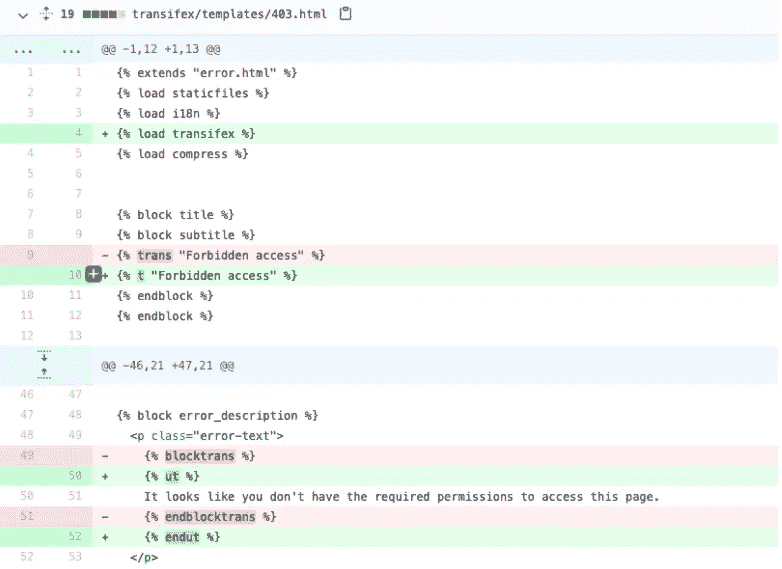

# 我们如何在两周内迁移到德克萨斯本地

> 原文：<https://medium.com/codex/how-we-migrated-to-tx-native-in-2-weeks-2c493c310b8a?source=collection_archive---------11----------------------->


回到 2020 年春天，Transifex 推出了 [Transifex Native](https://www.transifex.com/native/) 技术，这是一种现代化的端到端基于云的本地化解决方案，告别了产品开发期间管理本地化文件的繁琐流程。

然而，建立一个好的解决方案的最好方法是吃你自己的狗粮。毕竟，除非你首先让它为你工作，否则你怎么能指望它为你的客户工作呢？

Transifex 前端使用两种核心技术构建。一个使用服务器端 Django HTML 模板的传统前端和一个使用 webpack 和 React 的下一代堆栈，包括所有的附加功能。鉴于我们的 React 堆栈相当新，我们决定从一开始就使用[transi fex Native for Javascript](https://docs.transifex.com/javascript-sdk/quickstart-transifex-native-and-javascript)，并确保我们从第一个版本开始就使用本机无文件方法正确地本地化 React 页面。

然而，Django 是房间里的大象，将使用 [Django i18n](https://docs.djangoproject.com/en/1.11/topics/i18n/) 的数千个短语移植到 Transifex Native 似乎是一个需要解决的庞然大物。幸运的是， [Transifex Native Django SDK](https://docs.transifex.com/django-sdk/quickstart-1) 已经使用内置的迁移工具准备好了帮助迁移的工具。

```
*$ ./manage.py transifex migrate — path templates/*
```

该工具将解析 HTML 和。py 文件，检测 Django i18n 模板标签和 gettext 字符串，将它们转换为 ICU 消息格式的 Transifex 本机相关代码，包括复数。



为了认真对待迁移工作，我们指派了一个开发团队来完成迁移，并给他们集中时间来完成迁移。随着新技术的出现，以及新发布的 SDK 的边缘，我们的团队决定采取安全的方式来取得进展:

*   根据各种 Transifex 前端组件，例如团队页面、组织设置页面等，将工作分成多个迁移任务。
*   使用迁移工具自动迁移每个组件
*   创建一个拉请求并检查代码更改
*   在临时服务器上手动测试迁移的组件
*   释放并移动到下一个组件

这种方法在大约一个月的时间里效果很好。大约 10%的代码被成功迁移。然而，该团队必须平衡他们的时间与其他优先事项和客户要求，因此项目的终点线被推迟。

# 动作要快，打破东西要快，修好东西要快

几个月后，在一次管理会议上，产品团队提出了结束迁移工作并摆脱旧的基于文件的本地化堆栈的必要性。在讨论结束这个项目所需的努力时，我们的 CEO 提出了一个关于使用自动化迁移脚本的问题:“如果我们不信任我们自己的工具，我们如何期望我们的客户做到这一点？”

这是工程需要的推动力，让球滚动起来。毕竟，几个月后，解决方案已经成熟，它已经在生产中使用，并且所有已知的错误和问题都被解决了。

这一次我们决定迈出大胆的一步。将项目的范围限制在最多几个星期，并将遗留系统的剩余 90%一次性迁移到 Transifex Native。我们的安全带:每 10-15 分钟部署一次 Transifex 的能力，快速解决问题。

在几个小时内，我们对整个 Transifex Django 代码运行了迁移工具，产生了一个 pull 请求，对大约 350 个 HTML 文件和 4K 代码行进行了修改。

在做了一些本地测试并解决了一些问题后，我们希望在将这一巨大变化投入生产之前提高我们的信心水平。因此，在我们的军火库中，我们放入了以下内容，以确保正确的质量保证:

*   我们使用 Django 压缩器压缩静态资产，同时监控命令行错误。这帮助我们解决了几个问题。
*   创建了一个 python 脚本，可以读取所有 Django URLs，并从命令行向它们发出 HTTP 请求。我们监控 HTML 响应中的“HTTP 500”错误和“错误”文本，这是 Transifex Native SDK 无法呈现字符串时的默认显示。这缓解了一些与短语变量相关的问题。
*   通过抽样和快速扫描重要页面以发现可见错误，在临时服务器中进行手动测试。这修复了几个与错误转义包含 HTML 标签的字符串相关的问题。
*   Monitoring Sentry，我们用来捕获和报告代码缺陷的工具，用于 SDK 在发布到生产环境后抛出的错误。这导致在直播时修复了 2-3 个非关键性错误。

这一过程只持续了几天，并促成了一个超级顺利的发布。发现的缺陷占所有短语的大约 0.1%，只有大约 0.02%影响发布后的修复。不错吧？

通过利用快速部署和自动化，我们大胆相信自己的工具，将几个月的工作压缩到几天内。勇敢得到了回报，因为 Transifex 现在 100%使用 Transifex Native 本地化，这是一种幸福。

已经完成了代码方面的工作，现在需要的是转换心态和本地化速度，利用额外的工具！关于我们如何在 Transifex 中管理本地化过程的更多信息将在下一篇文章中发布。

[**本帖最初发表于此。**](https://www.transifex.com/blog/2021/how-we-migrated-to-tx-native-in-2-weeks/)