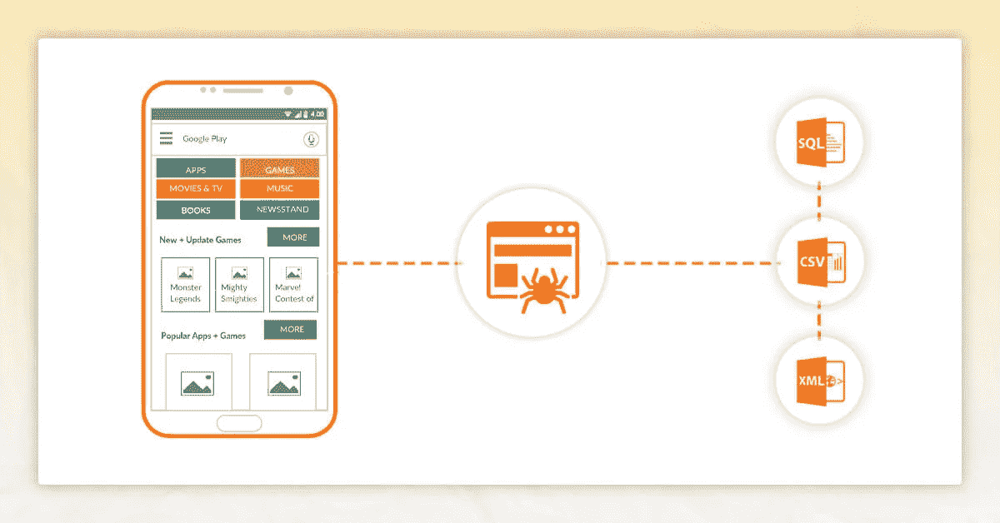
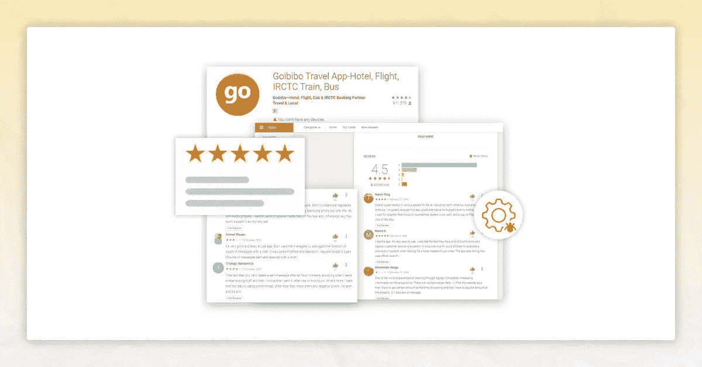

# 如何网页抓取是用来抓取谷歌 Play 商店数据？

> 原文：<https://medium.com/codex/how-web-scraping-is-used-to-scrape-google-play-store-data-36bafa8c2b61?source=collection_archive---------10----------------------->


应用程序增加了与世界的互动。购物、音乐、新闻和约会只是你在社交媒体上可以做的几件事。如果你能想到它，可能有一个应用程序。有些应用程序优于其他应用程序。你可以通过分析用户评论的语言来了解人们喜欢和不喜欢一个应用程序的什么。情感分析和主题建模是自然语言处理(NLP)的两个领域，可以帮助你做到这一点，但是如果你没有任何评论要检查的话就不行了！

在我们超越自己之前，你需要收集和保存一些评论。这篇博客将向您展示如何使用 Python 代码、google-play-scraper 和 PyMongo 包来做到这一点。你有几个选项来存储或保存你的刮掉的评论。

用于抓取谷歌 Play 商店的实时 API 由 google-play-scraper 提供。它可用于获得:

应用程序信息包括应用程序的标题和描述，以及价格、类型和当前版本。

**App 评测**

可以使用 app 函数检索 app 信息，使用 reviews 或 reviews_ all 函数获取评论。我们将简要介绍如何使用该应用程序，然后重点讨论如何充分利用评论。虽然评论在某些情况下很方便，但我们更喜欢使用评论。一旦我们到达那里，我们将用大量的代码解释为什么和如何。

# 从 Google-Play-Scraper 开始



**第一步:获取应用 id**

要抓取每个应用程序，你需要一条信息:应用程序的 ID 代码。这可以在谷歌 Play 商店的应用程序页面的 URL 上找到。您需要的组件就在“id=”后面，如下图所示。

在其他情况下，URL 以应用 ID 结束。在这种情况下，您只需要“id=" and "& "之间的部分。

你最近的工作将是收集心理健康、正念和自我保健的应用。在开发应用程序时，我们会在电子表格上记录大量不同的信息。这似乎是保存每个应用程序 ID 的合理位置。

**第二步:安装并导入**

在这里，我们将进口和什么是使用较早，包括 PyMongo。此外，最初您需要安装 MongoDB。安装社区版的指南将在[这里](https://docs.mongodb.com/manual/administration/install-community/)找到。

**为了能够导入以下各项，应根据需要安装 pip:**

```
import pandas as pd # for scraping app info and reviews from Google Play from google_play_scraper import app, Sort, reviews # for pretty printing data structures from pprint import pprint # for storing in MongoDB import pymongo from pymongo import MongoClient # for keeping track of timing import datetime as dt from tzlocal import get_localzone # for building in wait times import random import time
```

您还将安装 Mongo，为项目建立一个新的数据库，并添加新的集合(本质上是 MongoDB，相当于关系数据库的表)。您还将有一个应用程序信息集合和另一个应用程序评论集合。

```
## Set up Mongo client client = MongoClient(host='localhost', port=27017) ## Database for project app_proj_db = client['app_proj_db'] ## Set up new collection within project db for app info info_collection = app_proj_db['info_collection'] ## Set up new collection within project db for app reviews review_collection = app_proj_db['review_collection']
```

MongoDB 是一个懒惰的数据库和集合创建者。这意味着除非我们开始向集合中输入文档(MongoDB 相当于关系数据库表中的行)，否则这些特性都不会存在。

# 抓取应用程序数据


平台现在可以刮削了。我们需要的是应用程序 id 列表。你可以下载一份 csv 格式的电子表格，用 Pandas DataFrame 阅读。

```
## Read in file containing app names and IDs app_df = pd.read_csv('Data/app_ids.csv') app_df.head() ## Read in file containing app names and IDs app_df = pd.read_csv('Data/app_ids.csv') app_df.head()
```

我们可以简单地获取应用程序名称和 id 的列表，以便在抓取过程中进行循环:

```
## Get list of app names and app IDs app_names = list(app_df['app_name']) app_ids = list(app_df['android_appID'])
```

当我们收集评论时，我们将使用应用程序名称。我们所需要的是应用程序 id，以通过应用程序功能收集一般的应用程序信息。下面的代码遍历每个程序，从谷歌 Play 商店中抓取信息并保存在一个列表中。

```
## Loop through app IDs to get app info app_info = [] for i in app_ids: info = app(i) del info['comments'] app_info.append(info) ## Pretty print the data for the first app pprint(app_info[0])
```

最后一行提供了一个字典，里面有关于我们最初计划的各种细节。以下是该输出的简短版本:

```
{'adSupported': None, 'androidVersion': '4.1', 'androidVersionText': '4.1 and up', 'appId': 'com.aurahealth', 'containsAds': False, 'contentRating': 'Everyone', 'contentRatingDescription': None, 'currency': 'USD', 'description': '<b>Find peace everyday with Aura</b> - discover thousands of ' ... (truncated), 'descriptionHTML': '<b>Find peace everyday with Aura</b> - discover ' ... (truncated), 'developer': 'Aura Health - Mindfulness, Sleep, Meditations', 'developerAddress': '2 Embarcadero Center, Fl 8\nSan Francisco, CA 94111', 'developerEmail': 'hello@aurahealth.io', 'developerId': 'Aura+Health+-+Mindfulness,+Sleep,+Meditations', 'developerInternalID': '8194778368040078712', 'developerWebsite': 'http://www.aurahealth.io', 'editorsChoice': False, 'free': True, 'genre': 'Health & Fitness', ... }
```

让我们使用 PyMongo 的 insert many 方法将应用程序的详细信息安全地保存在我们的信息集合中。insert many 需要一个字典列表，这是我们刚刚创建的。

```
## Insert app details into info_collection info_collection.insert_many(app_info)
```

只要您想开始使用数据集，就可以用一行代码直接查询到数据帧！

```
## Query the collection and create DataFrame from the list of dicts info_df = pd.DataFrame(list(info_collection.find({}))) info_df.head()
```

# 抓取应用评论



使用 review 函数总比使用 reviews_all 要好。原因如下

*   如果你真的想要所有的评论，你仍然可以获得它们。
*   你可以把每个应用程序的过程分成几个部分，而不是一次做一个应用程序的所有事情。这是有益的，因为它为您提供了选择。您可以执行以下操作:
*   定期更新你获得了多少评论。
*   不要等到结束，在进行过程中保存收集到的数据。

# 剖析“评论”功能

reviews 函数返回两个变量。我们在第一个变量中寻找评论数据。第二个变量是一个信息令牌，如果我们希望获得的评论数超过计数，我们将需要它。

```
rvws, token = reviews( 'co.thefabulous.app', # app's ID, found in app's url lang='en', # defaults to 'en' country='us', # defaults to 'us' sort=Sort.NEWEST, # defaults to Sort.MOST_RELEVANT filter_score_with=5, # defaults to None (get all scores) count=100 # defaults to 100 # , continuation_token=token )
```

应用 ID 是你需要提供给评论的第一个参数。对评论进行分类有两种方式:最近的或者 Google Play 认为最相关的。您也可以根据分数过滤评论。

count 参数的主要目的是告诉函数在结束之前应该检索多少评论。以下摘自 google-play-scraper 文档:

“过高的计数会引起并发症。因为 Google Play 支持每页 200 条评论的限制，所以它被设计为按 200 条进行分页和重新搜索，直到结果数达到 count 为止。

* *作为题外话，将 count 设置为无穷大相当于将 reviews all 设置为无穷大，这在我看来有些过分。

在我看来，计数是思考和使用批量的更好方式。只需将评论的数量设置为 200，将评论和您的令牌一起返回，并在 reviews 函数的下一次迭代中使用您的令牌。

# 查看刮痧

让我们破解密码

*   通过遍历应用 id 列表来抓取 Google Play 评论。
*   定期将评论存储在 MongoDB 集合中。
*   打印有关刮擦操作的进度更新。

**步骤 1:设置回路**

你之前已经保存了我们的应用程序名称和 id 列表。抓取不一定需要应用程序名称列表。这背后是有原因的。在这段代码中，您将开始使用 loop 遍历我们所有的应用程序。请再次检查您的姓名和身份证列表是否相同。

```
## Loop through apps to get reviews for app_name, app_id in zip(app_names, app_ids): # Get start time start = dt.datetime.now(tz=get_localzone()) fmt= "%m/%d/%y - %T %p" # Print starting output for app print('---'*20) print('---'*20) print(f'***** {app_name} started at {start.strftime(fmt)}') print() # Empty list for storing reviews app_reviews = [] # Number of reviews to scrape per batch count = 200 # To keep track of how many batches have been completed batch_num = 0
```

**第二步:刮出第一批评论**

你需要给每本新得到的复习词典增加两个关键词。因为为每个评论收集的数据不会明确标识该评论是针对哪个应用程序的，所以附加这些标识符是有益的。一场潜在的危机已经避免了！

```
# Retrieve reviews (and continuation_token) with reviews function rvws, token = reviews( app_id, # found in app's url lang='en', # defaults to 'en' country='us', # defaults to 'us' sort=Sort.NEWEST, # start with most recent count=count # batch size ) # For each review obtained for r in rvws: r['app_name'] = app_name # add key for app's name r['app_id'] = app_id # add key for app's id # Add the list of review dicts to overall list app_reviews.extend(rvws) # Increase batch count by one batch_num +=1 print(f'Batch {batch_num} completed.') # Wait 1 to 5 seconds to start next batch time.sleep(random.randint(1,5))
```

**第三步:存储第一批的审核 id**

每篇评论都有独特的标识。我们需要在收集下一批评论之前保存这些评论，以便以后进行比较。

```
# Append review IDs to list prior to starting next batch pre_review_ids = [] for rvw in app_reviews: pre_review_ids.append(rvw['reviewId'])
```

**步骤 4:设置并循环最大批次数量**

在这里，我们已经收到了第一批评论的令牌，因此我们可以循环通过每批 200 个评论。我们将在下面的代码中使用 range(4999)将最大批次数设置为 5，000(我们已经获得了第一批)。这意味着我们将获得前一百万条评论，假设有的话。

```
# Loop through at most max number of batches for batch in range(4999): rvws, token = reviews( # store continuation_token app_id, lang='en', country='us', sort=Sort.NEWEST, count=count, # using token obtained from previous batch continuation_token=token ) # Append unique review IDs from current batch to new list new_review_ids = [] for r in rvws: new_review_ids.append(r['reviewId']) # And add keys for name and id to ea review dict r['app_name'] = app_name # add key for app's name r['app_id'] = app_id # add key for app's id # Add the list of review dicts to main app_reviews list app_reviews.extend(rvws) # Increase batch count by one batch_num +=1
```

**步骤 5:如果没有添加任何内容，则中断循环**

在抓取当前批次之前，您需要将审查 id 的集合与当前批次之后的审查 id 集合进行比较。如果两组长度相同，这意味着我们已经停止向数据库添加新的评论。结果就是你会中断循环，继续下一个 app。

```
# Break loop and stop scraping for current app if most recent batch # did not add any unique reviews all_review_ids = pre_review_ids + new_review_ids if len(set(pre_review_ids)) == len(set(all_review_ids)): print(f'No reviews left to scrape. Completed {batch_num} batches.\n') break # all_review_ids becomes pre_review_ids to check against # for next batch pre_review_ids = all_review_ids
```

如果长度不同，再刮一次。在开始下一批之前，您将把我们当前的所有审核 id 列表重新分配给 pre review ids 变量。

**步骤 6:保存数据并在每第 I 批后打印一次更新**

当你获得数万甚至数百万条评论时，获得事情进展的最新信息是一件美妙的事情。或许更重要的是，当你知道你的信息在旅行中被安全地保存时，你会感到很欣慰。每 100 批，下面的代码完成这两项。

```
# At every 100th batch if batch_num%100==0: # print update on number of batches print(f'Batch {batch_num} completed.') # insert reviews into collection review_collection.insert_many(app_reviews) # print update about num of reviews inserted store_time = dt.datetime.now(tz=get_localzone()) print(f""" Successfully inserted {len(app_reviews)} {app_name} reviews into collection at {store_time.strftime(fmt)}.\n """) # empty our list for next round of 100 batches app_reviews = [] # Wait 1 to 5 seconds to start next batch time.sleep(random.randint(1,5))
```

如果你正在寻找刮谷歌 Play 商店数据，联系网页屏幕刮今天！！！

*最初发表于*[*【https://www.webscreenscraping.com】*](https://www.webscreenscraping.com/how-web-scraping-is-used-to-scrape-google-play-store-data.php)*。*