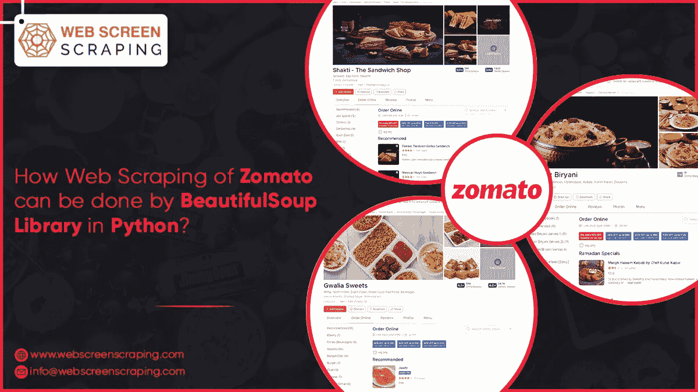
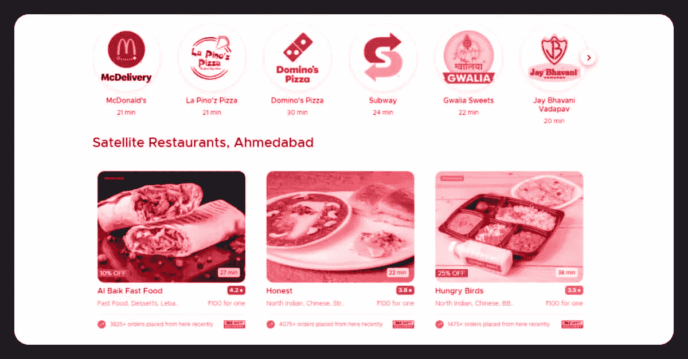

# 如何用 Python 中的 BeautifulSoup 库完成 Zomato 的网页抓取？

> 原文：<https://medium.com/codex/how-web-scraping-of-zomato-can-be-done-by-beautifulsoup-library-in-python-6f996a30fd0a?source=collection_archive---------19----------------------->



# 介绍

网页抓取，也称为数据抓取，是一种用于从不同网站收集信息的数据抽取。网络抓取软件使用网络浏览器或 HTTP 访问这些网站。软件用户手动执行网络抓取，但是网络抓取通常是由机器人或网络爬虫完成的自动过程。这是一种将网站和互联网上的特定数据复制并存储到本地数据集或电子表格中以供日后检索的过程。

在这里，我们将使用 [Zomato data scraper](https://www.webscreenscraping.com/scraping-zomato-restaurant-data.php) 来收集印度本加卢鲁最好的餐馆的信息。HTML 网页将用于访问和阅读信息。

# 抓取网站内容


在浏览器中键入网址，并发出 HTTP 请求来访问网页。如果请求成功完成，浏览器将显示网页，否则将显示错误。访问 Zomato 网页也需要同样的请求。

我们可用的一些工具帮助我们使用 Python 访问网页。

```
import requests from bs4 import BeautifulSoup
```

让我们在使用库之前了解它们的用途，以及访问网页的功能。

# 提出请求


它是为依赖这种语言的人而创造的。它消除了向 URL 手动添加查询字符串或加密帖子数据的需要。这些请求允许您使用 Python 发送 HTTP/1.1 的请求。您可以使用简单的 Python 库来添加诸如标题、多部分文件、表单数据和参数等内容。同样，可以检索 Python 的响应数据。

# 美丽组(BS4)


BeautifulSoup4 是一个 [Python](https://www.webscreenscraping.com/hire-python-developers.php) 的包，用于从 XML 和 HTML 文件中提取数据。它与您喜欢的解析器集成在一起，提供导航、搜索和修改解析树。对于程序员来说，节省几个小时甚至几天的努力是很正常的。

了解了工具之后，我们现在将尝试访问 Zomato 的网页。

Zomato 上最好的酒店的数据现在已经被放入变量中。然而，除了计算机科学家之外，它并不是人人可读的格式。让我们来看看刮出的数据的用途。

在这里，我们寻找餐馆的名称、地址和菜肴的种类。为了开始寻找所有这些特征，我们需要定位包含这些数据的 HTML 元素。

通过查看上面提到的 BeautifulSoup 资料，或者使用 Chrome 浏览器上的评论来检查哪个标签包含最佳餐厅的集合，以及包含更多信息的附加标签。

```
top_rest = soup.find_all("div",attrs={"class": "bb0 collections-grid col-l-16"}) list_tr = top_rest[0].find_all("div",attrs={"class": "col-s-8 col-l-1by3"})
```

前面的代码将查找任何带有 class="col-s-8 col-l-1by3 "的 div HTML 标记，并返回用于收集酒店列表的数据。我们需要使用一个循环来访问列表项，即每次访问一个餐馆信息，以便使用循环提取附加信息。

```
list_rest =[] for tr in list_tr: dataframe ={} dataframe["rest_name"] = (tr.find("div",attrs={"class": "res_title zblack bold nowrap"})).text.replace('\n', ' ') dataframe["rest_address"] = (tr.find("div",attrs={"class": "nowrap grey-text fontsize5 ttupper"})).text.replace('\n', ' ') dataframe["cuisine_type"] = (tr.find("div",attrs={"class":"nowrap grey-text"})).text.replace('\n', ' ') list_rest.append(dataframe) list_rest
```

前面代码中的 tr 变量保存了酒店的各种细节，比如酒店的名称、菜系、地址、价格、评论和菜单。每条信息都保存在其特定的标签中，可以通过查看称为每项数据的 tr 来识别。

在 HTML 中寻找标签之前，我们应该看看餐馆的菜单是如何出现在网站上的。



您可以在上面的图片中看到，抓取所需的数据以几种格式显示。回到 HTML 内容，我们发现数据保存在定义所用格式或字体的模块的 div 标记中。

开发数据框架是为了收集必要的信息。我们一个接一个地检查数据的每个细节，并将其保存在不同的 DataFrame 列中。因为 HTML 数据利用“n”来分割不能保存在 DataFrame 中的数据，所以我们必须使用一些字符串函数。因此，我们可以将“n”替换为“以防止任何空间问题。

从上述代码中获得的结果如下-


以可读格式保存数据


假设您需要将数据交付给一个不熟悉 Python 的人。他们不会理解任何信息。dataframe 数据将以 CSV 等可读格式保存。

```
import pandas df = pandas.DataFrame(list_rest) df.to_csv("zomato_res.csv",index=False)
```

上面的代码将生成 Zomato res CSV 文件。

# 结论

在这篇博客中，我们学习了从 Python 和 BeautifulSoup4 发出访问网页的请求，以便从可用内容中提取 HTML 数据。然后，将数据格式化为数据帧，并保存为 CSV 格式。

寻找网页抓取服务来抓取 Zomato 数据？立即联系 Web screen Scraping！请求报价！

*最初发表于*[*【https://www.webscreenscraping.com】*](https://www.webscreenscraping.com/how-web-scraping-of-zomato-can-be-done-by-beautifulsoup-library-in-python.php)*。*