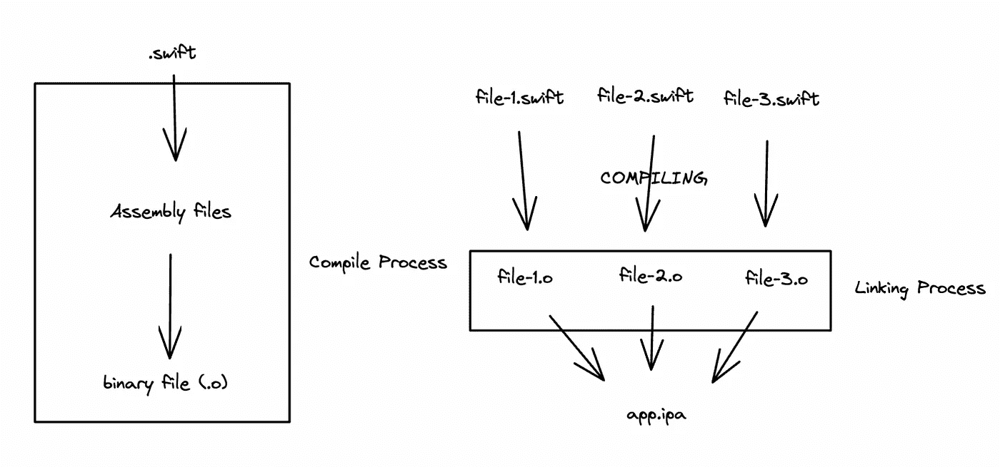
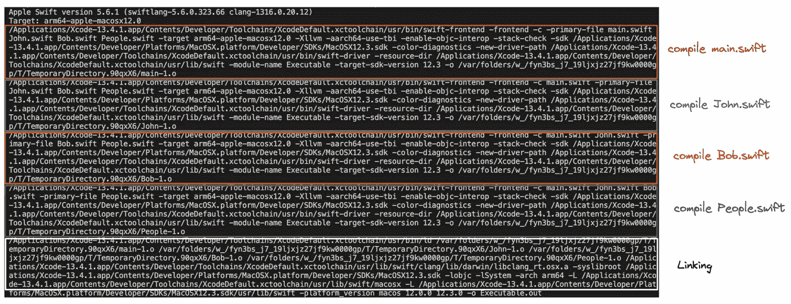

# 当我们构建 iOS 应用程序项目时，Xcode 是如何工作的

> 原文：<https://medium.com/codex/how-xcode-work-when-we-build-the-ios-app-project-95fe95f0b17?source=collection_archive---------4----------------------->


罗斯·斯奈登在 [Unsplash](https://unsplash.com?utm_source=medium&utm_medium=referral) 上的照片

你们中的许多人都熟悉 Xcode，通常，Xcode 被许多 iOS 开发人员用来开发一个 iOS 应用程序，但你是否一直想知道 Xcode 从我们的源代码到成为可执行的应用程序的过程是什么。ipa)？在这篇文章中，我将以简洁的方式向你解释 Xcode 如何处理我们的源代码，使之成为一些可执行的应用程序。

如果你查看 Xcode 中的`Show the report navigator`菜单，有一个过程叫做构建，如果你点击它，它会显示从`prepare build`到`build target of your project`的许多过程。在本文中，我将只解释构建目标过程的阶段，尤其是在称为编译和链接的过程中，因为如果您想从 Xcode 构建系统迁移到自己的构建系统中，这是一个非常基本的概念。

在我们开始解释编译和链接过程之前，通常编程语言有两种不同的类型，第一种是解释编程语言，第二种是编译编程语言。

解释编程语言的主要思想从字面上看是一种不进行编译过程的编程语言，然而，它进行解释或翻译该语言的过程。

通常解释型编程语言会复制用户将要运行的源代码。为了运行源代码，用户将需要解释器来翻译或解释代码。代码和解释器将同时运行。解释器的一个例子是网络浏览器。

解释程序语言的例子有 PHP、ruby、javascript 等。

编译编程语言的主要思想是将高级或人类可读的源代码翻译成机器代码的程序，它将作为可执行的应用程序由 CPU 运行。

编译编程语言的例子有 swift、objective c、java、c++等。

而且，因为 swift 是一种编译的编程语言，难怪在 Xcode 中，当我们构建 iOS 应用程序项目时，Xcode 将需要编译 Swift 源代码并将其链接到可执行的应用程序中，以便设备可以运行该应用程序。ipa)。

与其他编程语言一样，swift 具有与其他编程语言相同的编译器和链接器进程，但在 swift 中，它具有一些额外的进程，这就是为什么它使 swift 编译器进程比其他程序更复杂。我不会在这里讨论细节，因为这将需要一个漫长的阅读旅程来解释它。

所以基本上 swift 在编译过程中有两个维度，即前端和后端。

*   **前端:**在前端 swift 像其他常见的编程语言一样进行词法分析、解析和语义分析，例如在这个过程中，swift 代码将被词法分析作为文本和令牌，传递给解析器转换成程序的结构化表示。这个表示也将被传递给语义分析，之后它将被传递给后端流程。
*   **后端:** Swift 在后端做了一些非常聪明的事情来处理优化和代码生成阶段。Swift 编译器使用 LLVM 进行优化和二进制生成。当 Swift 代码以抽象语法树(AST)的形式被解析时，该语法树然后通过语义分析并被转换成 Swift 中间语言(SIL)。这段代码与 LLVM IR(中间表示)一起经过分析和优化。在这里 LLVM 把我们原来的 Swift 代码变成了汇编代码，最后以二进制文件结束，然后它会被链接成一个可执行的 app。

这是我为 swift 编译和链接流程创建的简明图表。



简而言之，我们的档案。swift 在 swift 编译过程中会被 LLVM 翻译成汇编文件，最后变成二进制文件(。o)，这是一个二进制文件，用于创建可执行的应用程序。以及如何从二进制文件创建可执行的 app？在这里，我们需要链接过程，所以基本上链接器是将一个或多个目标文件组合成一个二进制或可执行文件的计算机系统程序。想象一个拼图，在你看到拼图的图像之前，你需要把每一块组合到正确的地方，直到你看到一个完整的图像。在这种情况下，你作为组合拼图碎片的人，意味着你是链接者，拼图的每一个碎片都是目标文件。

我希望这个解释已经非常简洁地解释了 swift 编程语言中的编译和链接过程，现在让我们动手编译和链接我们的 swift 文件。

你可以试着按照下面的这些命令，在[这里](https://github.com/dannysantoso/ios-compiler-medium)使用示例代码进行编译和链接。

或者您可以为这个示例类创建一个单独的文件。

*   用下面的代码创建一个名为 Bob.swift 的文件。

*   使用以下代码创建一个名为 John.swift 的文件

*   使用以下代码创建一个名为 People.swift 的文件

*   使用以下代码创建一个名为 main.swift 的文件

在你创建了这些文件或者下载了我分享的源代码之后。现在让我们试着编译所有这些文件。您可以尝试使用以下命令:

```
swiftc main.swift John.swift Bob.swift People.swift -o Executable.out
```

在这个命令中，你将我们需要的所有文件 swift 写在里面，并在-o 后定义了可执行文件名，-o 在这里意味着输出。因此，在您运行这个命令之后，可执行的应用程序将被命名为 Executable.out。

如果您想知道这个编译背后的所有进程，您可以添加-v (verbose)来了解其中的进程。



如您所见，在第一行和第二行，编译器定义了要使用的架构目标和 swift 版本，之后，在我标记的红线中，它显示了终端显示编译 main.swift 的命令，在蓝线中显示了编译 John.swift 的命令，等等。直到我们有了所有的二进制文件，终端将显示链接所有这些二进制文件的命令。

不幸的是，通过使用这个命令，每次我们修改代码时，我们都需要重新编译所有这些文件。所以这就是为什么我们可以分开来把每个模块作为一个模块一个一个地编译，所以如果一个文件有任何变化，我们只编译变化文件所在的一个模块。

这也是为什么，当你有一个完整的 iOS 应用程序项目，其中有一个大文件，当你创建一个小的变化，将需要很长时间来编译。因为它将再次编译应用程序项目中的所有文件。解决方案是您需要将这些文件作为一个模块分开。

下面是一个例子，如果你想分开每次编译。

*   编译 People.swift

```
swiftc -c People.swift
```

因为 People file/class 根本没有任何依赖关系，所以我们可以直接使用这个命令。

*   编译 John.swift

```
swiftc -c John.swift People.swift -module-name MyApp
```

由于 John.swift 与 People.swift 有依赖关系，我们需要在命令中声明依赖文件，并将它们分组到一个模块中。

该命令中的顺序文件名很重要，第一个顺序是将被转换为目标文件的 swift 文件，其余的是文件依赖关系。

-module-name —是要构建的模块的名称，为了便于理解，您可以假设这是同一目录中的一组 swift 文件。

*   编译 Bob.swift

```
swiftc -c Bob.swift People.swift -module-name MyApp
```

与 John.swift 的编译过程相同，由于 Bob.swift 与 People.swift 有依赖关系，我们需要在命令中声明依赖文件，并将它们分组到一个模块中。

*   编译 main.swift

```
swiftc -c main.swift Bob.swift John.swift People.swift -module-name MyApp
```

因为在主类中初始化 John 和 Bob 类依赖于 People 类，对于这个例子，我们需要添加 John、Bob 和 People 类作为依赖来运行命令。

在你得到 4 个目标文件`main.o`、`John.o`、`Bob.o`和`People.o`后，我们需要将它们链接成一个可执行文件，因为我们还不能运行或看到程序。

要链接所有这些二进制文件，你可以使用`ld`或`swiftc`命令。

如果你想使用`ld`命令，它会更复杂，你可以看到上面图片中的链接器进程的例子，它使用`ld` 命令链接所有的二进制文件。在这里，我们需要从架构、工具链路径、swift 路径和 SDK 路径等多个方面进行声明。

下面是一个例子，说明如何使用`swiftc`命令将它们链接起来创建一个可执行的应用程序。

```
swiftc main.o People.o Bob.o John.o -o Executable.app
```

最后，`ld`和`swiftc`命令会生成与你在-o 参数后定义的名称相同的可执行 app。那就是`Executable.app`

这就是 Xcode 中的编译和链接过程，你可以用自己的构建系统来改进 Xcode 构建系统过程，也可以使用我将在下一个主题中讨论的 Bazel 构建系统或其他构建系统。

**参考文献:**

[苹果/Swift:Swift 编程语言(github.com)](https://github.com/apple/swift)

[swift 编译器简介(medium.com)](/xcblog/a-brief-overview-of-swift-compiler-7af0bd684718)