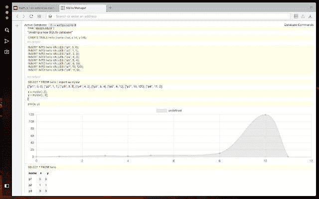

# 如何轻松对 Android 应用进行逆向工程

> 原文：<https://medium.com/codex/how-you-can-easily-reverse-engineer-android-apps-14005a9d3488?source=collection_archive---------4----------------------->

## 我反编译 Android 应用程序的简单方法。

图像[来源](https://chrome.google.com/webstore/detail/sqlite-manager/njognipnngillknkhikjecpnbkefclfe?hl=en)

我将专门讨论一个非常简单的技术，反编译安装(或不安装)在你的移动设备(手机、平板电脑等)上的 Android 应用程序。).

程序非常简单。我强调，我推荐这种做法只是为了学习…