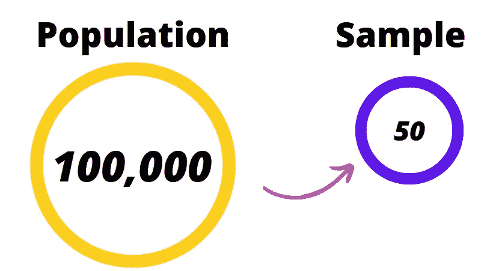

# 你对中心极限定理的不理解

> 原文：<https://medium.com/codex/how-you-can-understand-clt-d5d811a1c02a?source=collection_archive---------2----------------------->

作者图片

# 什么是 CLT？

**中心极限定理**指出:

> **样本均值**的**抽样分布**随着尺寸变大而趋近于**正态分布**，无论分布形状如何。

## 迷茫？

照片由 [charlesdeluvio](https://unsplash.com/@charlesdeluvio?utm_source=medium&utm_medium=referral) 在 [Unsplash](https://unsplash.com?utm_source=medium&utm_medium=referral) 上拍摄

让我们把它分解一下，假设我们有 **100，000** 名学生在一所特定的大学里。

我们有兴趣找出那所大学学生的平均身高。

作者图片

当然，我们不能测量所有学生的身高，然后求出平均值，那样做既费事又费力。

最明智的做法是随机抽取学生的身高样本，比如说 **50** 的学生，求平均值。

作者图片

我们将重复多次，当我们绘制样本平均值的直方图时，

我们将得到一个钟形直方图，如下所示。

作者图片

上面的直方图显示了 1000 个样本的数据，每个样本有 50 名学生。

取自计算了 **1000** 次平均值的总体。这导致 **6.0** 的平均高度具有最高频率。

重复实验 **500** 和 **50** 次，我们有这样的东西。

***试验次数= 500***

作者图片

***试验次数= 50***

作者形象

从直方图中你注意到了什么？

> ***试验次数决定了直方图的形状。***
> 
> ***试验次数越高，***
> 
> ***抽样分布越趋于正态分布。***

这就是**中心极限定理**的目的，

使用**样本手段**得到**正态分布**，

无论**人口分布**如何呈现。

# **关键要点:**

*   **人口** —这是从中选择样本的地方，在上面的例子中，人口规模是 **100，000**
*   **样本** —在本例中，这是从总体中抽取的一小部分，在本例中是 **50** 。
*   **样本平均值** —这是从总体中抽取的任何样本的平均值
*   **抽样分布** —这是**样本均值的直方图。**
*   **正态分布**——一个钟形直方图