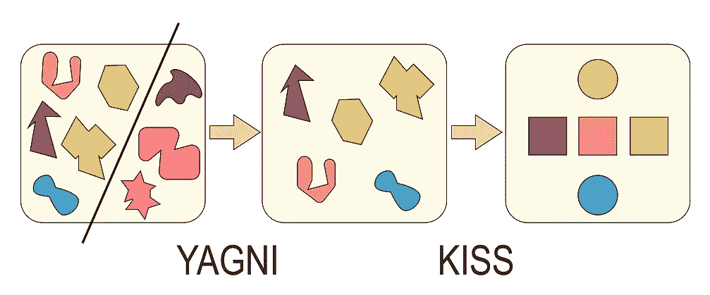

# 亲吻和 YAGNI 的区别很容易解释

> 原文：<https://medium.com/codex/how-you-wont-confuse-these-two-simple-principles-of-kiss-and-yagni-anymore-c3694ffdc42c?source=collection_archive---------16----------------------->

## *开发者经常混淆 KISS 和 YAGNI 的区别*

图片来自 [StackOverflow](https://stackoverflow.com/questions/25999724/whats-the-difference-between-principles-yagni-and-kiss)

KISS 代表*保持简单，愚蠢*但是有时候我也会读*保持简单，愚蠢*。

我把自己算在混球中。如果你写的代码不必要的复杂，过不了多久你就会像个白痴一样坐在自己的代码前。不…