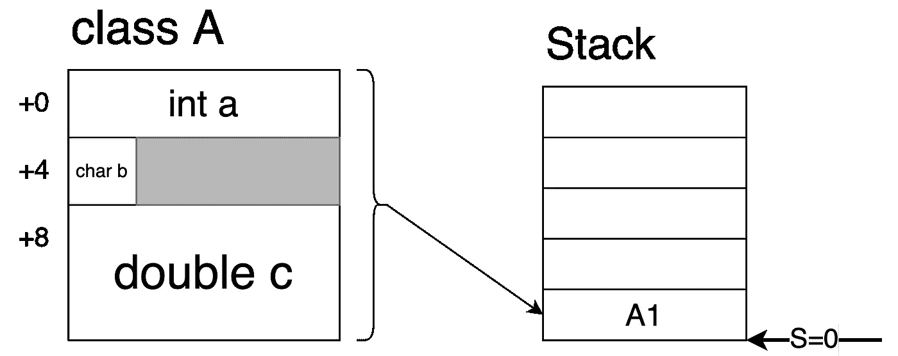
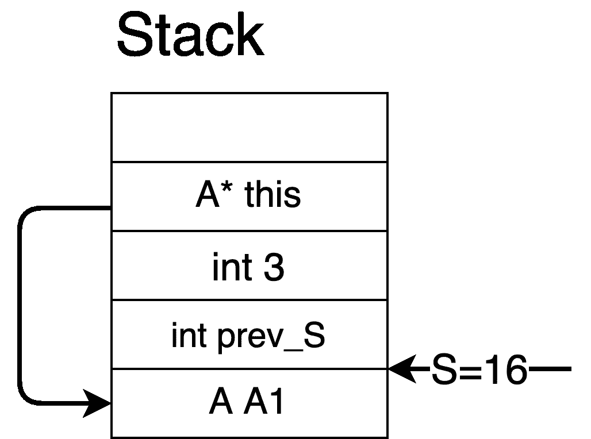

# 你的电脑到底是怎么运行 C++的？

> 原文：<https://medium.com/codex/how-your-computer-really-runs-c-1b58b993aa53?source=collection_archive---------8----------------------->


Alexandre Debiève 在 [Unsplash](https://unsplash.com?utm_source=medium&utm_medium=referral) 上的照片

让我们来谈谈实际执行简单 C++代码的所有复杂事情。我们将讨论内存、编译器、汇编代码等等，所以认真一点，让我们看看这是如何执行的。

```
struct A {
public:
  A(int _a, char _b, double _c): a(_a), b(_b), c(_c) {}
  int foo(int i);
  int a;
  char b;
  double c;
}int main(){
  A A1(1,'c',146.2);
  cout << A1.c;
  cout << A1.foo(3);
}
```

1.我们通过分配堆栈帧寄存器 S=0 来创建一个新的堆栈帧。

2.我们在堆栈上为 A1 分配了 16 个字节的内存。int 有 4 个字节，char 有 1 个字节，double 有 8 个字节。每个字段都需要按照其字段大小的倍数进行对齐。例如，int 只能在 4 的倍数的地址上定义。基本上，编译器优化了字段的对齐方式，以便可以通过一次读取将它们读入内存。电脑一次读入 32 或 64 位内存(取决于电脑的系统)，从 32 或 64 位地址的倍数开始，因此您可以通过对齐内存来节省额外的读取。如果这个概念不太熟悉，可以看看[https://fresh 2 refresh . com/c-programming/c-structure-padding/](https://fresh2refresh.com/c-programming/c-structure-padding/)。



3.在 S+0 上调用`A1`的构造函数，将分配的内存变成有用的位。在构造函数之前，内存只是垃圾。

4.对于`cout << A1.c`，存储器地址 S+8 从存储器中取出并存储在寄存器 r1 中。大会大概看起来像`READ S+8, r1`。所有的操作，包括加载和存储，都是通过寄存器来完成的。你不能只打印出内存 S+8，相反，你需要把它加载到一个寄存器中，然后打印出这个寄存器。

5.接下来，我们创建一个新的堆栈框架，这样我们就可以调用`foo`。我们通过在堆栈(prev_S)中保存当前的 S 并将 S 寄存器更新为 16 来实现这一点，因为我们当前已经在先前的堆栈中使用了 16 字节的内存来存储`A1`。

6.接下来，我们需要在堆栈上加载`foo`的参数。我们将常数 3 推送到堆栈上，`push S+0, $3`。

7.我们还需要将指向`A1`的指针推送到堆栈`push S+4, &A1`(在真实的汇编中，你需要将`&A1`的内存加载到一个寄存器中，然后将其推送到堆栈中)。如果`&A1`不是`foo`的参数，我们为什么要把它推到堆栈中？因为`foo`的实际指令在所有 A 对象之间共享，`foo`本身并不能访问调用它的特定 A 对象。所以，编译器会将`A1`对象的地址隐式传递给`foo`，这样`foo`就可以在这个特定的 A 对象上运行。这就是为什么我们在 C++类中有“This”指针。“this”指针隐式传递给所有方法，并隐式放在类中的每个字段访问或方法调用之前。



8.现在我们的堆栈框架和参数都设置好了，我们通过将程序计数器( [pc](https://whatis.techtarget.com/definition/program-counter#:~:text=A%20program%20counter%20is%20a,its%20stored%20value%20by%201.) )移动到`foo`指令的地址来调用`foo`。pc 是一个指向当前指令行的特殊寄存器。简单地将 pc 移动到开始位置`foo`会使计算机执行`foo`。

9.当`foo`结束时，它会将函数的返回值写入一个特殊的寄存器， [EAX](https://arvindsraj.wordpress.com/2013/01/12/x86-registers-register-conventions-and-calling-conventions/) 。此外，S 被设置为 prev_S=0，因为我们已经完成了`foo`函数。注意，栈上的东西实际上并没有被清除，而是 S，只是被移回到它之前的位置。

10.现在，我们`cout`走出 EAX。

11.我们的主堆栈即将结束，这将触发所有已创建对象的析构函数。调用`A1`的析构函数，程序退出。

我们完事了。请注意，为了避免冗余和避免一些复杂的组装，甚至本演练也掩盖了所发生的一些事情。我希望这能让你明白编译和执行 C++代码时到底发生了什么。