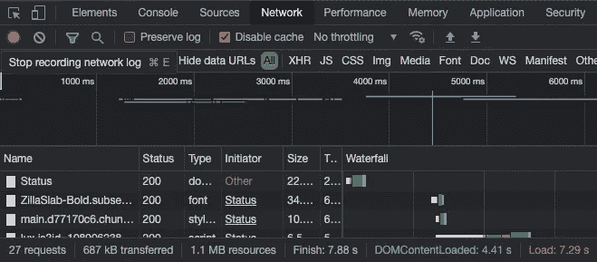

# HTTP 状态代码:类型和常见代码解释

> 原文：<https://medium.com/codex/http-status-codes-types-and-common-code-explanations-c6c02b95c631?source=collection_archive---------10----------------------->

自从您使用 web 浏览器以来，您就一直在接收 HTTP 状态代码(不管您是否知道)。它们会在您发出 HTTP 请求的任何时候发送给您。因此，基本上任何时候你请求访问任何 URL，点击浏览器中的链接，或者从 API 请求数据，你都会收到服务器返回的代码。您可能并不总是知道这个代码——除非您知道去哪里找，否则您通常甚至看不到状态代码！

## 如何查看状态代码

您可以通过打开浏览器开发工具的网络部分来查看 HTTP 状态代码。

Chrome 开发工具的网络标签

**Chrome:Mac**`command`+`option`+`i`+**Windows**`control`**+**`shift`+`j`

**火狐:Mac**`command`+`option`+`e`+**Windows**`control`**+**`shift`**+**`e`

**Safari:Mac**`command`+`option`+`e`

## HTTP 状态代码的类型

HTTP 状态代码是服务器在发出 HTTP 请求时发送给浏览器的 3 位数响应。有 5 种状态代码。每个类别的第一个状态代码从 100、200、300、400 和 500 开始。例如，所有 400 类别代码都被称为“客户端错误”。因此，状态代码 401、403 和常见的 404 代码都属于“客户端错误”类别。而且不用担心，每一类都不用背一百个代码！你可能会看到少数(63)种标准代码。让我们仔细看看这些类别:

**100 —信息响应:**HTTP 请求已收到，但进程尚未完成，仍在工作/进行中。这些代码是临时给出的，直到该过程完成，这将导致不同的代码被发送到浏览器。

**200 —成功响应:**HTTP 请求成功，客户端浏览器已收到服务器返回的预期数据。这些是您应该期望/希望看到的代码，以确保请求得到正确满足。

**300 —重定向:**您的浏览器已被重定向，必须采取额外的操作来完成请求。这意味着您请求的资源很可能已被移动，但您将被带到新的位置。重定向完成后，您应该会收到一个 200 状态代码。

**400 —客户端错误:**HTTP 请求有问题，没有完成。您的请求中存在语法错误*或*您试图访问的页面不可用(找不到页面或页面不存在)，请求无法实现。

**500 —服务器错误:**HTTP 请求是有效的，但是，在服务器端发生了一个错误，它阻止了请求的实现。(除非您控制了服务器，否则您对此错误无能为力！)

## 常见状态代码

**200:****OK**——最常见的，告诉你一切顺利的标准代码，嗯，“OK”。服务器满足了请求，响应被正确地返回到浏览器。通常在标准 GET 请求后收到。

**201: Created —** 请求被满足，结果创建了一个新资源。最常在 POST 或 PUT 请求后收到。

**204:无内容—** 请求已正确完成，但没有数据返回给浏览器。最常见的是在删除请求后收到。

**301:永久移动** —您正在访问的 URL 将您永久重定向到不同的资源。重定向还会将一些重要信息传递给搜索引擎，即使 URL 位于不同的位置。

找到了 —你正在访问的 URL 会暂时将你重定向到一个不同的资源。这意味着很快会有变化，因此不会向搜索引擎传递有用的信息。

**400:错误的请求** —服务器无法理解请求中的无效语法。

**401:未授权** —服务器需要验证，但请求中没有提供。一个例子是试图从一个 API 消费数据，但是遗漏了必需的惟一键。

**403:禁止的** —服务器收到一个有效的请求，但是客户端/用户没有访问数据的权限、帐户或权利。

404:找不到——最常见的错误！请求有效，但服务器找不到所请求的资源。

**410:消失** —请求被发送到失效的资源。它不再可用，也不会回来了。

**418:我是茶壶** —这是个笑话。但它是[真正的](https://developer.mozilla.org/en-US/docs/Web/HTTP/Status/418)。虽然没有以任何实际或有用的方式使用，但一些网站确实返回了这些代码，试图变得有趣。它被大多数浏览器忽略，因为它不是一个正式的状态码。

**451:因法律原因不可用** —服务器因法律原因禁止访问。可能是由于侵犯版权、政府审查或法院命令。是的，这是对雷·布雷德伯里的小说《华氏 451 度》的引用。

**500:内部服务器错误** —典型的服务器错误。不是请求有问题，而是服务器有问题。这是一个模糊的状态，除了问题是意外的之外，没有给出更多关于问题是什么的信息。

**502:错误网关** —这意味着接收请求的服务器正在充当上游另一个服务器的网关或代理，而上游服务器发回了无效响应。

**503:服务不可用** —通常是一种临时状态，表示服务器可能过载、停机维护等。不管是什么原因，它目前无法处理请求。

**504:网关超时** —与 502 错误类似，作为网关的服务器无法及时得到上游服务器的响应。

 [## HTTP 状态代码列表-维基百科

### 这是超文本传输协议(HTTP)响应状态代码的列表。状态代码由服务器在…

en.wikipedia.org](https://en.wikipedia.org/wiki/List_of_HTTP_status_codes)  [## HTTP 响应状态代码- HTTP | MDN

### 这个临时响应表明到目前为止一切正常，客户端应该继续请求，或者忽略…

developer.mozilla.org](https://developer.mozilla.org/en-US/docs/Web/HTTP/Status#information_responses)  [## HTTP 状态代码列表| HTTP 错误代码解释

### 每次在受监控设备上运行任务时，目标服务器都会返回 HTTP 状态代码，以指示…的状态

www.dotcom-monitor.com](https://www.dotcom-monitor.com/wiki/knowledge-base/http-status-codes-list/)  [## HTTP 状态代码:完整的指南和错误代码列表

### HTTP 状态代码就像来自服务器的短消息，被钉在网页上。他们实际上不是…

kinsta.com](https://kinsta.com/blog/http-status-codes/) 

[https://www . dot com-monitor . com/blog/2019/10/03/the-10-most-common-http-status-codes/](https://www.dotcom-monitor.com/blog/2019/10/03/the-10-most-common-http-status-codes/)

[https://umbraco.com/knowledge-base/http-status-codes/](https://umbraco.com/knowledge-base/http-status-codes/)