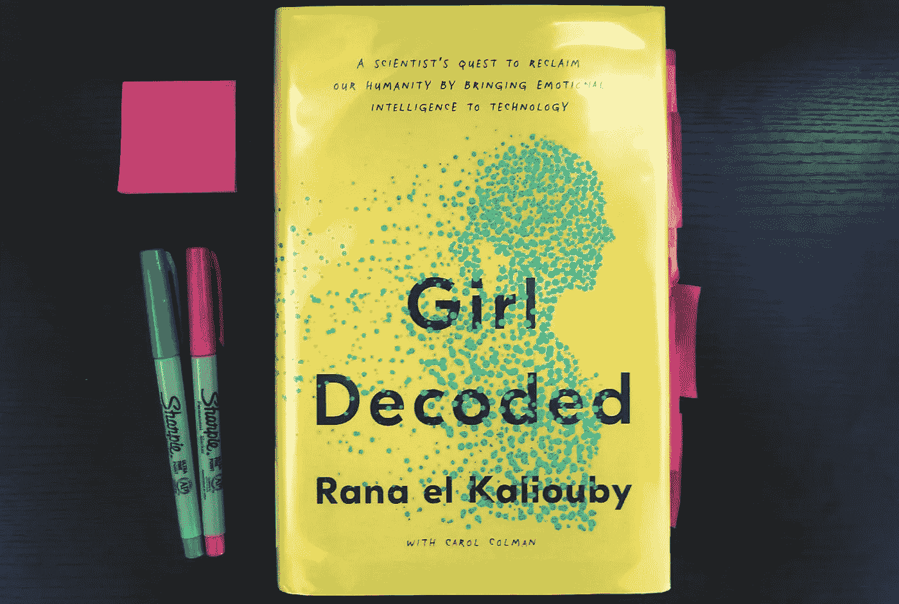
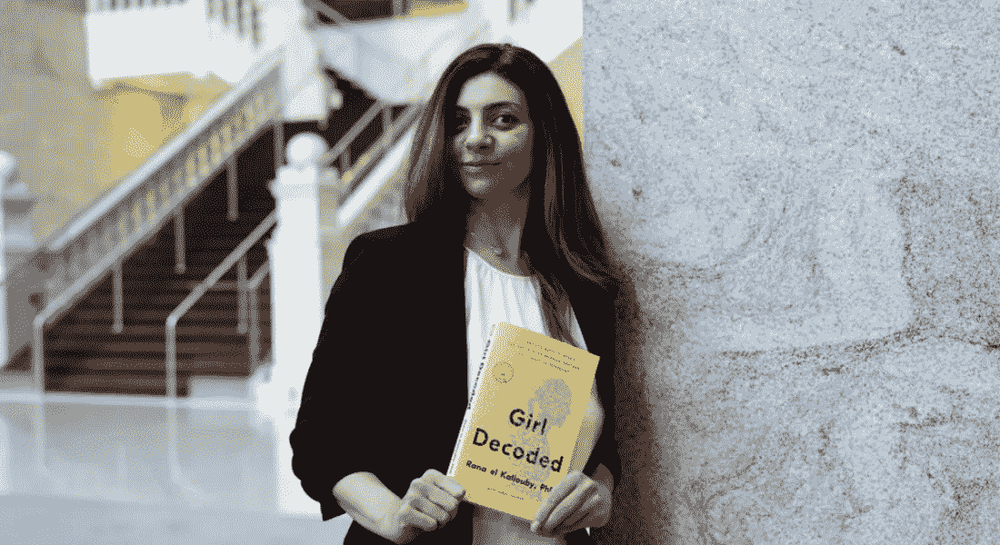

# 人造之前的人类——评拉纳·埃尔·卡里奥比的《被解码的女孩》

> 原文：<https://medium.com/codex/human-before-artificial-thoughts-on-rana-el-kalioubys-girl-decoded-ca192343a464?source=collection_archive---------4----------------------->

## [法典](http://medium.com/codex)

部分是回忆录，部分是科学发现杂志，[的拉纳·埃尔·卡利欧比](https://medium.com/u/b3f7a785d5e2?source=post_page-----ca192343a464--------------------------------)的书《[女孩解码:一位科学家通过将情商引入技术](https://ranaelkaliouby.com/girldecoded/)来重塑人类》详细描述了她作为一名年轻的计算机科学家的旅程，她希望在 21 世纪初将人类情感教授给计算机，当时这种事情被认为是不可能的。

照片由 Sumayah Abdulla 拍摄

我心中的 UXer 出于好奇选择了这本书，想对自己进行情商教育。我一开始没有意识到的是，作者作为一名阿拉伯裔美国人和穆斯林女性的背景，以及构成她身份的复杂文化世界之间的航行，会在多大程度上引起我的共鸣。

# 4 个外卖

随着这本书在 el Kaliouby 的生活中穿梭，四个教训一次又一次地出现在我面前。

图片 via [硅共和国](https://www.siliconrepublic.com/people/rana-el-kaliouby-affectiva-emotion-ai)

## **1。多样性带来新的&深刻的解决方案。**

在她的职业生涯开始时，el Kaliouby 将“e”字(情感)引入技术的想法遭到了质疑。她必须让强硬的观众相信她的想法是有效的，有价值的。在她职业生涯的后期，她描述了她在麻省理工学院和她的初创公司 [Affectiva](https://www.affectiva.com/) 所参与的多文化、跨学科团队，以及独特视角的团队如何带来能够服务于更多不同人群的弹性技术。正如越来越多的设计师所指出的，[无障碍设计改善了每个人的体验。正如她在书中所说，“在我们生命中的某个时刻，我们许多人都可以使用‘情感假肢’来帮助我们度过困难时期……”，无论我们面对的是暂时还是永久的损伤。](/design-bootcamp/why-accessibility-benefits-everyone-1703cba8a8b1)

> “我们的算法必须适用于各行各业、各种肤色、性别、年龄和种族的人。我们的算法必须用于帮助改善人类生活，解决一些长期存在的问题……为那些需求被忽视的人”(Girl Decoded，第 225 页)。

## **2。技术是不可知的。重要的是我们如何利用它。**

早期，Affectiva 收到了一个政府机构的提议，使用情感人工智能技术进行监控。另一方面，研究自闭症的人希望利用这项技术创造公平的竞争环境，让社交困难的人更容易沟通，营销机构希望利用这项技术更深入地了解客户的需求。El Kaliouby 选择只参与她的技术的伦理应用，尽管最初在这些类型的交易中赚的钱较少。技术被用来干预选举，T2 在社交媒体上宣扬偏见。同时，它还被用于[识别帕金森和其他神经系统疾病的早期迹象](https://www.michaeljfox.org/researcher/erin-smith)、[帮助自闭症患者学习解读社会暗示](https://brain-power.com/company/)等等。作为创造者和消费者，选择技术的道德用途取决于你和我。

> “今天，消费者有能力支持‘道德采购’和‘可持续’产品……那么，为什么不在遵循道德和可持续实践的公司名单中增加另一个行业呢？伦理技术》(女孩解码，第 304 页)。

## **3。“人类先于人工”。**

在 2015 年的 TED 演讲中，el Kaliouby 分享了她的重点是将情感带入技术，接受技术已经成为我们日常生活的一部分这一事实。她的使命是“在科技使我们失去人性之前使科技人性化”。使用 Baron-Cohen 的 412 种情绪作为基础，el Kaliouby 训练她的算法通过缩小到六种精神状态来识别情绪:同意、专注、不同意、兴趣、思考和不确定，她将其描述为情商的“基础”。

> “[Emotion-AI]并没有拿走我们的其他优势，而是增加了我们的能力”(Girl Decoded，第 102 页)。

## **4。当你为正确的理由做事时，好事就会随之而来。**

当 el Kaliouby 和联合创始人 [Roz Picard](https://web.media.mit.edu/~picard/) 收到政府情报机构 4000 万美元的投资提议时，很难拒绝，但他们选择坚持自己的核心价值观。在该公司现金耗尽的七天前，他们不确定是否能够为员工开具下一张工资支票，一位支持 Affectiva 尊重用户隐私的客户签署了一项 700 万美元的投资。

> “没有四千万那么多，但足以给我们提供我们需要的额外跑道。更重要的是，我们将与我们热爱的、与我们的使命和核心价值观一致的合作伙伴一起工作”(Girl Decoded，第 184 页)。

在不止一个场合，el Kaliouby 支持强大的道德和创造尊重人的技术的使命，即使回报不是立即显而易见的。她的行为是一个鼓舞人心的例子，体现了伊斯兰教所强调的观点，先知穆罕默德的*圣训*(讲述的传统)解释了这一观点，愿真主保佑他。

> 的确，你绝不会为了真主而留下任何东西，但真主会用更好的东西来代替它。

# 结束语

除了她对人性化技术的令人信服的论点，el Kaliouby 对她生活的开放给这本书增加了更深的层次，并进一步说明了拥抱情感的价值。

> “当我第一次开始写 *Girl Decoded* 的时候，我的目标是传播以人类为中心的技术，推动人工智能行业的发展。但是，当我反思我使技术人性化的道路时，我意识到我的职业使命与我自己的个人旅程如此紧密地联系在一起，我有一个关于坚持不懈和拥抱你的情感的更普遍的故事要分享”——Rana El Kaliouby，在与 Andrew Sears 的采访中。

作为第二代阿拉伯裔美国人，同时也是一名虔诚的穆斯林，我很高兴她决定将自己的个人生活旅程和情感纳入书中，而不是仅仅关注她的科学成就。这个决定让我真正与她建立了联系，我相信很多人在读完这本书后也会有同样的感受。

虽然我并不了解她的所有经历，但她面临的许多挑战是，在努力克服文化耻辱的同时，平衡她热爱的阿拉伯根源。

El Kaliouby 充满情感的真实故事填补了科技行业急需的空白。她是所有女性的灵感和榜样，同时也为阿拉伯和穆斯林女性提供了表达和空间，让她们感到被倾听和被理解，并安慰我们在旅途中并不孤单。

感谢 [Rana el Kaliouby](https://medium.com/u/b3f7a785d5e2?source=post_page-----ca192343a464--------------------------------) 的无畏和分享你的故事。

**TLDR；**如果你对情商、善用技术和鼓舞人心的故事感兴趣，不妨读读 [Girl Decoded](https://ranaelkaliouby.com/girldecoded/) 。你不会后悔的。

敬请关注更多关于技术、设计和 UX 的帖子！