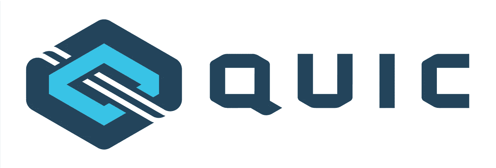

# 人权——QUIC！

> 原文：<https://medium.com/codex/human-rights-quic-3c6ddd33aefe?source=collection_archive---------11----------------------->

## 互联网的新传输协议(QUIC)将如何改变所有用户的数字和人权

随着新传输协议[**QUIC**](https://datatracker.ietf.org/wg/quic/documents/)**——**或快速 UDP 互联网连接的提供，IETF 推进了互联网的未来健康发展。QUIC 将开创一个包传输效率、延迟/抗丢失和强大安全实践的新时代(感谢 [TLS 1.3](https://datatracker.ietf.org/doc/html/rfc8446) ！)遍及全球互联网。

QUIC 于 2010 年初由 Google 开发，是建立在 UDP 之上的新传输协议(传统上仅用于发送视频和流媒体内容)。QUIC 是由鲍勃·卡恩和温顿·瑟夫在 70 年代早期开发的原始互联网传输协议 TCP/IP 的演进。在过去的五年中，QUIC 的采用动摇了 IETF 和互联网基础设施社区。

QUIC 已经被普遍接受，并且在一些最大的内容传输网络上经过了技术上的考验。基于这些[的结果](https://www.chromium.org/quic)，它似乎准备好了为全球舞台增色。这对世界各地的互联网用户来说都是积极的，理应庆祝。

然而，很少有人问这些技术进步对互联网上最终用户的数字权利意味着什么。此外，这种新的基础设施是否会极大地影响那些已经处于边缘的用户的生活。

我将研究 QUIC IETF 提案审查流程的一个要素，特别是哈佛大学和阿姆斯特丹大学的研究人员在 2019 年 4 月进行并报告的人权审查。这项审查是通过查看 IETF 文档草案和 QUIC 提案时间表进行的。尽管 IETF 提案，特别是已发布的 RFC，通常会积压在互联网和市政基础设施社区的知识中，但对一些有史以来最大的结构工程问题的审核和问责流程有更广泛的公众理解仍然至关重要。

**重要的一点是，像 QUIC 这样的全球互联网工程项目已经一次又一次地证明，在互联网的“堆栈”上构建任何东西都需要可靠的方法、协议和多利益主体审核流程，以公平地考虑所有互联网最终用户类型的需求。**

以下是从[人权报告中摘录的一些额外内容。](https://datatracker.ietf.org/doc/html/draft-martini-hrpc-quichr-00)

# 好人

零往返时间:

*   可以说，对所有最终用户的权利来说，QUIC 上传输速度的提高将使现有连接的往返时间为零，而首次多跳连接的运行时间仅为几毫秒。这将有望为所有人带来更好更快的互联网。从报告显示的数据来看([https://blog . chromium . org/2015/04/a-quic-update-on-Googles-experimental . html](https://blog.chromium.org/2015/04/a-quic-update-on-googles-experimental.html))，速度在全球范围内最多提升 8%。

内容不可知论/抵制审查:

*   2010 年，ISP 层面和网络层面的干扰和[审查](https://www.hrw.org/news/2020/06/18/russia-growing-internet-isolation-control-censorship)愈演愈烈。这些对全球数字和人权的攻击也发生在动荡时期(甚至在叙利亚的学生测试周期间)国有化的电信公司关闭网络和 DNS 解析器。虽然 QUIC 不能改变这些情况下的结果，但它确实提供了更多的保护措施，防止通过传输级的中间体进行审查和篡改。

安全(TLS 1.3):

*   2018 年新 TLS 协议(1.3)的加入为 QUIC 协议创造了一个非常需要的亲隐私维度。IETF 一直是加密的盟友，使加密成为 QUIC 的默认设置。这是针对最近的中间件攻击或中间人(DNS 级别欺骗)入侵，向互联网终端用户的安全迈出的一大步。

# 坏事

大科技“偏袒”(整合？s):

*   由于 QUIC 的起源故事是众所周知的，除了前面提到的或在人权报告中提到的，我就不再赘述了。我要说的是，当全球最大的互联网公司(在阅读本文时，这种情况可能会改变)引领互联网传输协议发展的未来时，人们会有所警惕。与 TCP/IP 的起源不同，它也对 ARPANET(美国海军)的资助者的潜在腐败开放，世界上最大的网络爬虫是该提议的起源，这令人不安。该报道有一段隐晦地标题为，“**隐私、权力与巩固”(** [**4.15.3**](https://datatracker.ietf.org/doc/html/draft-martini-hrpc-quichr-00#section-4.15.3) **)。虽然这一部分的标题是不祥的，但报告发现了潜在影响或长期违规行为的不确定证据。该报告指出:“另一方面，这使得不同类型的流量集中在一个端点，从而使服务提供商能够访问更多类别的隐私敏感信息。在当前的互联网现实中，最大的主机被大型的、联合的跨国公司所控制。这在终端用户与服务提供商和内容运营商之间造成了极大的权力差异”([**draft-martini-hrpc-quichr-00，4.15.3**](https://datatracker.ietf.org/doc/html/draft-martini-hrpc-quichr-00#section-4.15.3) **)。只有时间能证明这是否会带来意想不到的影响。这肯定是未来需要关注的一个领域。****

# **中间者**

自旋钻头“争议”:

*   QUIC 开发过程中的一个主要争论是关于包含一个单独的附加位([是的，只有一位](https://blog.apnic.net/2018/03/28/just-one-quic-bit/))。虽然对大多数人来说似乎无关紧要，但被审查的 QUIC 协议的起草者已经开发了一种实验性方法，该方法使用额外的比特作为旋转比特，作为增强隐私的机制。虽然自旋位的加入并没有使它成为最终的 QUIC 草案，但自旋位肯定会成为一致设计质疑的一个例子。在我看来，这预示着对这一议定书的审查将会很顺利。

**参考文献:**

 [## 草稿-martini-hrpc-quichr-00

### 人权议定书考虑研究小组 B. Martini 互联网-草案哈佛肯尼迪学院打算的地位…

datatracker.ietf.org](https://datatracker.ietf.org/doc/html/draft-martini-hrpc-quichr-00) 

[https://blog.apnic.net/2018/03/28/just-one-quic-bit/](https://blog.apnic.net/2018/03/28/just-one-quic-bit/)