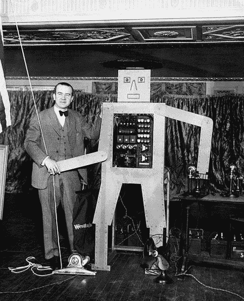
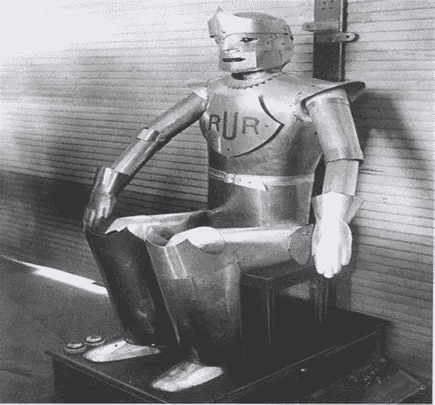
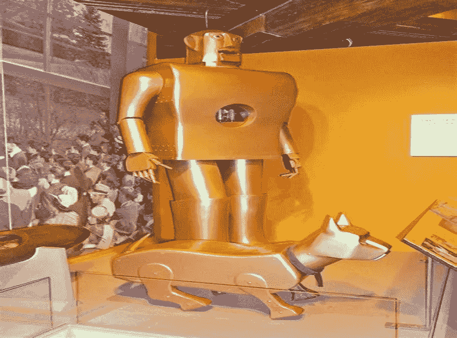
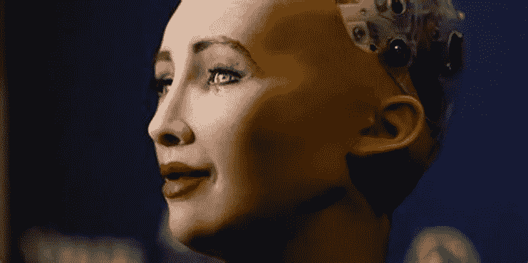
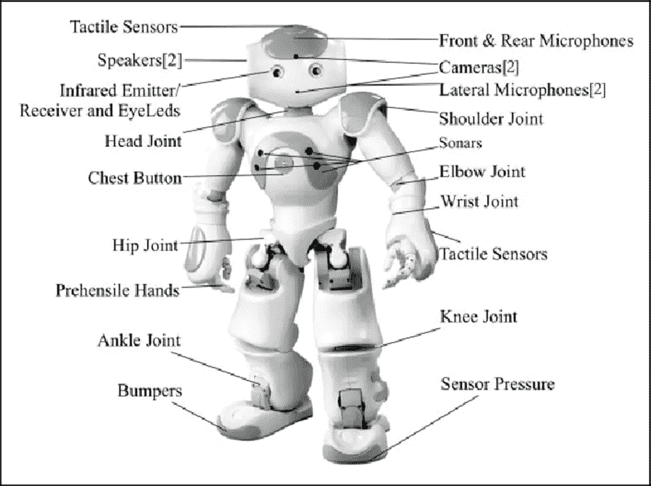
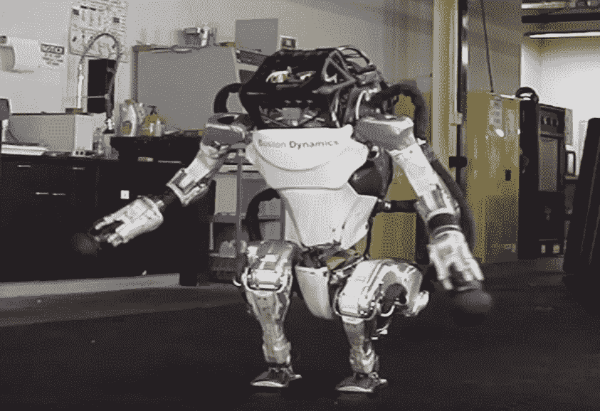
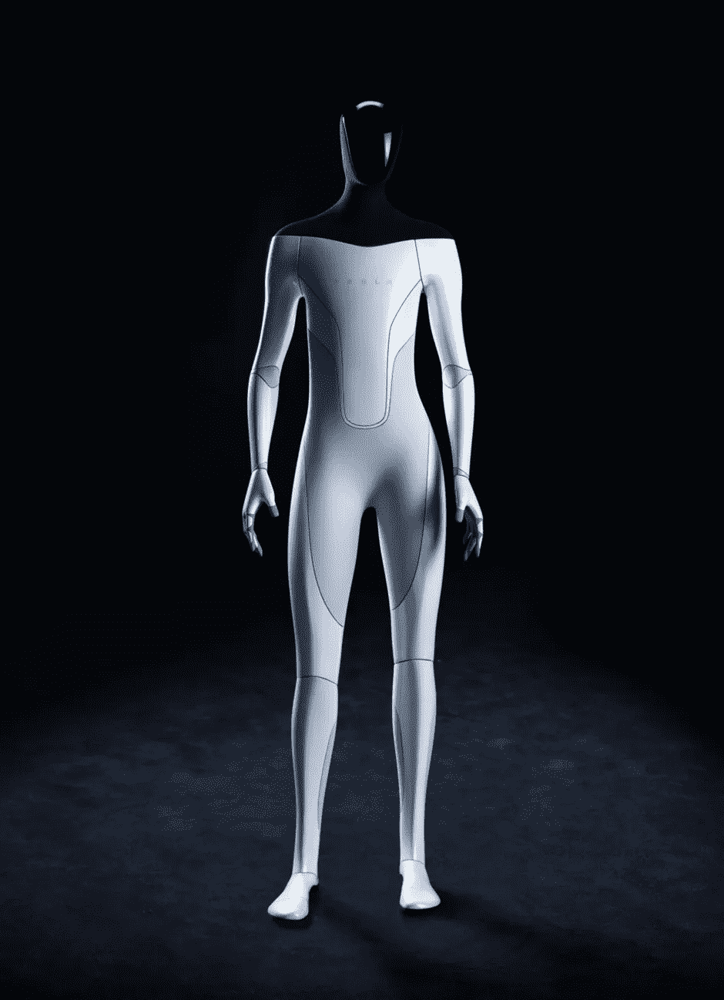
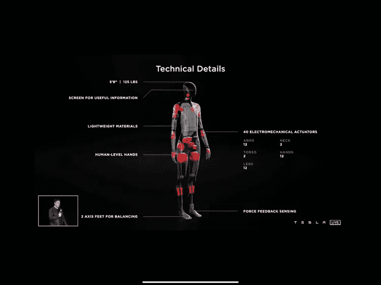
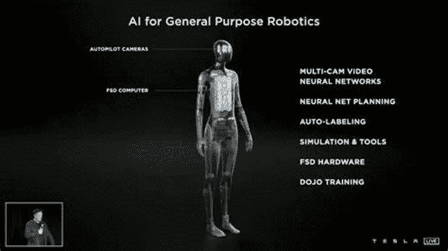
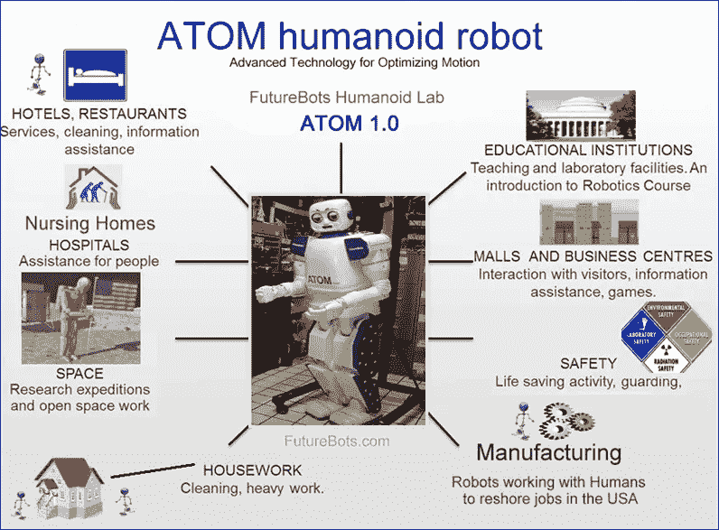

# 类人生物——新一代人类

> 原文：<https://medium.com/codex/humanoid-the-new-gen-humans-471bb57dc6b8?source=collection_archive---------15----------------------->

你需要知道的一切。

最近，在 9 月 30 日，由埃隆·马斯克拥有的美国汽车和清洁能源公司特斯拉庆祝人工智能日，他们推出了第一个人形擎天柱的工作原型，它肯定不再是穿着机器人服装的人类。它看起来远不敏捷或稳定，但机器人可以自己行走并向人群挥手，这无疑表明了过去一年取得的进展。令人惊讶的是，这句话出自一个家伙之口，我引用他的原话是“**有了人工智能，我们正在召唤恶魔**”。然而，这不是第一次有人试图以机器人的形式刺激人类。这个故事可以追溯到很久以前，人们相信希腊铁匠之神赫菲斯托斯创造了几种不同的人形机器人。因此，让我们更深入地探讨这个话题，了解什么是类人机器人。

# **类人机器人的历史**

人形机器人的历史有十几个故事，但这一切都始于希腊金属之神赫菲斯托斯使用一吨重的铜雕塑，这些铜雕塑可以在金色的轮子上从一个地方移动到另一个地方，就好像它们是自动化的机器一样。他用它们为拜访他的神提供服务。赫菲斯托斯也缺乏内在力量，这就是为什么他铸造了两个金子做的女仆。女仆们很强壮，能够在各种情况下表达自己的想法并表现得理智。他们是赫菲斯托斯的援助之手。他们在他外出时帮助他，等着他，为他唱歌，跳舞，逗他开心。根据荷马的《伊利亚特》，他们拥有“不朽的神所教导的一切”。另一个故事是塔洛斯的故事，塔洛斯是赫菲斯托斯为保护克里特岛而创造的青铜巨人。它被献给了克里特岛的国王弥诺斯。塔罗斯的身体是金属的，头上有角。有一条动脉从他身体的顶部延伸到脚趾，与一枚铜钉相连。每当有敌人入侵时，青铜人向敌舰投掷石块和红色火焰。然而，他被女巫美狄亚骗了，美狄亚利用了它的“虚假视觉”，从脚踝中含有所有生命液体的动脉中取出塞子，并从它的身体中排出“黑色油性血液”，杀死了塔罗斯。用专业术语来说，“黑色的油性血液”象征着人形机器人的燃料，而虚假的视觉可能是制导雷达干扰。喇叭可以是雷达系统的任何形式的天线。古代历史中提到了许多其他类似的人形存在的故事，可能是日本的卡拉库里木偶或伊斯梅尔·贾扎里开发的人形机器人，可能是莱昂纳多·达·芬奇概念化的复杂机器人或中国哲学文本《列子》中提到的机器人。

回到现代历史，当一个叫罗伊·温斯利的家伙在 1927 年**发明了 Herbert Televox** 时，人类第一次与类人生物互动。

赫伯特·电讯的图像

在最初阶段，它只是一个充满开关和电线的结构，对人们来说不够有趣。为了解决这个问题并吸引人们，罗伊在建筑中添加了一个类似人类的身体，甚至给它的眼睛添加了灯光，并使他的左手可以移动。这个机器人不能四处走动，也不能与人互动，这是人们质疑它是否是人形机器人的主要原因。但是已经取得了这样的进展，回到近 100 年前本身就是这一主题发展中的革命性的一步。

继 1927 年罗伊的发明之后，1928 年，**埃里克**，一个由第一次世界大战老兵威廉·理查兹上尉和飞机工程师艾伦·瑞弗尔制造的英国机器人问世了。1928 年，乔治六世(当时的约克公爵)取消了在伦敦皇家园艺大厅举行的模型工程师协会展览，展览的秘书理查兹很生气，提出要“制造一个锡人”来代替公爵的位置。埃里克被两个人控制，埃里克的声音被一个直播的无线电信号接收到。后来，一个更好的版本的埃里克，命名为乔治建于 20 世纪 30 年代，成本为 2000 相比，埃里克 140。乔治能用德语、英语、印度语等发表演讲。

埃里克的图像

埃里克之后是 Elektro——由在西屋电气公司工作的工程师约瑟夫·巴尼特制造的摩托人。这个 7 英尺高，120.2 公斤的人形机器人能够在语音命令的帮助下行走，每分钟说 700 个单词，吸烟，吹气球，移动他的头和手，玩 26 种不同的把戏。Elektro 的车身由一个钢制齿轮、凸轮和电机骨架组成，外面覆盖着一层铝制外壳。他的光电“眼睛”可以分辨红光和绿光。Elektro 的一句口头禅是，“我的大脑比你的大。”体重 25 公斤，的确如此。他甚至和他的伙伴机器狗 Sparko 一起出现在电影《纽约世界博览会上的米德尔顿一家》中。Elektro 在俄亥俄州的曼斯菲尔德纪念博物馆(Mansfield Memorial Museum)找到了一个家，它是该博物馆目前的财产，现在正在永久展出。

Elektro 和 Sparko

在 21 世纪初，将人类行为培养成机器人的领域也有了重大发展。索菲亚是一个特殊的人形机器人，一个有着棕褐色眼睛和长长的睫毛的精致女人，由香港的汉森机器人公司开发。作为科学、工程和艺术的独特结合，Sophia 同时也是一个描绘人工智能和机器人未来的人类科幻小说角色，以及一个高级机器人和人工智能研究的平台。索菲娅是以埃及女王娜芙蒂蒂为原型的。索菲亚使用计算机视觉算法来观察周围的环境，并使用决策树来生成对话。2018 年左右，还为她添加了功能齐全的腿。索菲亚于 2017 年获得沙特阿拉伯公民身份，这使她成为第一个获得任何国家自然公民身份的人形生物。Sophia 被描述为最适合用于医疗保健、客户服务、教育等领域。除此之外，另一项重大发展是由印度中学教师迪内什·昆瓦尔·帕特尔开发的**机器人 Shalu** 。这个人形机器人的特别之处在于，它的外部结构是由废料组成的，并使用基本的 python 库，如 Tensorflow 和 NLTK 来运行。添加到列表中的是最新发明**擎天柱**，这是在特斯拉人工智能日发布的特斯拉机器人。该机器人是一个全功能的人形机器人，该公司的目标是在 2023 年之前向公众提供，预算为 2 万美元。其他很多人形例子还有 Robonaut 2，OceanOne 等。

索菲亚(来源汉森机器人公司)

# 人形机器人是如何工作的？

任何人形机器人都由三部分组成——传感器(用于输入)、CPU(处理器)和机械动作(用于输出)。感官输入可以接受从嗅觉到视觉的任何输入。人形机器人中的本体感受传感器允许它使用加速度计、倾斜传感器、力传感器、速度传感器和位置传感器来感知其关节和身体中的方向、位置和速度。像触觉阵列和特殊触觉传感器这样的外部感受传感器被用来感测人形机器人的任何形式的物理交互，这可以启动进一步的过程。这些传感器还传递关于人形机器人和与之交互的物体之间的扭矩和力的信息。其他不同类型的传感器有压力传感器、压电传感器、光敏传感器等。所有这些传感器都是根据人形机器人的工作类型和与人类的相似程度来选择的。如今，计算机视觉技术也被用于人形机器人扫描周围环境，并向系统提供必要的输入。

人形结构的另一个重要部分是处理单元。处理单元是处理所有输入信息并将其发送回机器人各个部分以生成输出的地方。就处理单元而言，可以使用微控制器或微处理器。这种选择将取决于驱动负载。微控制器比微处理器更便宜且更容易编程。然而，微控制器的输出功率非常低，因此不能驱动大负载。另一方面，它的 PC 对应物，微处理器可以在其输出端驱动大负载。微处理器也可以同时驱动多个负载，但使用起来非常昂贵。由机器人执行的操作的复杂性将取决于它的处理单元。

人形身体最后也是最重要的部分是输出系统。输出系统由执行器、LED 屏、扬声器等组成。致动器使人形机器人移动。它们像关节和肌肉一样模仿人类的运动。致动器可分为三种类型:电动(电动致动器是一种可产生负载运动的装置，或一种需要力的动作，如夹紧或使用电动机产生必要的力)、液压(液压致动器是一种利用液压作为输入向控制系统提供激励的致动器)和气动(**使用仪表空气压力在隔膜上施加力以移动阀门致动器，然后定位阀杆的致动器)可根据要求使用。扬声器和 LED 屏幕用于向外界传达输出。**

**让我们以射频控制的人形机器人为例。无线机器人将有一个输入模块，它将根据用户要求的指令提供输出信号。该并行输出被编码器电路转换成串行形式，并且数据被馈送到 RF 发射机，该发射机对输入波的幅度执行调制。射频发射器通过其天线发送 ASK(幅移键控)信号。该数据通常以 1 至 10 Kbps 的速率在 433 MHz 上发送。该数据由接收器天线接收，并发送到 RF 接收器电路。该数据被接收器转换成串行输出，并馈送到 CPU 单元。CPU 单元是微处理器或微控制器。**

****

**阿特拉斯-波士顿动力公司开发的人形机器人。它使用液压致动器来工作。**

**串行输入的解码由处理单元完成，它将数据发送到相关引脚，这些引脚又将并行输出信号发送到电机电路，电机电路将人形机器人向所需方向移动。RF 是最首选的无线介质，因为它可以长距离传输，并且不是视距技术。**

# ****擎天柱——特斯拉机器人****

**2021 年 8 月 19 日，特斯拉首席执行官埃隆·马斯克(Elon Musk)宣布了特斯拉公司(Tesla，Inc .)正在开发的通用概念人形机器人的想法。在同一场活动中，马斯克还展示了在场大多数人认为的机器人原型，即穿着人形机器人服装的演员。他展示这一行为只是为了强调这个想法，并确保在场的人不会对该公司雄心勃勃的计划持怀疑态度。原型擎天柱也被称为特斯拉机器人，于 2022 年 9 月 30 日特斯拉人工智能日首次向世界展示。这一次，真正的机器人独自走上舞台，没有连接任何电源或稳定器，实际上这是特斯拉机器人第一次这样做。根据马斯克和特斯拉的说法，这个机器人的主要目的是为人类做重复、无聊或危险的工作，做人们不愿意做的工作。机器人显示了人工智能的研究已经走了多远。事实上，我们很快就将见证人形机器人在现实世界中的使用，这真的很令人着迷。**

****

**擎天柱:特斯拉机器人(来源特斯拉公司)**

**谈到机器人的技术规格，该结构计划测量 5 英尺 8 英寸高，重 57 公斤。机器人的结构主要由塑料制成，以减轻重量，但在必要的地方也使用金属。处理单元或大脑将由特斯拉 AI 芯片和**道场系统提供动力；**特斯拉的新超级计算机项目，据说是最先进的超级计算机。它的处理速度将是现在系统的 4 倍，也就是每秒一千万亿次浮点运算的 T4。这个机器人将有 40 个机电致动器；肌肉区域 28 个(颈部 2 个，躯干 2 个，手臂、手、腿 12 个)。对于机器人的眼睛，特斯拉机器人将利用**多摄像头神经网络** (8 个摄像头)。神经网络通过不同的摄像机和角度从周围环境中获取原始图像，并被训练来判断和预测各种因素。特斯拉的目标是使用其人工智能系统，该系统正在为其汽车上使用的高级驾驶辅助系统开发，“并具有 45 磅(20 公斤)的承载能力。这使得神经网络功能对于特斯拉机器人在一个地方导航至关重要，就像自动驾驶特斯拉汽车一样。根据该公司的说法，一个完整的自动驾驶神经网络包括 48 个网络，需要 70，000 个 GPU 小时来训练。**

****

**(来源特斯拉公司)**

**机器人的关节将受到人类系统的启发，它可以达到 8 公里/小时的速度，坐着时功耗为 100 瓦，行走时为 500 瓦。特斯拉机器人还将具有自动标记功能，使其能够标记数据集。还增加了 WIFI/LTE 连接、扬声器等其他功能。在运动能力方面，特斯拉机器人团队的目标非常高，至少有 18 个有时很复杂的运动。机器人的一些预期动作是向前行走、下蹲和下蹲行走、将物体从地面举到眼睛高度、使用螺丝刀等。他还讨论了机器人的各种变体，其中一种是将在市场上出售的猫女变体。**

****

**(来源特斯拉公司)**

**正如马斯克所说，机器人的目标是“我们所知的文明的根本转变”，马斯克猜测价格将非常合理:不到 2 万美元。与其他公司不同，特斯拉的目标是大规模生产 OPTIMUS bot:在 2 到 3 年内生产数百万台，马斯克称，这可能会导致“贫困的终结”，并导致一个“近乎无限”的经济。**

# ****人形机器人的应用****

**人形机器人一直对人类有着巨大的影响，它们的不同应用可以在我们的日常生活中看到。类人机器人一直在以各种能力帮助人类，广泛应用于医疗保健、教育和娱乐等领域。人形机器人被大量使用的一些领域如下:**

****医学** —类人机器人是医学研究领域的重要资源，其应用范围从人类矫形器和假肢的开发到医学研究领域。它正被用于为残疾人和失去肢体的人开发复杂的假肢。如今，它还被用于测试不同的医疗方法，并作为各种医疗程序的测试对象。研究人员还在致力于开发可以作为机器人护士工作的类人机器人，或者可以在轻微疾病的情况下为患者提供基本的医疗服务。远程医疗保健也已经成为人形机器人的主要应用之一，它可以由远离需要的地方的专家控制。WABIAN-2 是一种医疗人形机器人，旨在帮助患者康复下肢。**

**军事服务— 人形机器人的一个潜在应用是将它们部署到战场上。每年都有大量的人在战争和军事服务中丧生，但使用人形机器人可能是最终的解决方案。人形机器人可以在战区代替人类，在那里它们可以比人类更有效率，拯救很多生命。虽然政府仍然对这个想法持怀疑态度，因为类人机器人可能无法提供与人类相同的精确度，而且它们可能缺乏情商，从而使它们成为大规模杀戮的武器。尽管如此，它仍然可以用于次要的军事服务，如守卫边境，监视敌人并将信息传回营地，以及各种其他安全目的。**

****科学研究和太空开发——**类人机器人可以用于科学研究，在那里它们可以接受各种各样的实际测试，这些测试以前需要人类的帮助。他们可以根据测试的要求复制人类的行为。但这样做的缺点是，人形机器人可以帮助进行只需要人类行为方面而不需要物理方面的测试。类人机器人，特别是那些具有人工智能算法的类人机器人，可以用于未来危险的遥远太空探索任务，而无需在任务完成后再次掉头返回地球。它们也可以用来帮助宇航员完成太空任务，或者在地球上指挥他们。最近，国际空间站的五个合作空间机构也计划在国际空间站部署人形机器人，以减少在其上工作的人类数量。**

****

**(来源 FutureBots.com)**

****制造、采矿和维护—** 类人机器人可以被部署到人类去了会有危险的深矿区。大多数情况下，炸药和 TNT 炸药被用于采矿现场，以在地面内形成一个深洞，这使得洞穴下的地面不稳定，从而对在那里工作的人造成危险。类人机器人可以用在这些地方，它们可以在这种情况下代替人类，并且可以有所帮助。这些机器人可以被广泛使用，因为工业承载着沉重的负荷，并做大量的技术和计算工作，以减少与人类一起工作时持续存在的错误百分比。**

**除此之外，这些人形机器人还可以用于娱乐领域，它们可以是用于主题公园的现代电子动画的实体构造，作为替身，旨在模拟栩栩如生、无拘无束的动态运动。Engineered Arts 由导演威尔·杰克逊于 2004 年创建，是一家总部位于英国的公司，通过艺术家、机械和计算机工程师以及动画师之间的合作，创建各种娱乐类人机器人。著名的“RoboThespian”是他们的第一个人形机器人，是一个集印象、欢迎、歌曲和手势于一身的机器人表演者。这些类型的机器人在教育机构中用于教育目的。他们可以用来参加各种主题的小型会议，或者出于教育目的向儿童展示他们的工作。一些机器人可以在交通控制、警察管理等安全管理方面提供大量帮助。人形机器人还可以帮助进行时间敏感的搜索和救援行动，并遏制像贩卖儿童等威胁。，效率高。**

**未来应用 1 月份，福特成为第一家将 Agility Robotics 的数字投入生产环境的客户。这个无头人形机器人有着敏捷的四肢和一系列传感器。它能够通过楼梯、众多障碍物和各种地形。它可以单脚直立行走，力气大到可以拿起并堆叠重达 40 磅的箱子。它也可以折叠起来，便于存放。预测和检测犯罪的人工智能可能看起来很遥远，但它在短期内是完全可行的。例如，无人机镜头将很快使这成为可能。此外，借助基于摄像头的安全系统，自动检测可疑活动现已成为现实。**

**总结一下这个话题，全功能机器人的概念可能听起来有点不真实或模糊，但我们很有可能在未来看到一场巨大的革命，类人机器人将取代人类完成大部分任务。类人机器人的未来取决于我们——要么我们用它造福人类，要么用它祸害人类。从有利的一面来看，它在医疗保健、教育等领域有巨大的潜力，但从有害的一面来看，这些人形机器人很有可能成为恐怖分子黑色营销的对象，在那里它们只会沦为用于大规模杀戮的毁灭性武器。随着像特斯拉这样的大组织全力以赴，我们离人类控制的自动化的现在和自动化人类的未来不远了。**

## **谢谢你。**