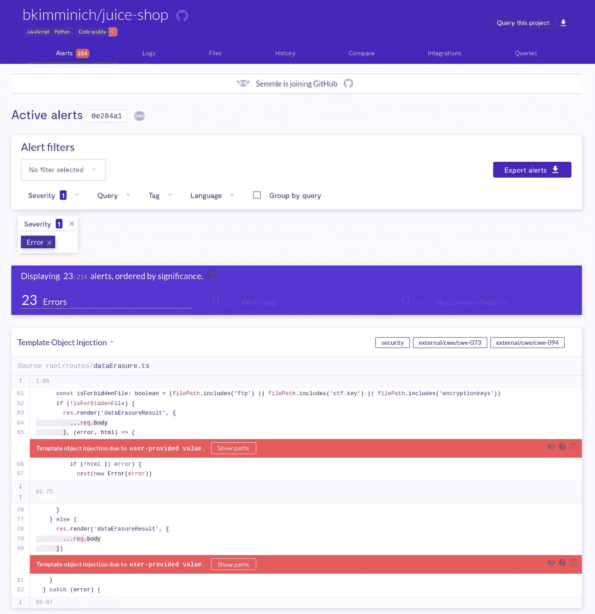

# 用 CodeQL 寻找 XSS

> 原文：<https://medium.com/codex/hunting-for-xss-with-codeql-57f70763b938?source=collection_archive---------4----------------------->

# 什么是 CodeQL

几个月前，我通过滚动我的 Twitter feed 了解了 CodeQL，从那以后我就爱上了它。顾名思义，CodeQL 是一种查询语言。然而，您不是在数据库中查询实体记录，而是在代码库中查询感兴趣的模式。例如，假设您有以下示例 NodeJS 应用程序。

示例 JavaScript 应用程序

现在，假设您想知道在项目的哪些地方，名为 **foo** 的属性被读取或写入。下面的 codeQL 查询将给出您正在寻找的结果。

示例查询

设置 codeQL 环境并开始试用的步骤非常简单，可以在[https://codeQL . github . com/docs/codeQL-CLI/getting-started-with-the-codeQL-CLI/](https://codeql.github.com/docs/codeql-cli/getting-started-with-the-codeql-cli/)找到。一旦你有了合适的环境，我推荐你观看 [**用 CodeQL**](https://securitylab.github.com/events/2020-05-07-codeql-workshop-javascript/) 寻找 JavaScript 中的安全漏洞研讨会。这将通过实际操作让你对这门语言及其特性有一个基本的了解。

# 内置查询

一旦你了解了基础知识，你将会了解到 CodeQL 已经有了很多内置的查询，可以用来寻找最常见类型的编码错误，包括 *XSS* 。也就是说，开始使用 codeQL 寻找 bug 的一种方法是简单地对您克隆的开源代码库运行现有的查询。

为了举例说明，您可以采取以下步骤，使用 CodeQL 找到我在 [Discourse](https://github.com/discourse/discourse/security/advisories/GHSA-v3v8-3m5w-pjp9) 项目中发现的基于 DOM 的 XSS 漏洞。要复制这个发现，克隆话语存储库，签出提交*bb 2 c 48 b 0657 f 6182 b 852 ab 76 fc 190825d F5 d 2 b 7 f*，并从中创建一个 codeQL 数据库。

话语数据库创建

创建数据库后，可以使用***xssthroughdom . QL***查询来寻找潜在的*基于 Dom 的 XSS* 漏洞。如果您设置了可视化代码+CodeQL 集成，您应该会得到如下结果。

***XssThroughDom.ql 结果***

结果将由路径组成。每条路径将一个*源*连接到一个*接收器*。换句话说，对潜在敏感的函数参数或属性赋值的一些输入。我不会深入讨论漏洞本身的细节，因为这超出了本文的范围。我只是用这个例子来证明人们可以通过简单地使用 codeQL 的内置查询来发现广泛使用的开源项目中的真实漏洞。

# LGTM

根据 GitHub，LGTM 是:

> 一个代码分析平台，用于发现零日和防止关键漏洞

LGTM 不仅允许你查询 GitHub 上托管的许多项目，而且它还使用 CodeQL 的官方查询不断评估它们。任何想看的人都可以得到结果。事实上，我在 Discourse 项目中发现的漏洞在 LGTM 也可以被任何有兴趣分析警报的人利用。

对于那些对该平台及其所能提供的感兴趣的人来说，一个很好的起点是分析故意易受攻击的 web 应用程序 [*果汁店*](https://lgtm.com/projects/g/bkimminich/juice-shop?mode=list&severity=error) *的结果。*

LGTM 结果

# 更进一步

在发现话语漏洞后，我对 CodeQL 的潜力感到非常兴奋，并开始尝试构建我自己的易受攻击的代码，并针对它测试内置查询。玩了一会儿之后，我使用剪贴板 API 作为恶意的*源*构建了一些基于 DOM 的 XSS 测试用例。对于那些不熟悉剪贴板 API 及其安全含义的人，我建议阅读[复制和粘贴的奇怪案例](https://research.securitum.com/the-curious-case-of-copy-paste/)micha Bentkowski 先生的一篇文章 ( [@SecurityMB](https://twitter.com/SecurityMB) )。令我惊讶的是，没有一个内置查询能够检测到哪怕是最简单的基于剪贴板的 XSS。然后，我决定构建自己的查询来寻找这种错误。最后，经过几个晚上的糟糕睡眠，我开始思考 CodeQL 的 Javascript 类型和类型跟踪谓词，然后*voilà*,*clipboard XSS . QL*查询诞生了。

剪贴板 Xss.ql

完成后，我开始查询所有我最喜欢的开源项目，这些项目在 LGTM 都有。我能够在 [GitLab](https://hackerone.com/reports/1196958) 和 [Github 的一个依赖项](https://github.com/github/paste-markdown/security/advisories/GHSA-gpfj-4j6g-c4w9)中找到 bug。目前都有可用的补丁。
一旦我的查询得到了真实的结果，我决定尝试为 CodeQL 项目本身做点贡献。在撰写本文时，我的查询[仍在审核中](https://github.com/github/securitylab/issues/422)，但我相信它会被接受，并且最终剪贴板 API 源代码会被合并到标准的 XSS 查询中。

# 解决闭源网络应用

CodeQL 非常适合开源项目，尤其是已经在 GitHub 上的项目。但是用它来评估闭源 web 应用程序呢？
我开发了一种手动方法，包括以下步骤:

*   安装 [*保存所有资源*](https://chrome.google.com/webstore/detail/save-all-resources/abpdnfjocnmdomablahdcfnoggeeiedb) Chrome 扩展(不涉及版税)
*   启用扩展后，使用 Chrome 导航到 web 应用程序
*   使用扩展下载页面的资源。确保选择下面突出显示的选项

*   将 zip 文件解压到您选择的目录中，并[从中创建一个 codeQL 数据库](https://codeql.github.com/docs/codeql-cli/creating-codeql-databases/)
*   享受查询项目的乐趣

# 未来的工作

我很想用 CodeQL 自动化我的评估闭源 web 应用的过程，并使它可扩展，但是我现在没有时间。我希望这篇文章能激励自动化僧侣们(例如， [TomNomNom](https://medium.com/u/6dadd1681332?source=post_page-----57f70763b938--------------------------------) ， [Jason Haddix](https://medium.com/u/1dfc5adea2d4?source=post_page-----57f70763b938--------------------------------) )去实现它，并且当他们实现时记得告诉我；)