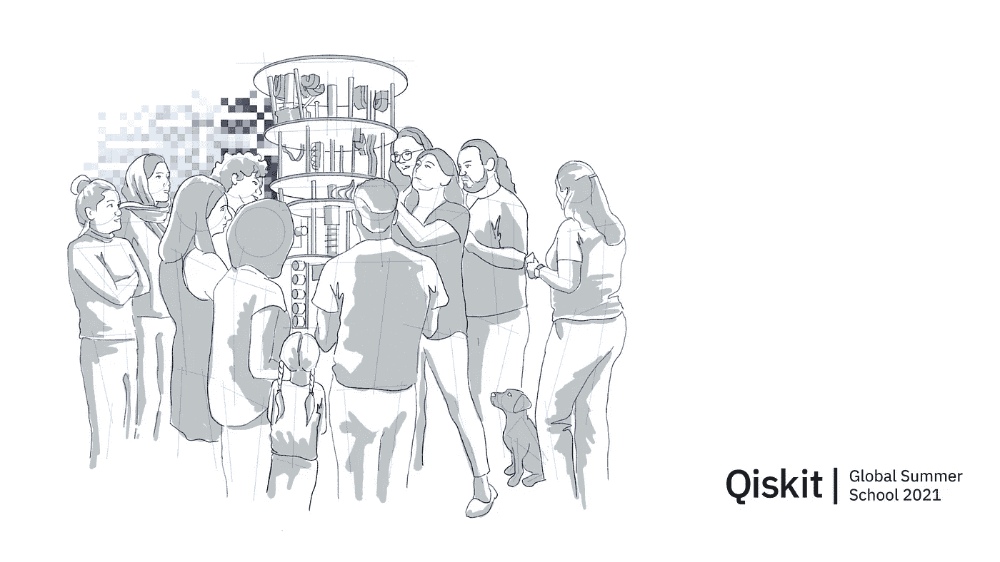
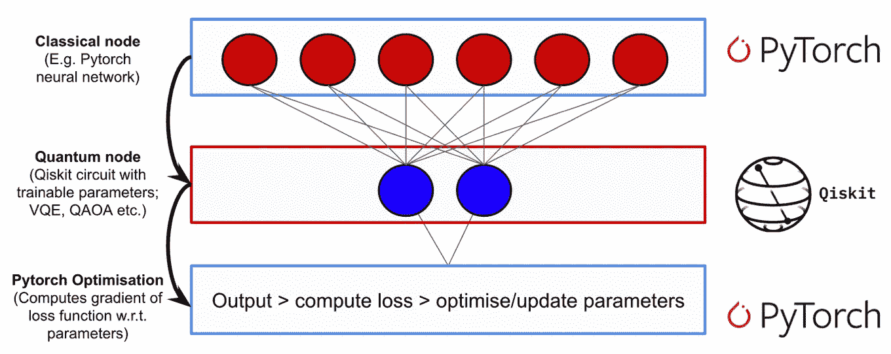
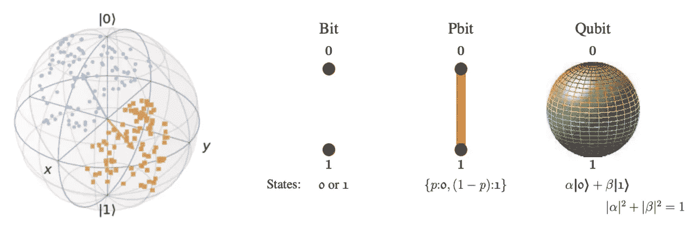
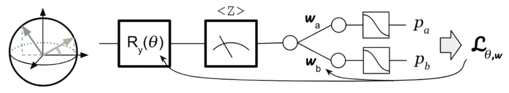
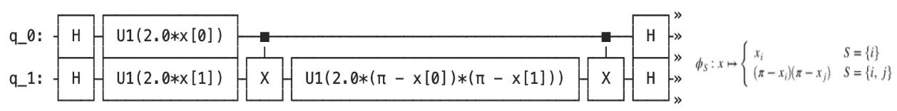
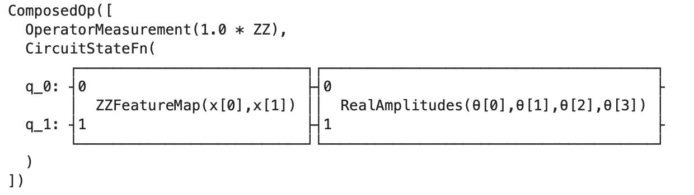
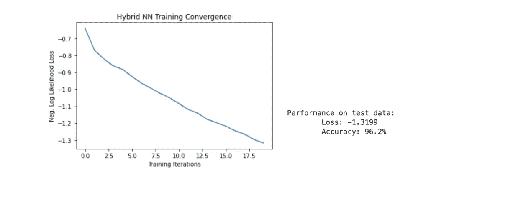
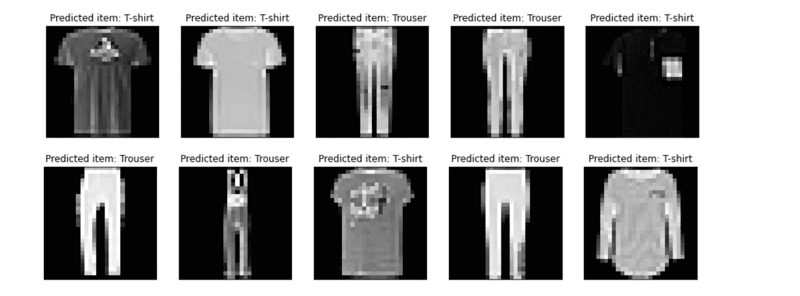

# 混合量子-经典神经网络用于时尚主义者数据集中的图像分类

> 原文：<https://medium.com/codex/hybrid-quantum-classical-neural-network-for-classification-of-images-in-fashionmnist-dataset-7274364f7dcd?source=collection_archive---------7----------------------->

为了在为期两周的关于量子机器学习的 IBM Qiskit 全球暑期学校 2021 之后开始我的量子之旅，我探索了 Qiskit 混合 PyTorch 经典-量子神经网络架构，该架构在 [Qiskit](https://qiskit.org/textbook/ch-machine-learning/machine-learning-qiskit-pytorch.html) 中可用。对于任何想要探索量子计算并启动其量子之旅的人来说，探索如何将量子元素嵌入到您已经存在的 AI/ ML 工作流中，并从实验量子计算中获得更快的实际结果，是一个很好的起点。

量子计算的核心优势是利用量子力学现象如干涉、叠加和纠缠来获得计算优势。与经典计算相比，它有望提供指数级的计算速度，解决否则不可能解决的复杂问题。

来自 [Qiskit 教科书](https://qiskit.org/textbook/ch-machine-learning/machine-learning-qiskit-pytorch.html)的混合架构插图

本案例研究的范围是建立一个基本的混合量子经典神经网络架构，用于对 FashionMNIST 数据集中的图像进行分类。Qiskit 的 TorchConnector 将用于将量子神经网络(QNN)层集成到 PyTorch 工作流中。QNN 将作为 PyTorch 模块提供，无需额外考虑即可共同训练。Qiskit 教科书中的上图很好地展示了混合架构。案例研究的代码可以在 [Github](https://github.com/Q-MAB/Qiskit-FashionMNIST-Case/edit/main/FashionMNIST%20case%20study.py) 中找到。如果你想深入研究量子计算，请查阅参考文献。

# 量子经典神经网络

将要使用的 PyTorch 架构是一个前馈神经网络。传统节点层的输入是(实值)向量。网络的隐藏层将是一个参数化的量子电路，它接受经典层的输出。量子电路的每个门的旋转角度将由经典输入向量的分量来指定。QNN 的工作方式不同于传统的神经网络。输入数据被编码成量子位，而不是使用神经元、权重和偏差。最终的目标是一样的，最小化损失函数。然而，在 QNN 的情况下，其完成方式略有不同。一系列量子门，相当于传统电路的经典逻辑门，但在这种情况下是量子逻辑门，被应用于量子位。以最小化损失函数的方式改变门参数。它实际上将最小化网络预测和输入标签之间的差异。[门操作](https://www.amazon.com/Dancing-Qubits-quantum-computing-change/dp/1838827366)实际上是酉算子，是量子电路的构建模块。

量子数据(蓝色/橙色显示两个映射标签)呈现在[布洛赫球](/from-the-diaries-of-john-henry/qml-6a5b68fb95d9)(左)和一个[经典比特对量子比特](https://arxiv.org/abs/quant-ph/0207171v1)(右)的表示上

> 需要注意的是，在量子计算中，信息的基本单位是由一个量子位来表示的。与经典比特不同，量子比特在计算过程中始终只由 0 和 1 表示，量子比特可以通过形成其状态的线性组合 [|ψ⟩ = α|0⟩ + β |1⟩](http://mmrc.amss.cas.cn/tlb/201702/W020170224608149940643.pdf) 而进入叠加状态。只有在进行测量时，它才必须被很好地定义，要么以概率|α|坍缩到 0，要么以概率|β|坍缩到 1。这听起来可能违反直觉，因为量子位在测量之前可能存在于|0⟩和|1⟩之间的连续统中，但由于这一特性，它可能一次需要指数级的多个[逻辑状态](https://quantum-computing.ibm.com/composer/docs/iqx/guide/)。纠缠是另一个有趣的属性，高度相关的两个量子态 [|ψ⟩ = |a⟩|b⟩](http://mmrc.amss.cas.cn/tlb/201702/W020170224608149940643.pdf) 无法独立描述，这使得[超密集](https://qiskit.org/textbook/ch-algorithms/superdense-coding.html)编码成为可能。本案例研究将使用线性纠缠。在测量中存在一定的随机性和不确定性，因此测量的输出将是它将处于的最可能的量子状态。

[QNN 建筑](https://arxiv.org/pdf/2003.02989.pdf)

为了从混合架构中的经典数据到量子态，通过使用量子特征映射，经典数据(*【xᵢ】*)被编码到量子态空间(|*【ϕ(xᵢ】*【⟩】)中。然后经典数据在希尔伯特空间中以量子态[表示，并可以作为我们参数化量子 circuit⁸.的输入在这种情况下，ZZFeatureMap 被构造并用于将经典特征向量映射到量子态。](https://arxiv.org/pdf/1803.07128.pdf)

一个 [ZZFeatureMap](https://qiskit.org/documentation/stubs/qiskit.circuit.library.ZZFeatureMap.html) 的更详细的例子，带有哈达玛和 CNOT 门操作

然后使用 Qiskit 的 TwoLayerQNN 类创建一个两层 QNN，并作为隐藏层嵌入 PyTorch 架构中。TwoLayerQNN 通过提供构造的 ZZFeatureMap 和 Ansatz(量子状态将仅具有实振幅)加上量子位的数量来初始化。

输入梯度被设置为真，以允许混合梯度反向传播。实现了线性纠缠，并且在这种情况下[泡利期望](https://qiskit.org/documentation/apidoc/qiskit.aqua.operators.expectations.html)用于计算相对于状态函数的可观察的期望值。

完整的 FashionMNIST 数据集包含 10 个类别的 60000 幅图像和 10000 幅时尚对象的测试图像。在这种情况下，只有两个标签从训练数据集中过滤出来，即 t 恤和裤子。一旦建立了一个工作的混合框架，下一步可能是通过添加更多的量子位和门操作来扩展到多标签预测(和时间，我在 EuroPython 2021 大会期间利用业余时间进行了这个案例研究，多标签预测需要更多的时间)。过滤后的数据被上传到 PyTorch 的 DataLoader 中，它在数据集周围包装了一个 iterable，以便于访问样本。

经典的卷积神经网络(CNN)是由完全连接的层创建的，其中嵌入了 QNN。简单地定义一下神经网络中的卷积:“对两个函数进行数学运算以产生第三个函数，其中参数被共享以提高计算效率”( [Raviv，E](https://businessdatascience.nl/deep-learning-summer-course) )。在每个操作中，下一层的大小相对于当前层减小。CNN 的每个神经元都被输入一个乘以不同权重的输入向量。该操作的结果被评估并被转发到下一层。

最大池用于下采样操作，ReLu 用作激活函数。输入层的输出被转发到 QNN，然后转发到输出层以获得最终预测。TorchConnector 功能支持将 QNN 集成到经典 CNN 中。沿着布洛赫球的 Z 轴在 QNN 末端进行的测量实际上将量子数据转换成经典数据。模型的优化是用[亚当](https://arxiv.org/abs/1412.6980)优化器完成的。

# 结果

代码在 jupyter-notebook 上实现。混合分类器表现得足够好。虽然，一开始精确度可能不是很高。

启用线性纠缠后，模型预测的准确度为 96.2%。人们希望获得更高的精度，但我们不得不把它放在一边，以便进一步研究。

由混合 CNN-QNN 架构预测的图像

结果可能不会像一开始承诺的那样显示出巨大的量子优势。量子层实际上是在经典计算机上计算/模拟的(还不是在量子计算机本身上)，计算量子计算机在理想情况下会做什么。这一简短案例研究的范围是探索一种具有 TorchConnector 和两层 QNN 的初始混合架构，这种架构可以在以后的进一步研究和开发中进行优化或改进。此外，该项目可以扩展到多类预测。

在等待容错量子计算机创造真正的量子优势时，利用当前[嘈杂的中等规模量子](https://quantumcomputing.stackexchange.com/questions/1885/what-is-meant-by-noisy-intermediate-scale-quantum-nisq-technology)设备可以做很多事情来创建概念证明(这将是具有大约百万量子位的量子计算机，参见[IBM](https://www.ibm.com/blogs/research/2021/02/quantum-development-roadmap/)的路线图)。因此，现在是时候开始考虑为你的企业或组织制定一个量子战略，如何及时采用和集成量子计算来为你带来优势。

# 短暂旅程的终点..

当我们在 2021 年夏天接近我的量子旅程的终点时，这同时也是一个更大旅程的开始。考虑到目前大型企业在量子计算方面的发展和重大投资，以及数千名对量子计算充满热情和兴趣的研究人员和开发人员，我对量子计算的未来及其将开启的许多可能性和它将创造的许多机会感到非常兴奋。我很高兴我能加入这个激动人心的伟大旅程。

# **参考文献**

1.  [https://qi skit . org/textbook/ch-machine-learning/machine-learning-qi skit-py torch . html](https://qiskit.org/textbook/ch-machine-learning/machine-learning-qiskit-pytorch.html)
2.  Sutor，R (2019)“与量子位共舞:量子计算如何工作以及它如何改变世界”，Packt。
3.  Loredo，R (2020)“用 Python 和 IBM 量子经验学习量子计算”，Packt。
4.  [https://medium . com/from-the-diaries of-the-John-Henry/qml-6a 5b 68 FB 95d 9](/from-the-diaries-of-john-henry/qml-6a5b68fb95d9)
5.  克尼尔，W (2008)《量子信息处理导论》，[arXiv:quant-ph/0207171 v1](https://arxiv.org/abs/quant-ph/0207171v1)。
6.  [https://www . IBM . com/blogs/research/2021/02/quantum-development-roadmap/](https://www.ibm.com/blogs/research/2021/02/quantum-development-roadmap/)。
7.  [https://medium . com/qi skit/building-a-quantum-variation-classifier-using-real-world-data-809 c 59 EB 17 c 2](/qiskit/building-a-quantum-variational-classifier-using-real-world-data-809c59eb17c2)。
8.  Schuld，M. (2018)“特征希尔伯特空间中的量子机器学习”，【https://arxiv.org/pdf/1803.07128.pdf】T2。
9.  Nielsen，M. & Chuang I. (2010)《量子计算与量子信息》，剑桥大学出版社。