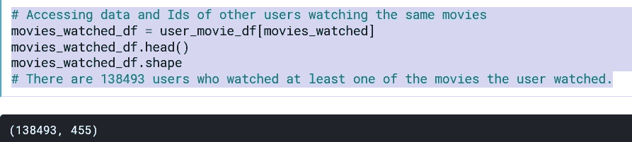
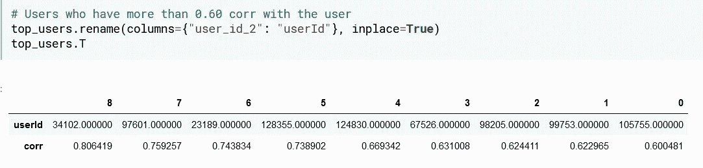

# 混合推荐系统-Netflix 奖品数据集

> 原文：<https://medium.com/codex/hybrid-recommender-system-netflix-prize-dataset-e9f6b4a875aa?source=collection_archive---------4----------------------->

亚历山大·沙托夫在 [Unsplash](https://unsplash.com?utm_source=medium&utm_medium=referral) 上拍摄的照片

## [抄本](http://medium.com/codex)

随着科技的发展，我们的习惯也在改变。多用于数字空间，易贝，亚马逊，阿里巴巴等。因此，今天的大多数电子商务网站使用他们自己专有的推荐算法来更好地为客户提供他们喜欢的产品。还有很多例子比如 ***网飞*** *的电影，Spotify 的音乐，脸书推荐好友，亚马逊的产品推荐等等。这些公司如此受欢迎的原因之一可以看出，它们的业务结构是基于推荐系统的。*

# **什么是推荐系统？**

推荐引擎是一个过滤系统，它分析来自属于不同用户的不同来源的数据，并产生解决方案来预测他们的兴趣并相应地向正确的用户推荐相关产品。然而，推荐系统是一种机器学习算法，它根据用户过去的偏好向用户提供他们可能喜欢的建议。

大多数推荐系统现在使用混合方法，结合协同过滤、基于内容的过滤和其他方法。

**推荐引擎主要有三种技术:**

*   协同过滤
*   基于内容的过滤
*   混合推荐系统

**网飞是使用混合推荐系统的一个很好的例子。该网站通过比较相似用户的观看和搜索习惯(即协同过滤)以及通过提供与用户评价高的电影具有共同特征的电影(基于内容的过滤)来进行推荐。**

**激发推荐系统研究的事件之一是 Netflix 奖。我们将使用本次竞赛中讨论的数据集来讨论这些主题。**

**我在这里使用的数据集直接来自网飞。它由 4 个文本数据文件组成，每个文件包含超过 2000 万行，即超过 4K 电影和 40 万客户。总共超过 17K 部电影和 50 万以上的客户！**

****

**例如，我们最初随机选择一个用户，并关注该用户观看的电影。**

****

**我们确定的用户观看的电影数量是 455 部。**

# ****协同推荐系统****

**协作推荐系统汇总对象的评级或推荐，根据用户的评级识别用户之间的合作关系，并根据用户对用户的比较生成新的推荐。通常，它基于收集和分析关于用户的行为、活动或偏好的信息，并基于与其他用户的相似性来预测他们会喜欢什么。协作系统分析用户和/或项目的相似性。**

***确定与要推荐的用户最相似的用户我们查看用户和用户之间的关系(相似性),这是我们通过相关性确定的。***

***此外，有几种类型的协同过滤算法:***

****

**[图片](https://predictivehacks.com/item-based-collaborative-filtering-in-python/)**

***1-用户-用户协同过滤:*基于搜索相似客户，基于相似客户提供建议。这种算法非常有效，但需要大量的时间和资源。**

****

**已确定用户观看至少 60%的电影(可能会有变化)。**

****

*   ***我们将与用户观看相同电影的用户聚集在一起。(与待推荐用户最相似的用户)***

****

***2-Item-Item 协同过滤:*这是一种基于用户之前喜欢或积极互动的项目来搜索相似项目的推荐方法。与用户-用户协作过滤相比，它需要更少的资源和时间。**

****

*   ***我们可以推荐与我们选择的用户至少 60%相似的用户观看的其他电影。***

# ****基于内容的过滤系统****

**过滤系统基于单个用户的交互和偏好。它基于从用户历史和交互中收集的元数据。**基于内容的**建议基于用户已经评分的对象的现有属性来学习新用户的兴趣简档。算法是这样的，它们向用户建议他们过去喜欢的或者当前正在观看的类似项目。**

**为了创建用户简档，系统主要关注两种类型的信息:**

1.  **用户偏好的模型。**
2.  **用户与推荐系统的交互历史。**

**用户提供的信息越多，准确度越高。**

****

**[图像](https://towardsdatascience.com/recommendation-system-series-part-1-an-executive-guide-to-building-recommendation-system-608f83e2630a)**

# ****混合推荐系统****

*   **我们可以根据用户最后观看的、评价高的电影片名进行推荐。**

****

**大多数推荐系统现在使用混合方法，结合协同过滤、基于内容的过滤和其他方法。**

**混合推荐系统可用于克服常见的问题**

**不足。一些杂交技术包括:**

**加权:将不同推荐组件的分数进行数字组合。**

****

**切换:在推荐组件中进行选择，并应用所选的组件。**

**混合:来自不同推荐者的推荐被一起呈现以给出推荐。**

**特征组合:来自不同知识源的特征被组合，并被给予单个推荐算法。**

## ****代码来源:****

**【kaggle.com/ayseymn 号**

## ****参考文献:****

**[https://en.wikipedia.org/wiki/Recommender_system](https://en.wikipedia.org/wiki/Recommender_system)**

 **[## 网飞的推荐系统是如何工作的

### 我们的业务是订阅服务模式，提供个性化推荐，帮助您找到节目和…

help.netflix.com](https://help.netflix.com/en/node/100639)** 

**[https://www.veribilimiokulu.com/](https://www.veribilimiokulu.com/)**

 **[## 推荐系统:原则、方法和评价

### 在互联网上，选择的数量是压倒性的，有必要筛选，优先和有效地…

www.sciencedirect.com](https://www.sciencedirect.com/science/article/pii/S1110866515000341)** ** [## 解释人工智能推荐引擎的简单方法

### 在我之前的博客中，它广泛地谈论了我们如何通过从 NLG 和 NLU 提取更多的价值来开发 NLP

medium.com](/voice-tech-podcast/a-simple-way-to-explain-the-recommendation-engine-in-ai-d1a609f59d97)**