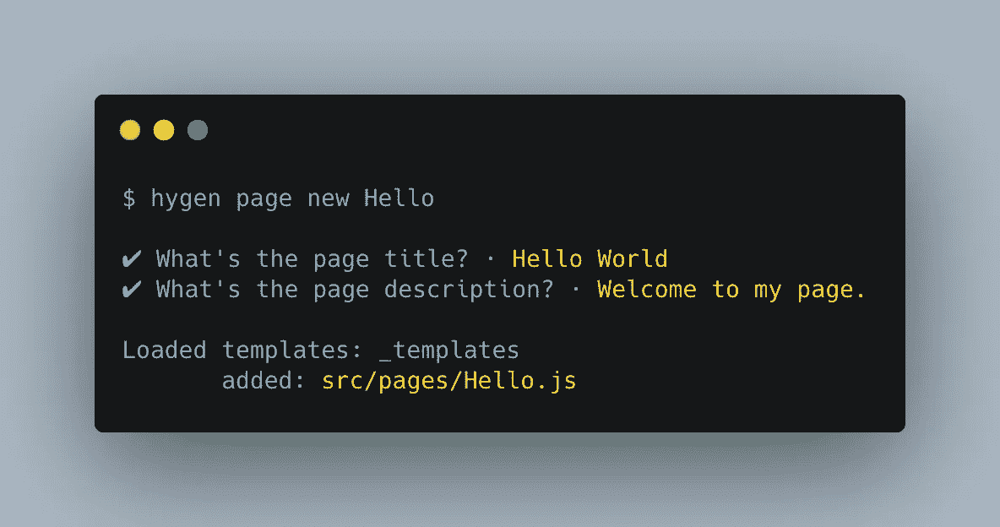

# 将 sh*t 从 React 应用程序中分离出来—第 2 部分

> 原文：<https://medium.com/codex/hygen-the-sh-t-out-of-your-react-application-part-2-ce004d9bab45?source=collection_archive---------7----------------------->

## [法典](http://medium.com/codex)

*第一部分:*[*https://medium . com/codex/hygen-the-sh-t-out-of-your-react-application-Part-1-6b 7cf 9442 a 15*](/codex/hygen-the-sh-t-out-of-your-react-application-part-1-6b7cf9442a15)

# **用户定义值**

在第 1 部分中，我们使用 hygen 来自动化 React 组件的创建，该组件带有一个 H1 标题，该标题与组件名共享相同的值，以及一个简单的 Lorem Ipsum…