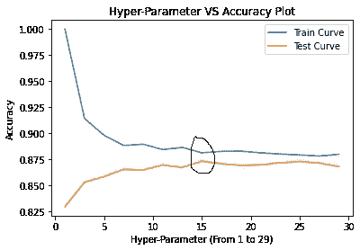

# 使用定制 GridSearchCV 进行超参数调整

> 原文：<https://medium.com/codex/hyper-parameter-tuning-with-custom-gridsearchcv-d5212f218cc0?source=collection_archive---------8----------------------->

通常在机器学习中，我们将数据集分为两部分，即训练(通常 70%)和测试(通常 30%)数据集。如果我们正在处理一个分类问题，其中我们将 **X** 作为特征，将 **Y** 作为标签，我们将数据拆分为 **X_train** 、 **X_test、**和 **Y_train** 、 **Y_test** 。我们通常做的是，在训练数据集上训练和拟合模型，并在测试数据集上测试模型。我们通常通过将我们的模型根据测试数据预测的值与实际数据进行比较来发现准确性。这种方法的问题是，每当您的模型在现实世界中遇到新数据时，准确性就不再一样了。你可能会看到你的模型是如何悲惨地失败的。为了解决这些问题，研究人员提出了各种方法，其中一种方法是在拆分数据时使用交叉验证。

# 交叉验证

为了理解这一点，我们举一个 KNN 算法的例子。我们通常将数据分成三部分，而不是两部分，即训练数据(60%)、cv 数据(20%)和测试数据(20%)。注意:并不总是 60–20–20，有些人更喜欢 70–10–20 和其他一些人。现在，在 K-NN 中，我们使用训练数据来训练和拟合模型，基本上，我们正在为数据集中的每个点找到所有最近的邻居。CV 数据用于寻找最佳 K(K-NN 中的 K 被称为超参数，选择正确的 K 至关重要。简而言之，K 是在应用 K-NN 时要选择的最近邻的数量。CV 数据用于查找多个 K 的精确度，精确度最高的 K 被认为是最佳 K。例如，当 K 为 5 时，我们得到了模型的最高精确度，即 95%。现在，如果我们使用最佳 K 和经过训练的模型，并在测试数据上对其进行测试，并说我们获得了大约 93%的准确性，我们现在更确定我们的模型在现实世界中也会给出高准确性，因为我们的模型在训练期间以及在寻找最佳 K 的过程中没有看到测试数据。

但是，还有一个问题需要解决。如果我们将数据分成 60–20–20 的比例，其中 60%用于训练目的，我们肯定会丢失 40%的信息，而使用 60%的信息来训练我们的模型在现实世界中并不合适。为了解决这个问题，研究人员提出了许多修改方法，我们将在本文中学习一种。

# GridSearchCV

将数据分成两部分，80%的数据将用作训练数据，而 20%将用作测试数据。现在，训练数据集进一步分为四个部分，每个部分占 20%，比如 D1、D2、D3 和 D4 区块。


图 1:将数据分为训练和测试(用 MS Excel 制作)

现在，我们将首次使用 D1、D2 和 D3 街区作为训练数据集来训练我们的模型，而 D4 将用作 CV 数据，K=1，以找到模型的准确性，即 81%。对于 K=1，将 D1、D2、D4 作为训练数据并将 D3 作为 CV 数据的第二组合将具有 85%的准确度。K=1 的第三个组合将给出 85%的准确度，第四个组合将给出 84%的准确度。一旦我们使用了所有的组合，我们现在取 K=1 时所有精度的平均值。这样，我们可以巧妙地使用 80%的数据作为训练，而不会像我们在前面的案例中看到的那样丢失太多信息。注意:我们仍然没有使用 D5 或测试数据，因此，对于 K=1，我们可以测试我们的模型，并可以预期测试精度对于现实世界的情况也是可持续的。人们可以对多个 K，K=1，3，5…尝试这样的组合，并且可以找到给出最高精度的最佳 K，在我们的例子中是 K=5，精度为 93%。因此，如果我们在测试数据上用 K=5 测试我们的模型，并说我们得到了相似的精度，我们现在更确定我们的模型在真实数据上也会给出相似的精度。


图 2:K 与折叠次数的网格状组合(用 MS Excel 制作)

这样一种通过制作网格(见上图)来寻找最佳超参数(K-NN 中的 K)的方法被称为 GridSearchCV。让我们在不使用 Sklearn 的情况下，使用 Python 从头实现 GridSearchCV。您也可以使用 Sklearn 库，它以自己的方式更加高效。

# 实现自定义 GridSearchCV

```
from sklearn.datasets import make_classification
from sklearn.neighbors import KNeighborsClassifier
from sklearn.model_selection import train_test_split
from sklearn.metrics import accuracy_score
import pandas as pd
import numpy as np
import random
import matplotlib.pyplot as plt
```

我们将使用来自`sklearn.datasets`的`make_classification`，这将帮助我们创建具有各种参数的点的聚类(用于分类问题)，例如`n_samples`用于样本数量，`n_features`定义我们想要的特征数量，`n_informative`定义您想要提供信息的特征，`n_redundant`定义您想要冗余或无用的特征，`random_state`如果设置为任何特定的数字，每次将返回相同的随机数据，这有助于您与任何人共享相同的随机选择的数据。

```
def GridSearchCV(x_train, y_train, classifier, parameter, folds):
    trainscores = []
    testscores = []
```

定义一个带五个输入的函数`x_train`、`y_train`、`classifier`在我们的例子中分类器是 KNN、`parameter`比如 **n_neighbors** 、`folds`我们的 cv 折叠数。最初，我们定义了两个空列表`trainscores`和`testscores`，它们存储了我们在用 **n 个折叠数**对 **n 个 K** 进行训练和测试时获得的所有精度。

```
for k in parameter['n_neighbors']:
        training_fold_scores = []
        cv_fold_scores = []
```

第一个 for 循环将 K 的不同值作为一组列表存储在变量**参数**中。`parameter={'n_neighbors':[1,3,5,7,9,11,13,15,17,19,21,23,25,27,29]}`我们将从 1 到 30 个奇数中迭代 K，因为在 KNN，如果 K 是偶数，如果我们得到偶数个邻居，则很难决定类别标签。

```
for j in range(0, cv_folds):
    training_data = select_data_without_duplicates(x_train) 
    cv_data = list(set(list(range(1, len(x_train)))) - set(training_data))
```

第二个循环将为每个 K 选择 k_folds 的数量。因此，如果 K=1，并且`cv_folds=4`我们得到四次迭代，K1F0，K1F1，K1F2，K1F3，其中 K1 是 K=1，F0 到 F4 是 F=0 到 3。由于我们取了从 1 到 29 的多个 K，我们将从 K1F0，K1F1，K1F2，K1F3，K2F0 得到 15*4=60 个组合…至 K29F3。正如我之前所说，我们将把数据分成两部分，即 80%的数据是训练数据+简历数据，20%是测试数据。因此，在第二行中，已经有 80%的训练+cv 数据，我们将其中的 60%数据拆分为训练数据，其余 20%数据拆分为 cv 数据。第三行简单地表示剩余的数据给了 cv_data。将我们的数据随机分成 60%而不创建副本的函数如下:

```
def select_data_without_duplicates(x_train):
    return random.sample(range(0, len(x_train)), int(0.6*len(x_train)))
```

上述函数基本上采用`x_train`数据，并返回 60%的随机样本数据，范围从 0 到训练数据的长度，没有重复。

```
X_train = x_train[training_data]
X_cv = x_train[cv_data]
Y_train = y_train[training_data]
Y_cv = y_train[cv_data]
```

由于我们已经将数据分为训练数据和 cv 数据，区分由训练数据和 cv 数据映射的`X_train` `X_cv` `Y_train` `Y_cv`非常重要。

```
classifier.n_neighbors = k
classifier.fit(X_train, Y_train)
```

我们将 n_neighbors 指定为用户给定的 k 的数量，然后使用`X_train`和`Y_train`来拟合模型

```
Y_cv_predict = classifier.predict(X_cv)
cv_fold_scores.append(accuracy_score(Y_cv, Y_cv_predict))

Y_train_predict = classifier.predict(X_train)
training_fold_scores.append(accuracy_score(Y_train, Y_train_predict))
```

一旦模型被训练，我们将预测`X_cv`，并将它与给定的`Y_cv`进行比较，以计算精确度。精确度将存储在我们已经创建的`cv_fold_scores`列表中。同样，我们将预测`X_train`，并将其与`Y_train`进行比较，以计算精确度并将其存储在`training_fold_scores`中。在我们的例子中，我们已经创建了`cv_fold=4`,所以我们为每个 k 获得了四个精度。

```
 trainscores.append(np.mean(np.array(training_fold_scores)))
    testscores.append(np.mean(np.array(cv_fold_scores)))
return trainscores,testscores
```

取四个精度的平均值，并将平均值分别添加到`trainscores`和`testscores`列表中。请参见图 2 以直观理解。现在已经创建了函数，我们可以在数据集上测试我们的函数了。

这是该函数的完整代码。

# 测试我们的功能

```
x, y = make_classification(n_samples=10000, n_features=2, n_informative=2, n_redundant=0, n_clusters_per_class=1, random_state=53)#Spliting data into training and testing datasets
X_train, X_test, y_train, y_test = train_test_split(x, y, stratify=y, random_state=32)
```

在这里，我们将创建一个包含 10，000 个样本的数据集，其中包含 2 个信息性特征和 0 个冗余特征(n_redundant 应等于 0，默认为 2)。将数据拆分成 X 和 Y 训练测试后，训练数据为 7500，测试数据为 2500。如果我们将数据的特征和标签可视化，它将类似于下图:


在将我们的函数应用于上述数据集之后，我们可以识别最佳 K 或最佳超参数。下面是**超参数与精度的关系图。**


对于测试数据，您可以看到的最高 K 值约为 15，准确率为 87.5%。见下图。



有关详细的分步代码，请参考 my [GitHub](https://github.com/noor12401/Machine-Learning/tree/main/Implementing%20Custom%20GridSearchCV) 或 [Colab](https://colab.research.google.com/drive/1LVt0p07240f21pJPv2stvTrF6JwfNOZy?usp=sharing)