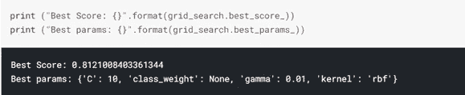

# 超参数优化:网格与随机

> 原文：<https://medium.com/codex/hyperparameter-optimization-grid-vs-random-3d87c7724f4f?source=collection_archive---------16----------------------->

## 泰坦尼克号数据集作为案例研究

图片来源:nationalgeographic.org

T**机器学习** ( **ML** )的美妙之处在于，计算机算法能够通过*从一组样本数据(称为训练数据)中不断学习*，直到[损失函数](https://en.wikipedia.org/wiki/Loss_function)收敛到可能的最小值，而无需人工干预。

该模型在其与训练数据的交互过程中学习一些[参数](https://en.wikipedia.org/wiki/Parameter)的值。在大多数情况下，这些参数可以简化为数学关系，并根据特定模型对训练数据的操作自动设置。示例包括[线性回归](https://en.wikipedia.org/wiki/Linear_regression)中的截距和斜率以及[神经网络](https://en.wikipedia.org/wiki/Artificial_neural_network)中的权重和偏差。

> 超参数是一个参数，其值用于控制学习过程，与训练期间学习的(其他)参数形成对比。

但是，还有另一类参数，它们的值是在训练模型之前设置的，因为它们不能通过将模型拟合到数据来学习。它们被称为[超参数](https://en.wikipedia.org/wiki/Hyperparameter_(machine_learning))。超参数是一个参数，其值用于控制学习过程，与训练期间学习的(其他)参数形成对比。示例包括学习速率和梯度下降中的迭代次数，以及神经网络中的层数和神经元数。

超参数非常重要，因为它们直接控制训练算法的行为，并对模型的速度和整体性能产生重大影响。

> H **超参数优化**或**调整**是为特定学习算法选择一组最佳超参数的过程。

超参数的精确调节可以提高性能。这被称为[超参数优化](https://en.wikipedia.org/wiki/Hyperparameter_optimization)或调整:为特定学习算法选择一组最佳超参数的过程。这涉及为学习算法提供最佳性能的值的混合。

在本文中，我将比较两种最广泛使用的超参数调优方法:

*   **GridSearchCV** ，以及
*   **randomsearccv**。

**GridSearchCV** 此后，选择具有最佳损失函数的值的组合，并为模型手动设置。这是简单和详尽的，但可能是耗时和昂贵的计算。

**RandomizedSearchCV**
与探索网格中每个可能组合的 GridSearchCV 不同，RandomizedSearchCV 评估一组随机的超参数值以找到最佳组合。这种方法速度更快，因为它减少了计算，但它可能不会返回最佳结果。

# **泰坦尼克号数据集**

> 在过去的 100 年里，这艘船的遗产和传说以各种形式被记录下来，成为虚构和非虚构作品和电影的灵感来源…

我们将使用机器学习最喜欢的新娘，Kaggle 上的[泰坦尼克号数据集。](https://www.kaggle.com/c/titanic/overview)

永不沉没的泰坦尼克号于 1912 年 4 月 10 日从英国南安普敦出发，开始了它的首航，驶向纽约。4 月 14 日，在旅程的第四天，在纽芬兰以南约 375 英里(600 公里)的地方，她在晚上 11 点 40 分左右与一座冰山相撞，导致船上的恐慌和与时间的赛跑。这艘客轮最终在 4 月 15 日凌晨沉没，导致 2224 名乘客和船员中的 1500 多人遇难。

在过去的 100 年里，该船的遗产和传说以各种形式被记录下来，成为虚构和非虚构作品和电影的灵感来源，该事件导致了海事法规和安全措施的重大变化。

因此，机器学习——人类最新的不可能领域——向雄心勃勃的前辈“永不沉没的泰坦尼克号”致敬也就不足为奇了。因此，它已经成为有抱负的数据科学家和机器学习爱好者的首选。

## 卡格尔比赛

泰坦尼克号 ML 比赛是开始你进入机器学习比赛的旅程并熟悉 Kaggle 平台如何工作的最佳挑战。

比赛很简单:使用机器学习创建一个模型，预测哪些乘客在泰坦尼克号沉船中幸存。

在比赛中，你可以访问两个类似的数据集，即“train.csv”和“test.csv”，其中包括乘客的信息，如姓名、年龄、性别、社会经济阶层、上车地点等。训练数据包含一个针对幸存者的额外列，这是您为测试数据寻找的内容。

然而，本文的目的只是使用数据集作为案例研究，分析两个最著名的超参数优化策略返回最佳结果所需的输出和时间。

# 结果

您可以查看完整的笔记本:[https://www . ka ggle . com/mabalogun/hyperparameter-optimization-grid-vs-random](https://www.kaggle.com/mabalogun/hyperparameter-optimization-grid-vs-random)

## GridSearchCV

GridSearchCV 花了 3.66 秒探索超参数的 24 个可能值。最高等级是平均验证分数 0.812，标准偏差 0.008。

## RandomSearchCV

RandomSearchCV 花费 0.98 秒获得 0.812 的平均验证分数，标准偏差为 0.018，这与 GridSearchCV 的结果相同。

# 结论

得到的超参数是相同的，因此输出也是相同的，而 RandomSearchCV 方法比 GridSearchCV 快 373%。

虽然从上面可以清楚地推断出 GridSearchCV 与 RandomSearchCV 相比可能没有定性优势，但要得出确定的结论，需要的不仅仅是一个数据集和一个模型。

然而，可以明确地说，在某些情况下，RandomSearchCV 可能是比通常使用的 GridSearchCV 更好的方法，特别是如果您对要优化的超参数和要使用的值有一个大致的概念。