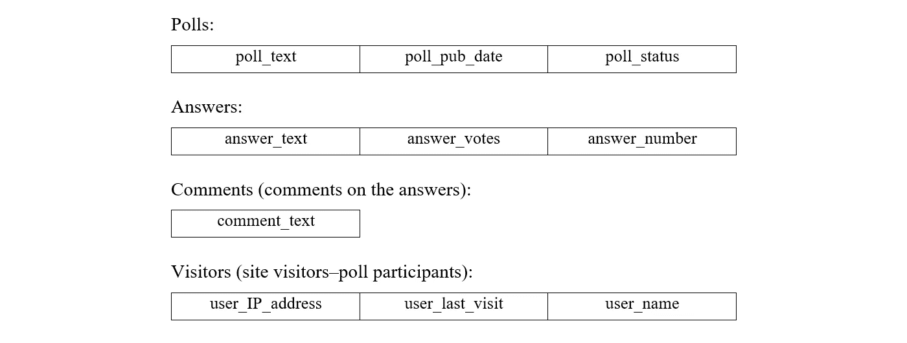
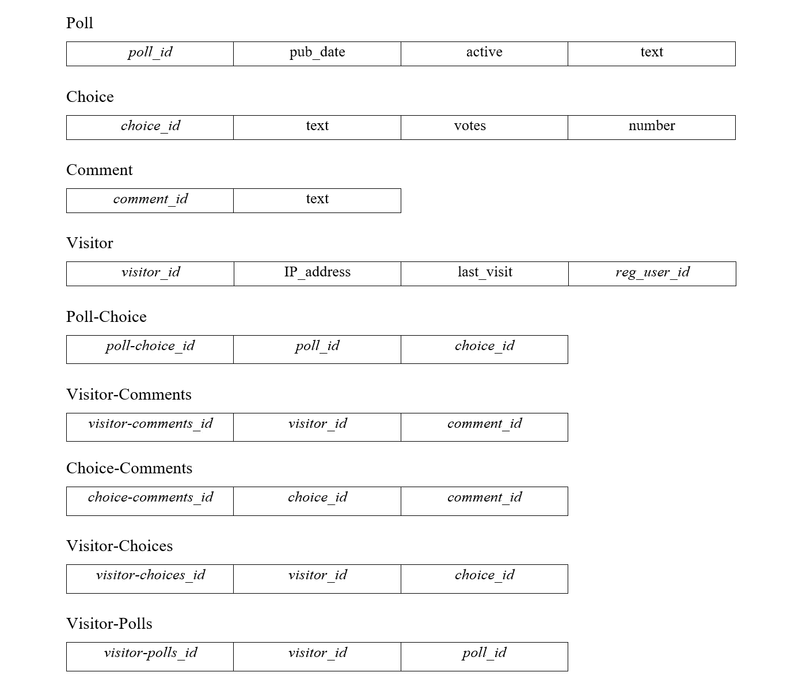
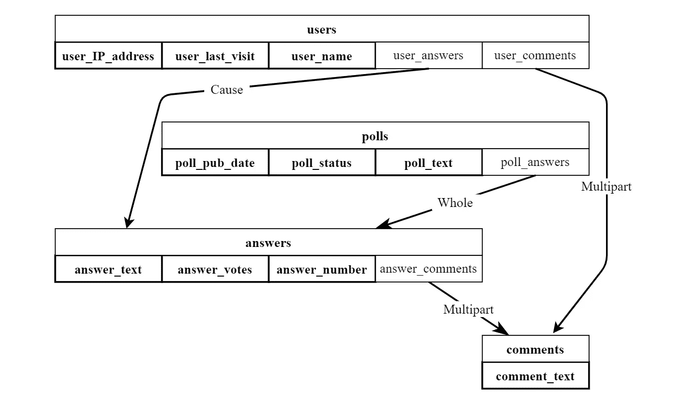
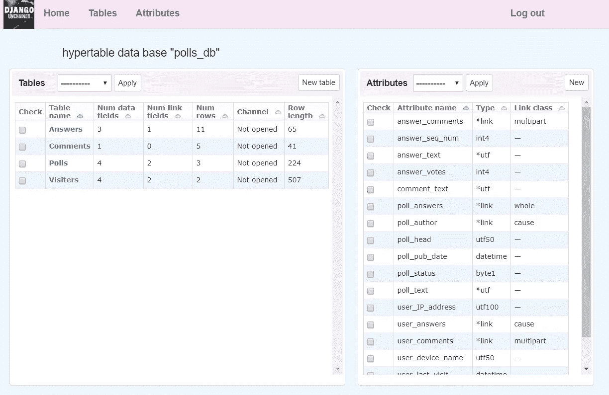

# 表格网络数据库的超级表格管理系统(HTMS)

> 原文：<https://medium.com/codex/hypertable-management-system-htms-for-tabular-network-databases-1e9ef617f0ad?source=collection_archive---------27----------------------->

## 超表格或表格网络数据库——关系数据库和网络数据库概念与 Python 中面向对象编程的交叉点上的新方法

【这是*表格网络数据模型*系列的第 4 部分。点击查看所有帖子的链接[。为了清楚起见，代码示例将在 Python/Django 生态系统的框架内提供。要理解这些例子，需要 Python 和 Django 的知识，或者至少是面向对象编程(OOP)的基础知识。]](/@azur06400/tabular-network-data-model-series-f7b8469ed333)

为了更具体地理解表格网络数据模型及其与关系模型的区别，让我们看一个例子。其结构如下:

1.  根据众所周知的用 Python 创建网站的教育和方法解决方案，制定了“民意测验”数据库的概念模型:template⁶.微软 Visual Studio Django 网络项目
2.  Django ORM⁷.公司的 API 在关系数据库(RDB)的逻辑级别上对数据库“轮询”概念模型的常规实现由于使用 ORM 来形式化原始操作(创建、读取、更新和删除 **)** 以及数据检索和过滤操作的技术是众所周知的，因此在示例中省略了这一点。
3.  HTMS API 在表格式网络数据库(TNDB)的逻辑层实现了数据库“轮询”的概念模型。为了便于理解，偶尔会省略一些类属性和方法参数，因为它们并不扮演基本的角色。感兴趣的读者可以参考上传到我在`github.com` ⁴ ⁵.的知识库上的 HTMS API 的完整程序代码和文档
4.  比较

## 概念模型:数据库轮询的一个例子

实体(关系)见图 1



图 1:数据库轮询概念模型的表格

依赖性和约定:

1.  每个投票(*投票*表中的一行)有两个或多个答案，即*答案*表中的行。
2.  每个答案(*答案*表中的一行)对应零个或多个评论，即*评论*表中的行。
3.  如果站点访问者第一次投票，将在*访问者*表中为该访问者创建一个新行。
4.  用户通过他们的 IP 地址来识别。
5.  每次投票后，投票中所选答案的投票数增加 1。
6.  网站应该记住每个访问者给出的答案和他们的评论。每个用户注释都保存在注释表的新行中。

备注:

*   *答案*表中的*答案编号*仅在显示投票的 UI 页面时使用。
*   *访客*表中的*用户名*仅供注册用户使用(非注册用户也可以投票和评论)。

## 数据库“民意测验”的逻辑关系模型——用 ORM 形式化

让我们从展示如何使用 Django ORM 的类来描述数据库开始。

```
**class** Comment(models.Model):
    **#** *table with comments on answers to the polls:*
    text = models.CharField()                    **#** *comment text***class** Answer(models.Model):
    **#** table with answers for the polls:
    text = models.CharField()                    **#** *answer text*
    votes = models.IntegerField()                **#** *number of votes*
    number = models.PositiveSmallIntegerField()  **#** *answer number*
    comments = models.ManyToManyField(Comment)   **#** *answer comments*
    **def** votes_percentage(self):
        **#** *calculation of the percentage of votes for the answer:*
        total = self.poll.total_votes()
        **return** str(
            self.votes / **float**(total) * 100 **if** total > 0 **else** 0
        )[:5]  **#** *show no more than 3 decimal places***class** Poll(models.Model):
    **#** *table with polls:*
    pub_date = models.DateTimeField()       **#** *date and time*
    active = models.BooleanField()          **#** *status (active/not*)
    text = models.CharField()               **#** *poll text*
    choice = models.ManyToManyField(Answer) **#** *poll answers*
    **def** total_votes(self):
        **#** *calculation of the votes cast by the poll:*
        choices = self.choice_set.all()
        votes = 0
        **for** choice **in** choices:
            votes += choice.votes
        **return** votes**class** Visitor(models.Model):
    **#** *table with participants info:* user_IP_address = models.CharField()
    last_visit = models.DateTimeField()**#** date and time of last visit
    reg_user_id = models. ForeignKey(   **#** user link in Django admin
        on_delete= models.SET_NULL)
    choices = models.ManyToManyField(Choice)  **#** choice of answers
    comments = models.ManyToManyField(Comment)**#** comments on answers
    polls =  models.ManyToManyField(Poll) **#** polls participated
```

*Visitor* 类中的 *polls* 属性可能看起来是多余的，因为投票列表可以通过答案列表获得，但是如果答案被删除，该属性用于保存用户参与投票的记录。

*Visitor* 类中的 *reg_user_id* 属性表示与标准 Django 认证系统通信的关系。

Django ORM 在第一次启动基于模型的用户子类的站点程序之前，物理地创建(或修改)数据库。Python 命令`manage.py migrate`和`manage.py makemigrations`在应用上下文中执行。

对于本例，Django ORM 创建了下面的表——参见图 2



图 Django ORM 生成的数据库轮询的真实关系结构。

添加属性(代理键) *poll_id* 、 *choice_id* 、 *visitor_id* 、 *comment_id* 来组织数据之间的关系。

关系模型的开销是显而易见的:四个额外的属性和五个额外的连接表: *Poll-Choice* 、 *Visitor-Comments、* *Choice-Comments* 、 *Visitor-Choices、Visitor-Polls* 。

## 数据库“民意测验”的逻辑表格网络模型——用 HTMS 形式化。第一部分。数据库结构

本小节将演示如何在 API HTMS 中描述“投票”数据库。参见[这里](/@azur06400/tabular-network-data-model-part-1-conceptual-definition-49e84104b8aa)的“超表”(HT)、语义类型、显著变化数据类型属性(DTA)和引用类型属性(RTA)的定义以及[这里](/@azur06400/tabular-network-data-model-part-2-important-features-99a07f514b4)的搜索波和超表管理系统(HTMS)的定义。

**A)*****HT _ Obj***类用于在应用程序内存(RAM)中创建特定数据库(HT)的实例。

***HT_Obj*** 实例可以在服务器上创建一个新的数据库作为一组必要的文件，或者“打开”一个现有的数据库——将其核心从文件加载到 RAM 中。

实例还可以使用 ***HT_Obj*** 类方法对数据库结构进行更改，例如添加、重命名或删除属性。这将在下一篇文章中举例说明。

当初始化具有特定 HT 的类的对象时，所需的参数是:

*   `db_name`:文件服务器中 HT 的符号名；
*   `server`:带有数据库的文件服务器的 IP 地址(或 DNS)；
*   `db_root`:文件服务器上 HT 文件的路径。

可以另外指定参数`new`:如果“*真”*，则创建一个新的数据库，作为一组文件和一个新的类；如果“*False”*(默认情况下)，则现有数据库“打开”，即打开其文件，并根据其中的信息创建该类的对象实例。

要确定 HT 的属性，即它们的名称和数据类型，应使用以下结构:

`ht_instance_name.attribute_name = "data_type"`，在那里:

*   `ht_instance_name` —对象名称—*HT _ Obj*的实例；
*   `attribute_name` —属性符号名；
*   `data_type` —数据类型，例如:“int4”(整数)、“float8”(双浮点数)、“* utf”(UTF-8 字符字符串。Unicode 转换格式，8 位是一种通用的字符编码标准，使用可变的字节数(从 1 到 4)可以更紧凑地存储和传输字符。)、“*link”(对表格行的引用)等。(documentation⁵).中给出了 HTMS 数据类型的完整列表

`ht_object_name.relation(dictionary)`方法为 RTA 添加了明确的类别描述(“整体”、“多部分”、“原因”)。

**b)*****表格*** class⁴用于为表格创建对象。必需的参数:

*   `ht_name`:HT 的符号名；
*   `t_name`:表格的符号名。

当一个表对象被初始化时，它在 HT 中的存在被检查，现有的对象或者被“打开”或者一个新的被创建。

为了确定表的列，即它们与 HT 属性的对应关系，使用以下结构:

`table_instance_name.fields_add = {<HT attributes subset>}`，其中:

*   `table_instance_name`是表对象实例的名称；
*   `fields_add` 是*表*类的特殊系统属性(字段)，利用其值 Python 解释器生成一组新的表属性(基于被覆盖的 `__setattr __ ()`系统方法)；
*   `{<HT attributes subset>}`是 HT 属性的子集(符号名)。

**示例数据库“民意测验”结构形式化**

在站点程序执行期间，HTMS 创建一个新的数据库或直接打开一个现有的数据库。相关选项:

**A)** **创建一个名为“polls”的新** HT。

`polls_db = HT_Obj(db_name= ’polls’, server=’…’, db_root=’…’, new = True)`

结果:

*   主数据库 files⁵(“空”)被物理地创建；
*   主数据库对象实例`polls_db`在内存中创建。

**或**

**B)**打开现有的 HT，名称为“polls”。

`polls_db = HT_Obj(db_name= ’polls’, server=’…’, db_root=’…’,)`

结果:

*   现有数据库的主文件被物理打开；
*   对象`polls_db`在内存中创建，其属性包含从其文件中读取的关于数据库的公共信息(HT descriptor⁵)。

对于在 **HTdb** 子类的实例初始化期间创建的新数据库，有必要确定逻辑层的结构(方案)。

**定义所有数据库属性、它们的名称和它们的数据类型:**

```
polls_db.poll_pub_date = "datetime" **#** *poll publication time*polls_db.poll_status = "byte1" **#***poll status “active/not” (byte)*polls_db.poll_text = "*utf" **#** *poll text - variable length)*polls_db.poll_answers = "*link" **#** *RTA - poll answers*polls_db.answer_text = "*utf"  **#** *answer text*polls_db.answer_votes = "int4" **#** *number of answer votes*polls_db.answer_number = "int4" **#** *poll answer serial number*polls_db.answer_comment = "*link"  **#** RTA -  *comments on the answer*polls_db.comment_text = "*utf"  **#** *comment text*polls_db.user_IP_address = "*utf"  **#** *poll participant IP address*polls_db.user_last_visit = "datetime" **#** *time of last site visit*polls_db.user_name = "*utf"  **#** *registered (in admin) username*polls_db.user_answers = "*link"  **#** *RTA - answers selected poll*  
                                 **# **     * by the participant*polls_db.user_comments = "*link" **#** *RTA - participant comments*
```

**定义 RTA 的语义类型(默认情况下，其余类型为“原因”):**

```
polls_db.relation(
    {
        "poll_answers": "whole", **#** *when a poll is deleted, all answers to it are deleted,*
           **#** *and when any answer is deleted,*
           **#** *the poll with all answers is deleted* "answer_comments": "multipart", **#** *when an answer is deleted, all comments to it are*
           **#** *deleted, but when the comment is deleted,* 
           **#** *the answer is not deleted* "user_comments": "multipart", **#** *if  a participant is deleted, all their comments*
           **#** *are deleted, but if a comment is deleted,* 
           **#** *the participant is not deleted*
    }
)
```

**创建表格实例，并从 HT 的公共属性集中为其选择属性(列)**

```
class Polls(Table)
    pass
class Answers(Table)
    pass
class Comments(Table)
    pass
class Users(Table)
    passpolls = Polls(polls_db.db_name)polls.fields_add = {
    "poll_pub_date",
    "poll_status",
    "poll_answers",
    "poll_text"
}answers = Answers(polls_db.db_name)answers.fields_add = {
    "answer_text",
    "answer_votes",
    "answer_number",
    "answer_comments",
}users = Users(polls_db.db_name)users.fields_add = {
    "user_IP_address",
    "user_last_visit",
    "user_name",
    "user_answers",
    "user_comments",
}comments = Comments(polls_db.db_name)comments.fields_add = {"comment_text"}
```

该代码的执行导致数据库结构的形成和服务器上相应文件的创建。如果已经创建了一个数据库，那么使用它只需要创建 HT 类和 table 类的实例。

对于本示例，HTMS 创建 HT(表格网络数据库)的结构，如图 3 所示。



图 3:表格网络数据库“polls_db”。该图通常以属性集的形式显示带有名称(“用户”、“投票”、“回答”、“评论”)和结构的表格。加粗的单元格边框表示数据类型属性(DTA)，带箭头的非加粗单元格边框表示引用类型属性(RTA)。每个箭头都标有 RTA 的语义类型，并指向一个表，其中的行出现在给定属性的值中(链接对:“table，row”)。



图 4:表格网络数据库的 HTed web 编辑器的屏幕截图

## 比较

通过比较关系模型和表格网络模型，可以清楚地看出，与关系数据库相比，表格网络模型更容易理解，更能代表经验场景。HTMS 和 ORM 中逻辑级别的数据方案的形式化是相似的，但是存在根本的区别:

*   在 HTMS 中，属性和数据类型被定义为数据库的公共集合，并且可以在应用程序算法中添加或删除它们；在 ORM 中，它们被绑定到不同的表中，不可能在运行的程序中改变它们。
*   ORM 中每个表的属性是静态的，但在 HTMS 中是动态的。HTMS 中的表结构被定义为公共属性空间的投影，这比 ORM 中的更简单、更直观。使用 HTMS 的应用程序算法可以改变表的结构，例如，通过添加新列或删除现有列，这在 ORM 技术中是不可能的。

我计划继续撰写关于表格网络数据模型和我的 HTMS 实现的文章。在下一篇文章中，我将继续讨论数据库“投票”示例——HTMS 数据操作，以及搜索和过滤。

本文授权文本: [CC BY-NC-ND 4.0](https://creativecommons.org/licenses/by-nc-nd/4.0/)

所示代码的许可: [CC BY-NC-SA 4.0](https://creativecommons.org/licenses/by-nc-sa/4.0/)

## 引文

【1】:*笼具系统。*[github.com/Arselon/Cage](https://github.com/Arselon/Cage)

【2】:*HTMS*github.com/Arselon/HTMS

[3]: *HTMS 对象级别*。[github.com/Arselon/HTMS/tree/main/htms_obj](https://github.com/Arselon/HTMS/tree/main/htms_obj)

【4】:*HTMS 中层。*[github.com/Arselon/HTMS/tree/main/htms_mid](https://github.com/Arselon/HTMS/tree/main/htms_mid)

【5】:*HTMS 低水平。[github.com/Arselon/HTMS/tree/main/htms_low](https://github.com/Arselon/HTMS/tree/main/htms_low)T21*

[6]: *Django web 项目模板*。[docs . Microsoft . com/en-GB/visual studio/python/python-django-we B- application-project-template？view=vs-2019](https://docs.microsoft.com/en-gb/visualstudio/python/python-django-web-application-project-template?view=vs-2019)

[7]: *Django ORM* 。【www.fullstackpython.com/django-orm.html 号