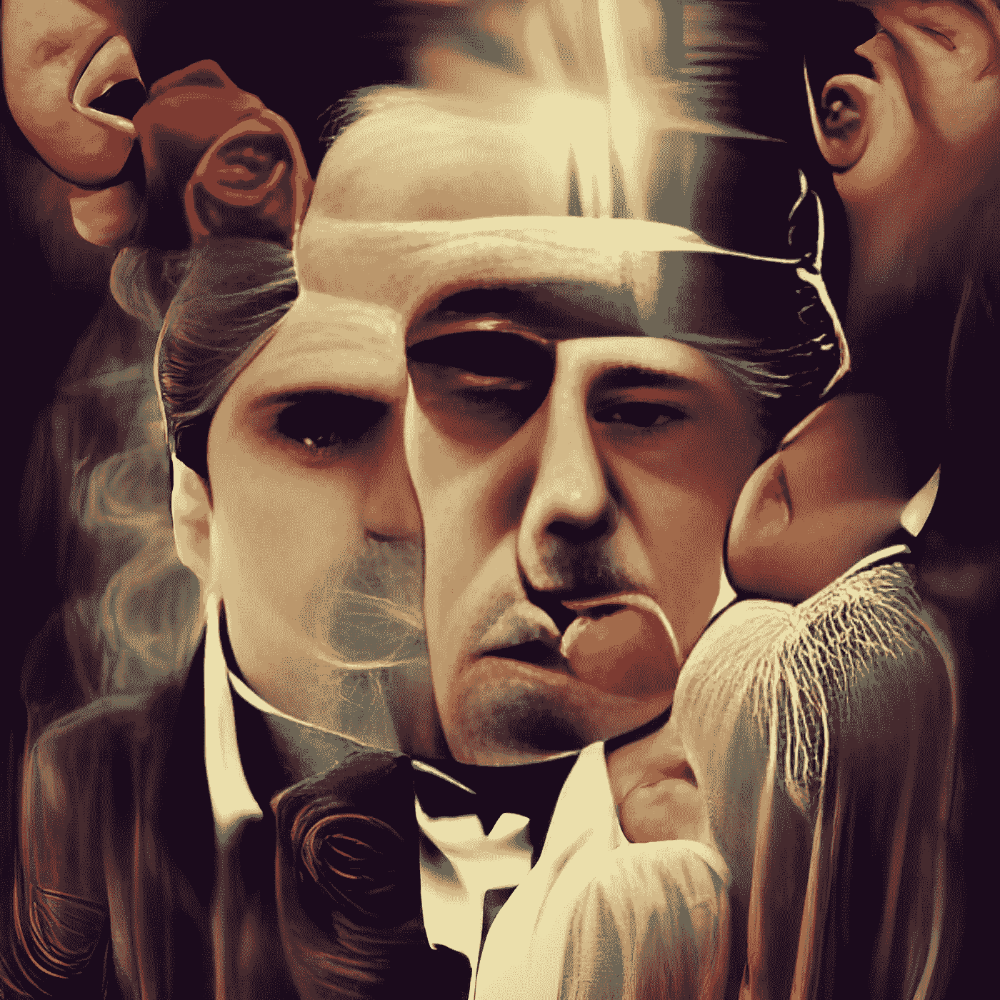

# 我让安艾画出了有史以来十大电影的名字。查看结果

> 原文：<https://medium.com/codex/i-asked-an-ai-to-make-marvelous-painting-of-the-top-10-movie-titles-of-all-time-see-the-results-310dda227eee?source=collection_archive---------2----------------------->

图片作者[作者](/@jimclydemonge)

近年来，人工智能变得无处不在。它无处不在，现在几乎每个人都在做 AI。许多艺术家正在慢慢地从传统艺术过渡到数字艺术。在人工智能的帮助下，艺术制作的整个过程可以明显加快。