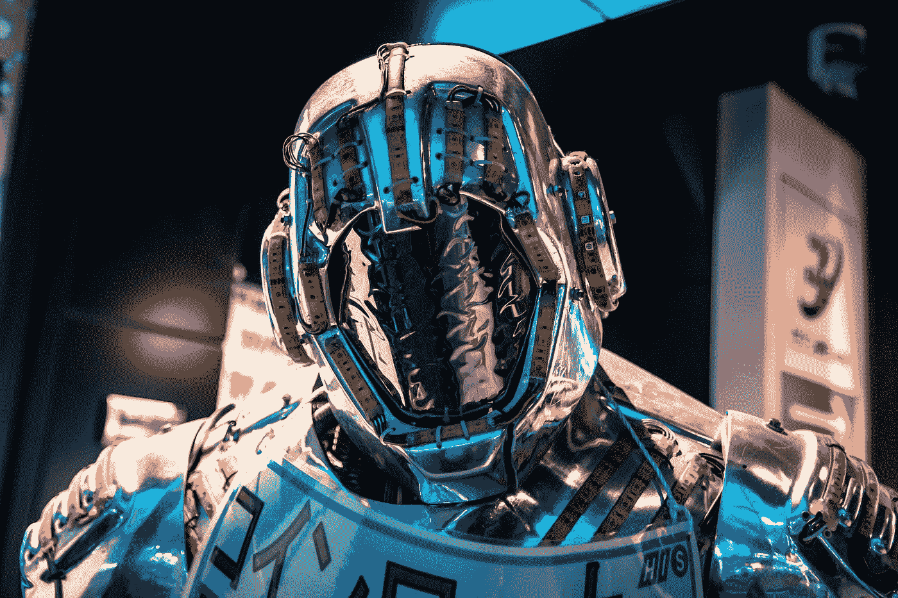

# 我请一个 AI 告诉我为什么 AI 是危险的

> 原文：<https://medium.com/codex/i-asked-an-ai-to-tell-me-why-ai-is-dangerous-afbfcb6e602b?source=collection_archive---------5----------------------->

## 这不是…没有错。

照片由 [Maximalfocus](https://unsplash.com/@maximalfocus?utm_source=medium&utm_medium=referral) 在 [Unsplash](https://unsplash.com?utm_source=medium&utm_medium=referral) 上拍摄

人工智能在过去几年里突飞猛进，它越来越有能力做一些非常酷的事情。但也不是没有风险。出于好奇，我请一个 AI 告诉我它认为人工智能的潜在危险是什么。