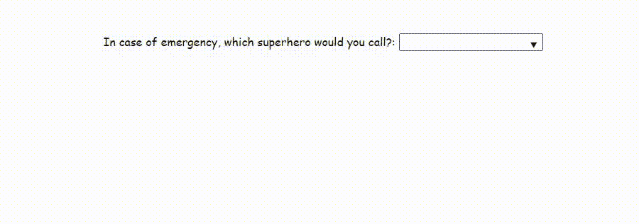

# 我打赌你不知道这 15 个 HTML 特性。

> 原文：<https://medium.com/codex/i-bet-you-didnt-know-about-these-15-html-features-9b0824dba28f?source=collection_archive---------0----------------------->

## 大概…


在过去的几年中，前端开发已经发生了革命性的变化，变得更高效、更快，当然也更大。SPA 框架的引入给 web 开发带来了突破性的变化。更多的繁重工作被转移到前端，需要处理更多的事情，比如动态 UI、路由、状态管理等。因此程序员习惯于新的方法和第三方来减轻一些负担。当然，它有它的优点，但是它确实使我们变得更懒。但是，如果我告诉你，在前端发展的这段时间里，你可能已经错过了一些基本的功能，而不是使用它们，你正在使用第三方包，甚至更糟，定制风格来实现基本的东西？！当然可以，让我们从 15 个你可能不知道的 HTML 特性开始，这些特性将帮助你不费吹灰之力实现一个友好的用户界面。事不宜迟，尽情享受吧！

## **1。内容可编辑**

`contenteditable`是可以在元素上设置的属性，使内容可编辑。它与 DIV、P、UL 等元素一起工作。你必须指定它像，`<element contenteditable=”true|false”>`。

```
<h2> Earth 616 superheroes </h2> 
<ul class="content-editable" contenteditable="true">     
 <li> 1\. Iron Man</li>     
 <li> 2\. Captain America</li>     
 <li> 3\. Black Panther</li> 
</ul>
```


## **2。细节标签**

`<details>`标签为用户提供了随需应变的细节。默认情况下，小部件是关闭的。打开时，它会展开并显示其中的内容。

标签`<summary>`和`<details>`一起使用，为它指定一个可见的标题。

```
<details>     
<summary>Click here to see more from Earth 616</summary>              <table>
  <tr>                    
    <th>ID</th>                    
    <th>Name</th>                    
    <th>Location</th>                    
    <th>Job</th>                
  </tr>                
  <tr>                    
    <td>1</td>                    
    <td>John Doe</td>                    
    <td>Earth</td>                    
    <td>Human</td>                
 </tr>          
</table>  
</details>
```


## 3.**数据表**

`<datalist>`标签指定了一个预定义选项列表，并提供了一个自动完成特性。

```
<label for=”superhero”>In case of emergency, which superhero would you call?:</label>
<input list=”superheroes” name=”superhero” id=”superhero”>
<datalist id=”superheroes”>
 <option value=”Iron Man”>
 <option value=”Captain America”>
 <option value=”Black Panther”>
 <option value=”Thor”>
 <option value=”Spider Man”>
</datalist>
```



## **4。范围**

`range`输入类型的行为类似于滑块范围选择器。

```
<head>
    <script>
        function changeValue(event) {
            let value = event.target.value;
            let output = document.getElementById('output');
            output.value = value;
        }
    </script>
</head>
<body>
    <form method="post">
        <input 
             type="range" 
             name="range" 
             min="0" 
             max="100" 
             step="1" 
             value=""
             onchange="changeValue(event)"/>
     </form>
     <div class="range">
          <output id="output" name="result">  </output>
     </div>
</body>
```


## **5。仪表**

`<meter>`标签定义了定义范围内的标量测量或分数值。

```
<label for="home">Cloud storage</label>
<meter id="home" value="0.4">40%</meter><br><label for="root">Internal storage</label>
<meter id="root" value="0.6">60%</meter><br>
```


## 6。进展

标签代表任务的进度。

```
<label for="home">6/10 tasks done</label>
<progress value="60" max="100" id="home"></progress>
```


## 7。颜色选择器

一个简单的颜色选择器。

```
<p id="colorPicker">Color Picker!</p>
<input type="color" onchange="showColor(event)">
```


## 8。标记内容

使用`<mark>`标签高亮显示任何文本内容。

```
<p>Did you know that <mark>not all heroes wear capes.</mark></p>
```


## 9。引用

如果你包含了不同来源的内容，你绝对应该引用那个来源。

```
<figure>
  <blockquote>
    <p>It's an imperfect world, but its the only one we've got.</p>
  </blockquote>
  <figcaption>--TONY STARK, <cite>IRON MAN</cite></figcaption>  
</figure>
```


## 10。缩写

“abbr”是缩写的简称！这里的想法是，如果你使用一个头衔(如“先生”)或缩写(如“盾牌”)，缩写标签准确地表明缩写的意思。

```
<p>Agent Phil Coulson leads a team of highly skilled agents from the     global law-enforcement organisation known as 
<abbr title="Strategic Homeland Intervention, Enforcement, and Logistics Division">SHIELD</abbr>. 
</p>
```


## **11。< del >和< ins >和**

实际上，有一个标记用于删除线文本，另一个标记用于指示替换文本。

```
<p><del>Iron Man</del> <ins>Captain America</ins> is ehmmm.. yea the captain!</p>
```


## **12。输出**

`<output>`标签表示计算的结果。通常，该元素定义了一个区域，用于显示某些计算的文本输出。

```
<form oninput="x.value=parseInt(a.value) * parseInt(b.value)">
    <input type="number" id="a" value="0"> * <input type="number"  id="b" value="0"> 
    = <output name="x" for="a b"></output>
</form>
```


## **13。隐藏的**

说到隐藏元素，我们都尝试了不同的方法，比如在 CSS 文件中使用`opacity:0`、`visibility:hidden`、`height:0; width:0`、`display:none`。每一个都有自己的用例，并在不同的布局上工作。另一个类似的选项是[隐藏的](https://developer.mozilla.org/en/docs/Web/HTML/Global_attributes/hidden) HTML 属性。如果一个元素指定了`hidden`，它将被隐藏。我碰巧有用于存储值的隐藏输入，所以如果您也需要它，请不要惊讶！

```
<div hidden>...</div>
```

## **14。时间**

标签定义了一个特定的时间(或者日期时间)。

该元素的`datetime`属性用于将时间转换为机器可读的格式，以便浏览器可以通过用户的日历添加日期提醒，搜索引擎可以生成更智能的搜索结果。

```
<p>The next assemble meeting is postponed on <time datetime="2022-12-01">2022-12-01</time>.</p>
```


## **15。音频**

`<audio>`标签将定义一种声音，有三种支持的文件可供该标签使用。这些是 MP3、WAV 和 OGG。然后浏览器会选择它支持的第一个。

```
<audio controls>
  <source src=”introduction.ogg” type=”audio/ogg”>       
  <source src=”introduction.mp3” type=”audio/mpeg”>       
  Your browser does not support this audio      
</audio>
```

就是这样！请分享这篇博文来传播知识。

如果你觉得这篇文章对:D 有意思，请在 Linkedin 上加我