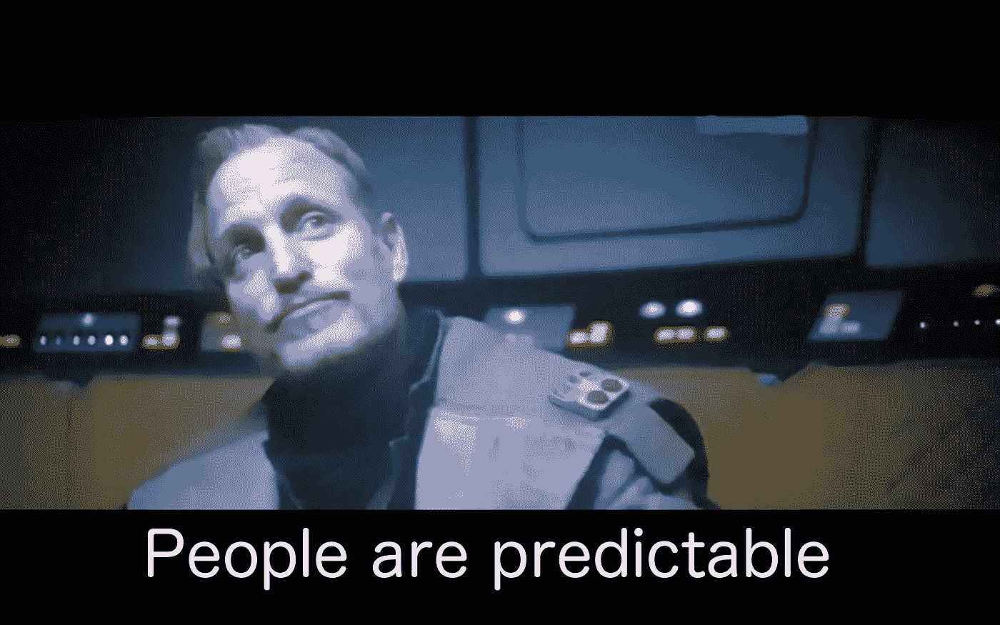

# 我开发了一个软件…

> 原文：<https://medium.com/codex/i-built-a-software-ad9c874b5900?source=collection_archive---------9----------------------->

这…是真的。我对大约 20 个人做了一个实验，这个实验真的有效，并且得出了一些你应该担心的意想不到的结论。

顺便说一句，这并不奇怪。人工智能是人类研究了很长时间的东西。让我吃惊的实际原因不是它的存在。这是因为随着时间的流逝，现在变得越来越容易。

# 介绍

艾。每个人都大肆宣传的东西。埃隆·马斯克开门见山地说，这是人类需要担心的第一件事。**我遇到的几乎每个人都可能以错误的方式理解了这一点。**

**现在，我不必向大多数人解释人工智能是什么，因为它已经被大肆宣传，甚至街上随便一只狗都知道它。但是，对于那些一直生活在洞穴中的人来说，简单地说，AI 或人工智能是计算机理解、分析、模仿并做出类似人类决策的能力。**

## AI 到底有什么问题？

世界末日不会是人工智能机器人接管我们，也不会是机器奴役我们。当然比这更复杂。

人类从来没有在巨大的、重大的不可预测的情况下成功过。要么来自大自然，要么来自其他人类自身。**总会有一些伤亡和我们犯下的错误。**因此，由此我们可以得出一个结论，**如果任何难以预测的事情扑向我们，我们很有可能出错并影响人类自身的生存。这……这就引出了 AI。**

使用人工智能和一些复杂的算法，我们可以很容易地创建软件，不仅可以预测人类的行为，还可以做出我们无法预测的决定。

现在，你们大多数人都知道这一点，这可能是几乎所有关于人工智能的文章。**我再次这么说的原因是，尽管我们知道如何用人工智能做到这一点，但我们仍然没有意识到简单地模仿人类模式是多么容易，这导致了我进行的实验。**是的，确实需要编程和一些知识，但是……真的就这些了。对于完全初学者来说，这就像观看一些 YouTube 视频、一些复制粘贴和一些谷歌搜索一样简单。

# 实验

我开发了一个控制台程序，可以预测你能猜到的下一个数字。不开玩笑，这能够预测人们所想到的数字… **嗯…至少是一个相当令人印象深刻的数字。我将解释其中的逻辑和工作原理。**

我和我的 10 个朋友测试了这个，他们不知道我在做什么，为什么要这么做。他们所要做的就是立即随机写出 1 到 10 之间的任何数字。他们需要这样做 10 次。最后，我从他们那里得到了 10 个随机数……现在奇迹来了。**我把所有的随机数输入我的控制台软件。计算机分析这些数字、模式和所有类似的东西，最终预测下一个数字。**我向这个人询问另一个随机数(1-10)。**如果计算机生成的数字是正确的，它就继续。否则，我会给出正确答案。计算机重新分析它并预测下一个数字。**

# 我什么意思？

**令人惊讶的是，该应用程序平均每个人都能正确预测 37%的数字。还有 Btw，数学计算一下，我答对一个数字的概率应该在 10%左右(没有任何计算)。所以这个软件几乎“正确”了 4 倍，这是…嗯…巨大的，考虑到我投入的很少的努力和我花在它上面的很少的时间。**现在你必须记住，这个应用程序是我一个人创建的，我使用的逻辑非常简单，更不用说我总共用了大约 1 天就完成了构建。**想象一下，如果这是一个更复杂的水平，由一个更大的团队来完成，需要更长的时间……即使百分比从 37%上升到 60……这也是一个巨大的差异。**

我的结果是，当我们必须立即做出决定时，我们会下意识地选择相似的模式(和决定)。对于所有阅读这篇文章并对心理学感兴趣的人来说，**如果我错了，请联系我。很明显，我对人类行为一无所知。**

而这些只是一些无用的数字。**如果这是现实世界的决策会怎样？我们真的可以预测未来的政治决策，等等…我知道我在这里说的有点太科幻了，但这并不遥远。将这种技术与 neuralinks 这样的想法结合起来，我们可以预测整个人类的未来。**

# 应用程序是如何工作的？

这是结果

我将在我未来的 YouTube 视频中，在我的频道“[**FadinGeek**](https://www.youtube.com/channel/UCAEEOplNQDzc1bmrGqDPnyw)**”谈论这个应用程序是如何工作的，以及我是如何使用 JavaScript 创建它们的。但是，因为你们大多数人都不会去 YouTube，所以我就简单地用一段话来解释一下。**

当然，在大约 20 次预测后，我的朋友们能够理解我的应用程序有多愚蠢，所以他们设法逃脱了。

好的…这就是应用程序的工作方式。如前所述，要求你随机给出 10 个数字。该应用程序的工作是给每个数字打分。数字的分数越高，这个人就越有可能预测到这个数字。简而言之，出现次数越多的数字得分越高。但这不会给出数字的模式。为此，我们假设这个人说 3、7、5 和 1 是一个数字模式。如果这个人的下一个数字是…比如说… 7，那么 7 会得到 2 分，3 和 5 会得到 1 分，因为它们可能是下一个类似的预测。我还添加了一些像这样的规则，应用程序就完成了。是啊…你可能会意识到这个应用程序甚至不是人工智能。只是……太简单了。但是，这可以让你知道预测人类行为是多么简单。

现在我甚至不知道这是否可行，因为我对人类行为心理学不感兴趣。这只是我的猜测，似乎在猜测模式时效果很好。

# 结论

我们…是可预测的。这比你想象的要容易。即使你完全无视我的实验。久而久之，我们将会看到更多的人能够预测我们更多的人，直到最终我们可能开始预测人类自身的未来决策。我可以很容易或多或少地预测 2022 年及以后会发生什么，我也就此写过文章。

## 关于这方面的更多信息…

**如果你觉得这篇文章有帮助，这里有一篇关于为什么人类走得太远的相关文章。我相信你也会喜欢的。我也有一个名为“ [FadinGeek](https://www.youtube.com/channel/UCAEEOplNQDzc1bmrGqDPnyw) 的 YouTube 频道，在那里我会发布更多类似的内容。**

[(题外话)人类正在走上一条错误的道路……有点过了……|作者 FadinGeek | Dec，2021 | Medium](https://fadingeek.medium.com/off-topic-humans-are-going-in-the-wrong-way-a-bit-too-much-d606a902f5c8)

**你真棒:)**

> **法丁吉克**