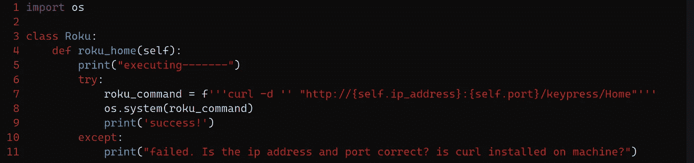
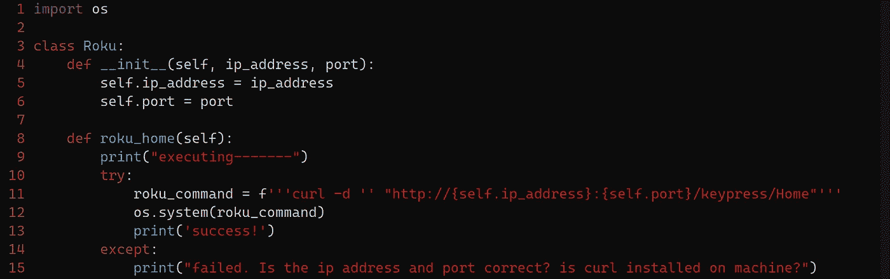

# 我创建了一个 Python 脚本来控制我的 ROKU 电视

> 原文：<https://medium.com/codex/i-created-a-python-script-to-control-my-roku-tv-d8fb0217308?source=collection_archive---------9----------------------->


# 前言

对于那些不知道什么是 Roku 电视的人来说，这是一种带有软件的电视，可以播放不同的流行流媒体服务，如网飞，Hulu，Disney+等服务。你也可以下载一个应用程序到你的手机上，它可以控制音量、频道、视频输出和屏幕上的移动。虽然我确实发现这个应用程序非常有用，但我经常会发现自己把手从笔记本电脑上拿开，用手机上的应用程序与它互动。因此，就像软件开发人员一样，我创建了一个可以与电视互动的 CLI(命令行界面)。这样我就可以更容易地使用这个设备。在这篇文章中，我真的想谈谈我从对产品一无所知到能够通过命令行操作它的过程。

**哦，还有，我将只谈论我如何发现如何使用 ROKU 设备和脚本中的逻辑部分，GUI 和 CLI 部分将在另一篇文章中讨论。**

# 首先，我必须弄清楚它是如何工作的。

起初，我不知道 Roku 平台是如何工作的，所以我用简单的谷歌搜索进行了调查，比如，Roku 是如何工作的？Roku 如何与 app 交互？有 Roku 开发者页面吗？经过几次搜索，我终于找到了这个网页

[https://developer . Roku . com/docs/developer-program/debugging/external-control-API . MD](https://developer.roku.com/docs/developer-program/debugging/external-control-api.md)

这是开发者谈论 ECP 的一页，该协议允许通过局域网控制设备。经过进一步调查，我发现这些设备可以通过使用特定的 URL 路由向正确的套接字(套接字表示 IP 地址和端口号)发出空 POST 请求来控制。例如，假设您的设备套接字是 199.111.255.9:1234，要使设备增加音量，您可以向该套接字发出 post 请求，URL 以 VolumeUp 结尾。这里有一个例子，我让一个 Roku 设备增加音量，向下导航，另一个导航回家。我将使用 Linux 命令 curl 来实现这一点。

```
curl -d '' "http://199.111.255.9:1234/keypress/VolumeUp"curl -d '' "http://199.111.255.9:1234/keypress/Down"curl -d '' "http://199.111.255.9:1234/keypress/Home"
```

如你所见，使用 curl 和-d 标志，控制 Roku 设备真的很容易。还要注意，post 请求的主体中没有任何内容。

# 现在是时候构建 CLI 了！

现在我们知道了如何通过网络控制 ROKU 电视，是时候让它在 python 脚本中工作了。这样，我就不必经常单独使用 curl 命令来操作电视了。

首先，我想想出让一切正常工作的逻辑。我想创建一个概念证明，所以我从创建命令并确保它们工作开始。我决定在 python 类中创建方法，然后将该类绑定到一个变量以便于访问。我还想使用 try，除了用于简单故障排除的语句。总而言之，我最后想出了这个。



我需要导入 OS 命令，因为 CURL 依赖于 Linux 操作系统。然后，我将该类初始化为一个变量，使用该方法，它工作了！从这里开始，整个过程变得简单了。

# 简单！现在我将添加更多的命令和类属性。

现在我们已经证明了我们的概念证明，一切都变得简单了，我只需添加更多的命令来实现我想要 ROKU 设备做的事情，如移动和音量。我还想在类中添加引用设备 IP 地址和端口的属性。总之，看起来是这样的。我觉得很好很整洁。



# 是时候结束一切了。

现在大部分逻辑都完成了，是时候将类绑定到变量并使其运行了。首先，我创建了一个名为 my_device 的变量，并把它赋给了这个类，同时像这样给出了 Ip 地址和端口号的参数。

`my_device = Roku ('112.111.647.9', '1234')`

就像我说的，我只想回顾一下使用这项技术的发现，以及我是如何让它与 python 一起工作的。如果你有兴趣看完整的源代码，我在下面附上了 GUI 和 CLI 的链接。

# 谢谢你看我的文章！

这个项目的源代码包含一个实际的 CLI 和我创建的 GUI。我只想回顾一下准系统项目和这里的主要逻辑。

**另外，你可以在** [**大卫自由 2/roku**](https://github.com/Davidfree2/roku_tv) **_tv** 这里查看

一如既往地感谢您的阅读！我希望你觉得这篇文章很有趣，并在这个过程中学到了一些东西。如果你觉得我遗漏了什么，请在下面评论，或者直接给我发消息。如果你觉得这篇文章内容丰富，也留下你的关注吧！:)

# 我最近在忙什么。

我的名字大卫和我已经从事软件 web 开发大约两年了。大多是自由职业者的工作。我知道 Python，JavaScript，Bash，CSS，HTML，PostgreSQL，MongoDB，还有很多其他的技术。如果你想联系我，请到 davidesquerra.com 来找我。在这个网站上，你可以直接给我发短信或电子邮件。就像我上面说的感谢阅读:)。