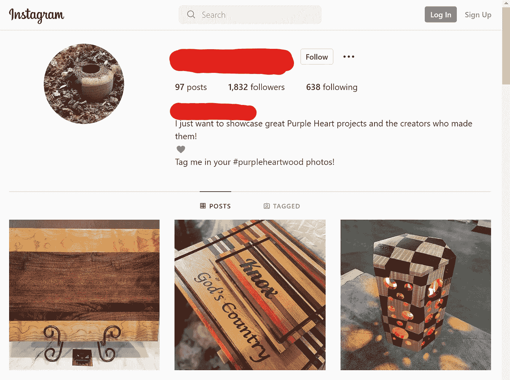

# 我创造了一个人工智能影响者

> 原文：<https://medium.com/codex/i-created-an-ai-influencer-3f69543d1c98?source=collection_archive---------0----------------------->

## 我如何使用 Python 和机器学习来自动化 Instagram

作者图片

在我能想到的大多数情况下，拥有大量的在线观众将有利于你的努力。写书？好吧，你已经有一个专门的受众来推广它了。对新产品有什么好主意吗？好吧，你已经有完美的观众来支持你的 Kickstarter。事实上，如此有益是一种…