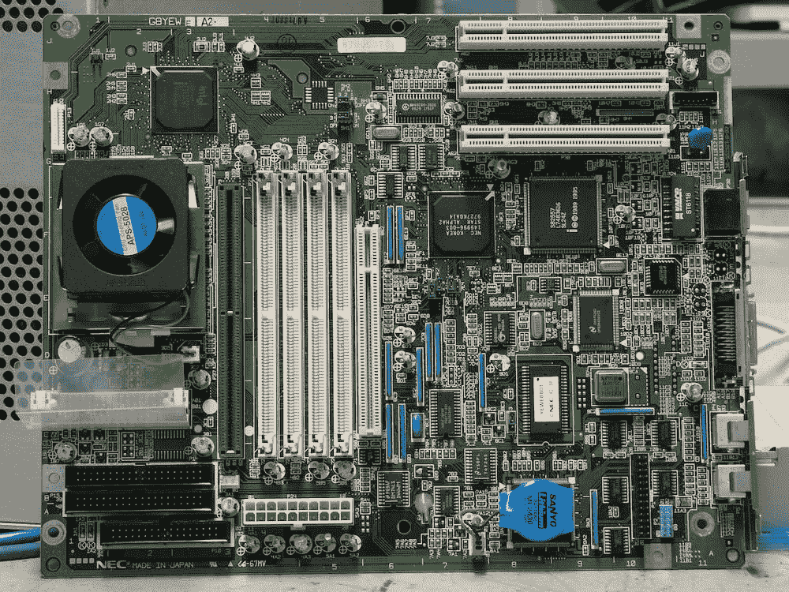

# 我不知道如何初始化一个数组

> 原文：<https://medium.com/codex/i-dont-know-how-to-init-an-array-2d24d6c58b57?source=collection_archive---------13----------------------->

*免责声明:所有观点均为本人*

[照片](https://www.pexels.com/photo/green-motherboard-163140/)来自 Pexels 的 Pixabay

我要深吸一口气，告诉你我不知道怎么用 Java 初始化一个`ArrayList`。

我断断续续写 Java 已经超过 10 年了。我和几百个，也许几千个，也许几百万个`ArrayList`互动过(我不能确定我是否夸张)。