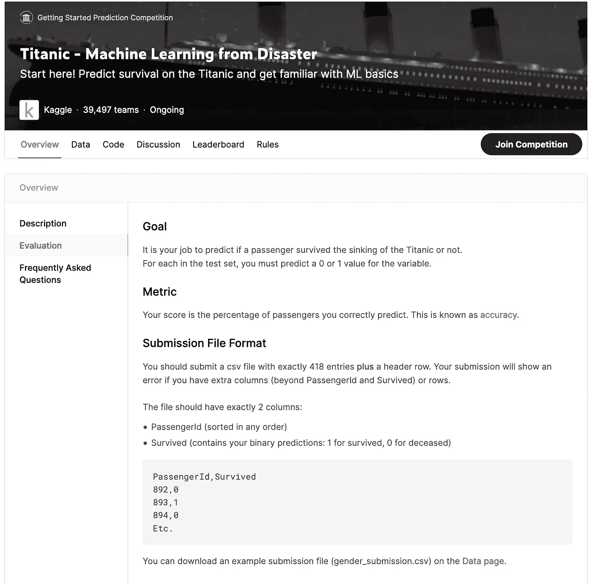
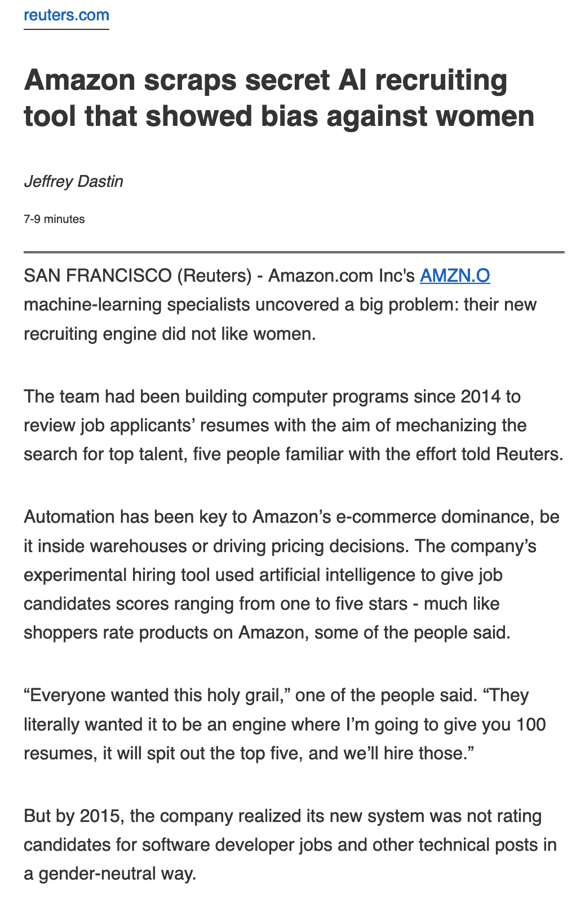
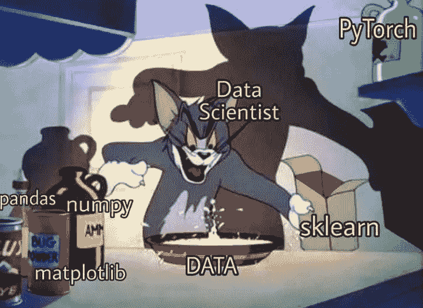

# 我不喜欢数据科学竞赛

> 原文：<https://medium.com/codex/i-dont-like-data-science-competitions-714a83dc4612?source=collection_archive---------6----------------------->

# 什么是数据科学竞赛？

数据科学竞赛在过去 5 年中变得非常受欢迎。它们不仅在像 Kaggle 这样的网站上很受欢迎，而且在以[候选人测试](https://exercism.io/)的形式与公司进行求职面试时也很受欢迎。这些测试很快变成了一种判断参与者/候选人提交的表现并确定他们是否在挑战中成功的方式。

**热门泰坦尼克号比赛**

这些竞赛/测试通常包括一个有时间限制的目标，其中组织者提供一些数据，很多时候是训练和测试集[1]，参与者提交他们的模型得出的预测，以查看他们与所有其他参与者相比表现如何。也就是说，将预测与测试集中忽略的因变量[2]进行比较。那些产生最高精度的要比其他的好得多。在某些情况下，参与者的方法也可能会受到质疑，但这种情况在求职面试中更常见，尽管没有在网上竞争中常见。

虽然我对数据科学的了解发生在我大学学习期间，但行业中的 it 实践帮助我认识到这是两个不同的世界。这并不是说教育在数据科学和机器学习领域没有一席之地。

我的学士论文围绕着算法交易。我训练了一个机器学习模型，从一篮子股票中挑选相关和反向相关的股票，预测这些股票的未来价格走势，并根据这些见解决定是否持有、购买或出售，而不需要任何人工输入。虽然我从这次经历中学到了很多，但我绝对不会把这个模型用在工业上，也绝对不会让它用真金白银去投资。

# 真实数据不会出现在 CSV 文件中

与竞争中发现的数据集相比，行业中发现的数据集完全不同。事实上，我甚至不会称它们为数据集，而是一个巨大的数据库，如果你不够幸运没有一个集中的数据仓库，有时会是多个。您需要筛选大量表格，其中缺少适当的文档，寻找您需要的数据，然后做一些繁重的整理工作来组织您的数据，并彻底检查数据，然后才能考虑在机器学习模型中使用它。

这与你在比赛中拿到的`.csv`文件完全不同，那是一个已经有人为你完成打包工作的数据集。有个笑话说“数据科学家花 80%的时间清理数据，另外 20%的时间抱怨数据。”这当然有点夸张，但它意在强调，对于数据科学家来说，在开始建模之前，获得他们需要的数据是多么困难。这是这些比赛没有教会你的。

# 工业不是生产最高精度的产品

当你与公司及其客户打交道时，更重要的是理解一个模型是如何形成决策的，而不是它能达到的最高精度。最终，一个薄弱的模式会损害公司的业务和形象，潜在地损失客户和金钱。机器学习模型可能在测试集中取得优异的结果，但是这并不意味着一旦模型被部署到生产中并根据真实数据进行测试，它的假设就成立。当你的模型发现一个从未遇到过的例子时，它会怎么做？

也有可能模型在训练数据上[过拟合](https://en.oxforddictionaries.com/definition/overfitting)【3】，在测试环境中表现出色，但在生产中表现不佳。在其他情况下，训练集和测试集也可以包括由人类引入的偏差，允许机器学习模型从相同的偏差中学习，并将其应用于决策。

[*路透社*](https://www.reuters.com/article/us-amazon-com-jobs-automation-insight-idUSKCN1MK08G)

就合法行为而言，如果一家公司因为其机器学习模型所做的决定而被起诉，该公司将承担损害赔偿责任，除非他们能够理解其模型的内部工作原理，并向公众解释这些决定，假设这些决定背后的决策是合理的。

为了遵守监管框架，公司需要能够解释他们的流程，以便获得监管机构的批准。如果一家公司的反洗钱(AML)流程因某个特定案例的失败而受到质疑，那么“机器学习”这个借口就行不通了。这就是为什么易于理解和透明的机器学习算法，如决策树[4]在应用于合规性问题时往往更受青睐。

[*电报*](https://www.telegraph.co.uk/technology/2019/02/28/revolut-failed-block-suspicious-transactions/)

# 竞争不会帮助你理解你的模型

竞赛的最终目标是在时间有限的情况下获得最高的准确度，即使是很小的一部分也会产生影响。这并不鼓励你花时间去理解数据，它的不完美，并训练一个对对立的例子健壮的模型。相反，你会受到激励，去尝试任何能让你稍稍前进的事情，不管代价有多大。这鼓励了黑盒模型的使用，让你无法理解你的模型从你的数据中学到了什么。

竞赛倾向于使用不太复杂的数据集，以降低准入门槛，促进参与，当然，除了时间限制。他们这样做也是因为他们不允许公开分享客户的个人身份信息(PII)。另一个原因是公司的数据是适当的。数据被称为[“新石油”是有原因的没有一家公司会心甘情愿地将自己的秘方提供给其他人，让他们为自己的业务所用。这就限制了你在这样的比赛中竞争所能学到的东西。](https://www.forbes.com/sites/forbestechcouncil/2019/11/15/data-is-the-new-oil-and-thats-a-good-thing/)

# 并非所有的提交都需要源代码

如果你没有足够的激励来产生一个黑盒解决方案以产生最高的准确性，一些竞赛甚至不强制要求提交你的解决方案背后的代码供其他人尝试，将更多的重要性放在准确性结果上，而不是用于实现所述结果的方法。

# 你不需要写好的干净的代码

作为一名数据科学家，工作不仅仅是建模，还包括编写清晰的代码，让其他人能够理解和重现你用同样的数据获得的结果。由于数据科学的挑战如此集中于模型的准确性，你没有动力去正确地记录你的代码和你得出你所展示的结论的方法。这阻止了其他人学习你的方法，当然也阻止了你向其他人学习同样的方法。

# 没人教你 SQL

SQL 是数据科学中最重要的技能之一。如果没有任何 SQL 知识，您将无法查询数据所在的数据库，以便以您的模型所要求的格式获得您需要的数据。当然，你可以将一个表格转储到一个文件中，然后只使用[熊猫](https://pandas.pydata.org/)来完成剩下的工作，但是这不会让你走得太远。

如果您的数据库跨度达到数百 GB，甚至数 TB，会怎么样？。一般的经验法则是，在熊猫身上，你需要十倍的内存来处理数据。这意味着 1GB 的数据需要 10GB 的内存。数据库在处理数据方面远比像 Pandas 这样的库更有效，这就是为什么我总是建议在数据库中进行尽可能多的处理，并且只有在您确实需要像 Pandas 这样的库来继续您的工作时才提取数据。这并不是说没有比 Pandas[5]更高效的库，但是你必须在效率和复杂性之间做出权衡。

# 如何提高您的数据科学技能

如果你正在寻找学习的方法，找到一个你感兴趣的特定行业，并尝试将机器学习应用于该行业。假设您对房地产感兴趣，并希望训练一个模型来根据其特征预测房地产的价值。你甚至可以试着预测未来 X 年的价格增长。这可能有助于其他寻求购买房产的人，并揭示目前房地产市场的价格波动。

你肯定可以在网上找到一个数据集，它会给你这些信息，但是正如我上面解释的，这些数据集在现实世界的例子中不成立。如果你找到一个列出你需要的信息的网站，并建立一个 [scraper](https://scrapy.org/) 来收集你需要的数据，并安排它定期运行，这样你就可以开始收集历史数据。在某些情况下，一些网站甚至会提供一个 API 来让你更容易的获取你需要的数据。

简单地抓取数据是不够的，因为您将定期这样做，您需要想出一种有效的方法来存储数据并跟踪历史记录。这就是数据库的用武之地。没有必要去建立一个分布式数据库， [SQLite](https://www.sqlite.org/index.html) 对于这样一个项目来说已经足够了，让您不必再去设置和维护数据库服务器，同时还能为您提供一个快速的 SQL 查询引擎来查询您的数据。

你现在可以开始分析你在一段时间内收集的数据，了解在评估一处房产价值时真正重要的特征，以及导致价格随时间变化的事件。一旦你有了一个模型，你甚至可能想通过一个 API 提供给其他人使用，允许他们输入属性特征并从你的模型得到一个预测。

我为什么要提出这些建议？因为虽然很容易在互联网上找到一个数据集，但这并不是你在工业中获取数据的方式。如果你在网上找到了你的数据集，很可能有人已经对它做了些什么。这可能是你尝试新事物的机会。

# 什么比赛好

这并不是说竞赛在数据科学中没有一席之地。我确实相信，假设代码已经提交，这样的竞赛提供了一个很好的相互交流想法的方式，以便您在自己的数据上尝试新的方法。

好的竞赛也包括书面报告，为社区内的知识共享提供了一个很好的机会，允许社区对提交者的方法提出问题。

*   [0] Kaggle 是一个以将数据科学家和机器学习实践者聚集在一起参加比赛以解决数据科学挑战而闻名的网站。
*   [1]测试集是数据的子集，用于根据从未见过的数据测试模型的准确性。在竞争的情况下，测试集往往忽略了因变量。
*   [2]因变量是您试图预测的值，它取决于其他变量的值。
*   [3]过度拟合是指“产生的分析过于接近或精确地对应于一组特定的数据，因此可能无法拟合额外的数据或可靠地预测未来的观察结果”。
*   [4]决策树是帮助确定行动方针或显示统计概率的图表。决策树的每个分支代表一个可能的决策、结果或反应。树上最远的分支代表某个决策路径的最终结果。
*   [5] [NumPy](https://numpy.org/) 是一个 Python 库，用于对数据进行数学运算。它是用 C 语言编写的，这使得它比其他库快得多。

*原载于 2021 年 5 月 18 日 https://gabriel.gaucimaistre.com**的* [*。*](https://gabriel.gaucimaistre.com/2021/06/on-failed-machine-learning-experiments/)