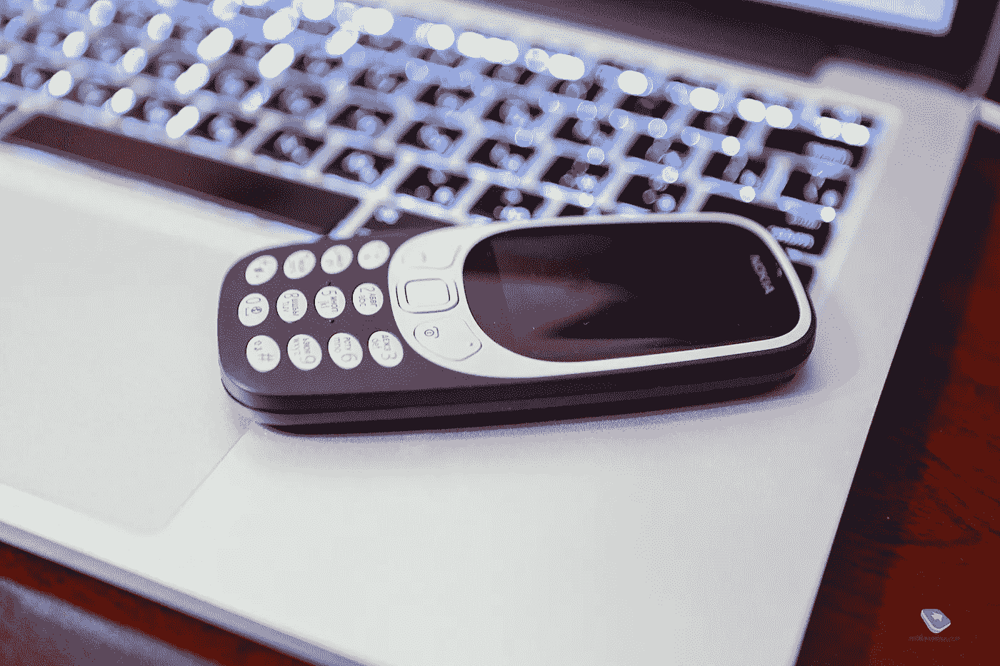

# 我降级为一个哑巴

> 原文：<https://medium.com/codex/i-downgraded-to-a-dumbphone-bcc9dfb9a72b?source=collection_archive---------9----------------------->

几个月前，当我打碎我的智能手机时，我得到了一个傻瓜手机。

它的特色是 T9 短信，那种我们都讨厌的怀旧 8 位诺基亚铃声，还有蛇。

我为什么想要它？好吧。不是蛇。

# 1——我破产了。

# 2——因为智能手机很智能，我不喜欢我的手机比我还智能。没有人喜欢无所不知的人。

而是为了隐私。我认为谷歌没有必要再追踪我去了哪个公共浴室，我什么时候排卵，我用谁的手机玩。这只是令人毛骨悚然的，有一些可爱的和基本的关于保持自己的东西。

至少对我来说，电话并不是很不方便。到目前为止，对我的收件人来说比较麻烦，发图片和视频，便便表情符号的人，手机太笨了，收不到。当被提醒必须关闭 messenger 应用程序并打开 email 应用程序才能给我发送任何类型的多媒体时，他们总是有点不高兴。它很快清除了痞子。但是人们总是忘记，他们还是会给我发照片，看到那个愚蠢的回形针图标，无论我点击多少次都不会打开，我有点恼火。当我的男朋友知道这一点后，他开始说服我们的朋友给我发照片，因为敌对是他表达爱意的方式。

**最好的:**续航，再也不用群聊了。告别各种形式的多媒体信息。再也不用祝你节日快乐，也不用和不认识的人预订房间了。“不要再聊工作了……”努夫说。

我也喜欢手机的小巧。它非常适合我的手，放在口袋里更好。不用拖着巨石到处跑的感觉真好。

与数字技术脱节也伴随着某种叛逆。这是一种刺激，但却是秘密的，就像逃学或不穿胸罩一样。我承认我喜欢这样。它带着在悠闲的 90 年代长大的熟悉感觉，翘课去买冰淇淋，跳进河里。

**最糟糕的事情:**发短信。在被屏幕键盘惯坏之后，t9 发短信就像穿着一条狮子狗裙子，在任何一家现代夜总会里扭来扭去。就是尴尬，我现在的留言也是。我写“u”而不是“you”，写“ya”而不是“yeah”。我已经完全不用“the”这个词了。所有的信息都是用学步儿童的语言进行的，需要被破译:“你什么时候回家？”和“你在哪里？”我现在说“k”，没人喜欢。我给人打电话，而不是发短信，也没人喜欢这样。如今，每个人都有电话焦虑症，但我觉得诱导我的朋友近乎恐慌的发作来降低他们的敏感度是诚实的工作，所以我一直在做。

我还在学习如何用我的真相机拍照，我还在用我那残破的安卓做手机银行存款。到目前为止，它还没有困扰到我去改变。我用纸做计划，用笔记本做提醒——真的很迷人。当我想躲开某人时，我不会消失在手机里，而是带着一本书。事实上，我因此读了更多的书。

然而，我离不开的一个智能功能是 GPS。我一摔坏手机就出去给我的车买了一个，安装在仪表板上的那种，你知道，老式的那种。我需要全球定位系统，因为我的方向感很差。有些人可以左转然后右转，然后再右转然后左转，右转，左转，仍然知道苔藓长在巨石的哪一边，或者其他什么。不是我。我会在旋转木马上迷路。

我感觉更自由了吗？从我的手机，是的。我再次记起如何使用我的大脑，比如在我离开家之前检查商店和餐馆的营业时间。有一次，我不得不真的*走到*邮局门口去看时间。旧世界的东西。

当我离开家时，它无疑在现实世界和数字世界**之间设置了一个缓冲区。当然，这些都在等我回家的时候，不过现在更好的遏制了。我可以把它放在盒子里，只在我需要的时候才打开。我喜欢这样。距离。**

同时也很可笑。如果我离家时真的想远离手机，我可以把它留在身后，让语音信箱完成它的工作。这不违法。这是一个选择。可能是下一个。

订阅我的时事通讯，看看我能坚持多久，以及其他可能有点用处，或者至少有趣的随机博客帖子…