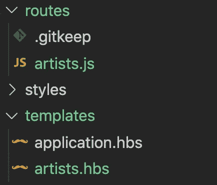
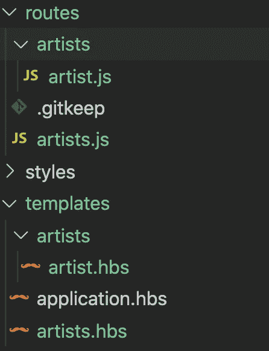
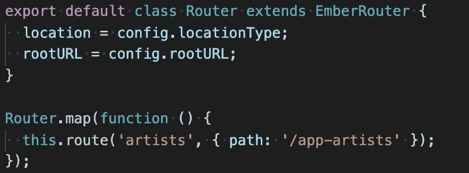
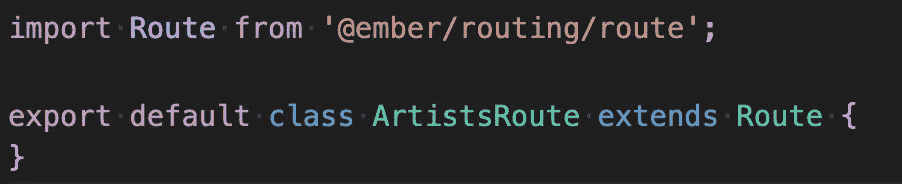
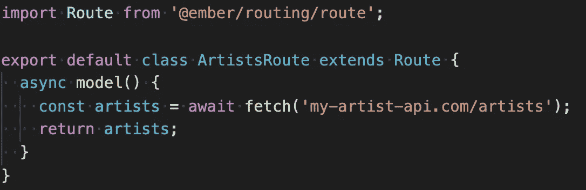
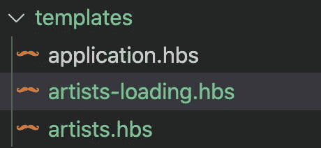
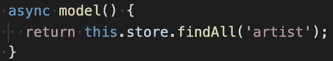

# 一.❤·恩伯网站-路线和恩伯数据

> 原文：<https://medium.com/codex/i-ember-js-routes-ember-data-b6baf4308803?source=collection_archive---------5----------------------->

## [法典](http://medium.com/codex)

## 了解为什么在 Ember 中处理数据是一股新鲜空气。

由[Gustavo espin dola](https://unsplash.com/@basico?utm_source=unsplash&utm_medium=referral&utm_content=creditCopyText)在 [Unsplash](https://unsplash.com/s/photos/air?utm_source=unsplash&utm_medium=referral&utm_content=creditCopyText) 上拍摄的照片

我❤ Ember.js 是一个系列，在这里我谈论如何使用 Ember 以及为什么你应该在你的项目中使用它。我使用 Ember 已经有几年了，它已经成为我最喜欢的创建强大的 web 应用程序的工具，而且非常简单！

欢迎回到 I ❤烬。在这篇文章中，我们将开始仔细看看路线。在 Ember 中，路由是至关重要的，我们将看到路由心智模型如何使推理出如何实现特性变得超级容易。本文还介绍了 Ember 的内置数据管理层 Ember Data。如果你曾经为 React 使用过 Redux，我打赌你会感激 Ember Data 提供的便利。

# 上一次，在 I ❤烬. js

让我们回顾一下 Ember 中的路线是如何工作的:

*   一个用户访问你应用中的一个 URL，比如`/artists`。
*   Ember 找到相关的`artists`路由文件，并调用它的函数来获取任何需要的数据。
*   Ember 用获取的数据和其他属性设置`artists`控制器。
*   呈现属于`artists`路线文件的模板文件，并可访问其控制器属性和功能。

# 语义文件

现在想象你正在做这个项目，你需要改变为`artists`路线渲染的模板。很容易确定你需要编辑哪个文件，只要看看 Ember 为你设置的文件夹结构:

类似地，artists 控制器应该在 controllers 文件夹中！

后面如果想介绍一个`artists/artist`路由，就用 ember-cli 这么简单:

`ember generate route artists/artist`

并创建适当的文件:

现在有子文件夹了！

太棒了！应用程序的结构从文件夹结构中显而易见，这意味着我们需要考虑的事情少了一件。

项目中还有一个名为`router.js`的文件。当您使用 ember-cli 创建新路由时，该文件会自动更新。您也可以手动编辑它，以防需要进行更改。例如，如果`artists`路由实际上应该有 URL `/app-artists`，这是一个简单的更改:

这是 router.js 文件

现在，我们可以看到 Ember 对语义的重视程度。优先考虑语义意味着开发人员一眼就能理解代码是如何工作的。变量、函数和文件夹的名字都很合理。我**喜欢**这个 Ember 值，在编码时尽可能保持语义已经成为我自己的习惯。

# 路线文件

Ember 开发人员致力于使用现代技术，因此路由文件是一个 ES6 类:

路由的工作是获取数据。为此，我们只需在 route 的`model()`函数中编写数据获取逻辑。由`model`函数返回的是提供给相关控制器/模板的数据。如果你需要做一些异步获取，你甚至可以让`model`函数成为一个异步函数(Ember 将在继续之前等待获取完成):

`model`函数是所谓的**钩子**，route 类可以访问其他一些函数。例如，假设一旦您提取了所有艺术家的数据，您想要立即重定向到第一位艺术家的路线。您只需将`afterModel`钩子添加到您的 route 类中，Ember 将在获取数据之后、呈现模板之前运行它。

如果您使用过 React 和 React-Router，那么想象一下，与使用 Ember 相比，您必须在 React 项目中实现重定向功能。这不是很爽吗？

# 装货

另一个简单的例子是当你需要实现一个加载状态时。如果您的`model`、`afterModel`或任何其他数据获取挂钩很慢，您将希望显示某种加载指示器。在 Ember 中，只需在正确的位置添加一个加载模板文件即可。Ember 将看到它，并在加载路线时显示加载文件:

拜托，太酷了！

# 余烬数据

当你创建一个新的 Ember 项目时，你还会得到这个叫做 Ember Data 的神奇工具。Ember Data 提供了各种各样的功能，使管理应用程序的数据变得轻而易举。我们可以在另一篇文章中做更深入的探讨，但是作为一个例子，让我们继续处理我们的艺术家数据。

Ember Data 允许我们定义和配置我们的数据模型，因此 CRUD 操作非常简单。例如，如果我们有一个`models/artist.js`文件，那么我们可以获取路由文件中所有艺术家的列表，如下所示:

什么？！

在幕后，Ember Data 从 artists API 获取数据，并将数据反序列化为艺术家模型！不仅如此，它还将获取的数据保存在一个名为 **store** 的服务中。store 就像 Redux 或 MobX，它跟踪实体，这样我们就可以跨应用程序使用数据。

# 哇，踩刹车！

任何与 Redux 合作过的人在这里都可能会犹豫。不要误会，Redux 很梦幻，极其强大。但是，唉，我已经厌倦了编写动作创建者、动作名称、减少者和中间件，以及设计如何组织商店…

抱歉，我真的很感激商店有这种理智的默认。Ember Data 确实让事情变得如此简单。数据管理不会拖你的后腿，你可以开始使用它。

# 你加入吗？

我已经使用 React 年多了，尽管工具已经有了很大的进步，但是为了获得您需要的功能，您还需要编写很多样板文件。希望这篇文章至少让你对和 Ember 一起玩有点兴奋。在为这些文章做研究时，我只是越来越想使用 Ember，所以我必须尽快开始自己的新项目！

路线和余烬数据太强大了！尝试一个小的 Ember 项目，如果您有任何问题，请随时联系我或社区。如果你喜欢这个系列，并且想在未来看到一篇具体的文章，一定要在评论中告诉我！

*此页面/产品/etc 与 Ember 项目无关。Ember 是蒂尔德公司的商标*