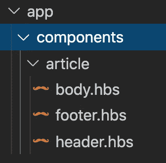

# 一.❤·恩伯. js——模板

> 原文：<https://medium.com/codex/i-ember-js-templates-bf01190ce4c?source=collection_archive---------9----------------------->

## [法典](http://medium.com/codex)

## 在 Ember 中单独编写表示代码是非常强大的，原因如下。


保罗·斯科鲁普斯卡斯在 [Unsplash](https://unsplash.com/s/photos/lens?utm_source=unsplash&utm_medium=referral&utm_content=creditCopyText) 上的照片

我❤ Ember.js 是一个系列，在这里我谈论如何使用 Ember 以及为什么你应该在你的项目中使用它。我使用 Ember 已经有几年了，它已经成为我最喜欢的创建强大的 web 应用程序的工具，而且非常简单！

当我在做软件的时候，我很容易因为脑子里一次装了太多东西而不知所措。这是因为构建前端应用程序是一项复杂的任务！突然，开发人员需要编写代码来呈现可视元素，将这些元素绑定到数据，并使其交互以执行业务/应用程序逻辑。我使用❤ Ember.js 的一个原因是因为它将你的表示代码分成模板文件，这样当你使用模板时，你就可以专注于应用程序的表示方面。此外，Handlebars 允许我们引入逻辑，而不影响代码的语义。

# 快速回顾

模板可以访问来自后台类(如控制器)的数据。该类中定义的任何属性都可以在相应的模板中呈现。给定一个控制器:

```
class MyController extends Controller {
  favoriteAnimal = 'dog'
}
```

我们可以在模板中使用属性，如下所示:

```
<div>
  <p>My favorite animal: {{this.favoriteAnimal}}</p>
</div>
```

我们还没有深入讨论组件，但是如果这是一个组件的模板，唯一的区别就是如果`favoriteAnimal`被传入，它将被一个`@`符号访问:

```
<div>
  <p>My favorite animal: {{@favoriteAnimal}}</p>
</div>
```

很简单，对吧？这很像 React 中的 JSX，除了我们不能在那些弯弯曲曲的括号中写 Javascript，我们必须使用已经定义的变量。

# 助手

尽管我们不能在模板中直接编写 Javascript，但是我们可以访问**助手**。帮助器允许我们以模板代码保持不变的方式在模板中实现逻辑

*   **整齐的**，
*   **表象**，以及
*   **语义**

想象一下，我们必须迭代一个`users`数组，每个用户都有一个流行语，如果他们很有名，我们希望有条件地呈现出来(我知道，这是一个奇怪的场景)。下面是我们如何在 React 渲染函数中实现它:

```
render() {
  const { users } = this.props;return (
    <div>
      {
        users.map(user => {
          if (user.isFamous) {
            return <h1>{user.catchPhrase}</h1>;
          }

          return <p>Hello!</p>;
        })
      }
    </div>
  );
}
```

这还不算太糟！它有适当的间距，并且很容易理解这个函数将呈现什么。现在让我们将它与我们在 Ember 中编写的模板进行比较:

```
<div>
  {{#each @users as |user|}}{{#if user.isFamous}}
      <h1>{{user.catchPhrase}}</h1>
    {{else}}
      <p>Hello!</p>
    {{/if}}{{/each}}
</div>
```

现在我可能有偏见，但我认为 Ember 模板代码更容易理解(也更容易编写)！原因如下:

*   帮助器将逻辑压缩成简单的操作符，如`each`，所以我们不需要弄乱代码来执行常见的操作，如迭代数组。
*   模板中唯一的逻辑与我们将呈现给用户的内容有关。这里没有任何关于我们如何获得`@users`属性的内容。这让我们保持专注。
*   模板文件更容易阅读。当您必须在同一个空间内解析 HTML 和 Javascript 算法之间切换时，肯定会发生小的上下文切换。车把上使用的语言是自然的，让我们保持一种表象的心态。

即使手柄限制了我们可以实现的逻辑，我们仍然可以做很多很酷的事情。


照片由 [Josh Rakower](https://unsplash.com/@joshrako?utm_source=unsplash&utm_medium=referral&utm_content=creditCopyText) 在 [Unsplash](https://unsplash.com/s/photos/loop?utm_source=unsplash&utm_medium=referral&utm_content=creditCopyText) 上拍摄

# 循环&循环

我们已经看到了如何迭代数组，但是`each`助手可以为我们做更多的事情！也许您需要呈现每个条目的索引:

```
<div>
  <h1>Guest List</h1>{{#each @guests as |guest index|}}
    <p>{{guest.fullName}} is number {{index}} in the list.</p>
  {{/each}}
</div>
```

或者，如果数组为空，您可能希望使用`else`呈现不同的内容:

```
<div>
  {{#each @blogPosts as |post|}}
    <p>{{post.content}}</p>
  {{else}}
    <h1>You haven't written anything yet!</h1>
  {{/each}}
</div>
```

# 做点什么！

您的模板很可能需要是交互式的，并且您可以轻松地调用组件或控制器中定义的函数:

```
<!-- template.hbs --><div>
  {{#each @artists as |artist|}}
    <button {{on 'click' this.likeArtist artist}}>Like</button>
  {{/each}}
</div>
```

其中`likeArtist`是在组件中定义的函数，如下所示:

```
// component.jsclass ArtistList extends Component {
  @action
  likeArtist(artist) {
    // perform the 'like' functionality
  }
}
```

# 自定义助手

你甚至可以写你自己的助手！您可以使用 ember-cli 创建一个新的助手，然后在模板中使用它。例如，跑步后

`ember g helper hotdog`

您将获得一个可以编辑的新帮助文件:

```
// helpers/hotdog.jsfunction hotdog(testString) {
  if (testString === 'hot dog') {
    return 'hot dog';
  } else {
    return 'not hot dog';
  }
}
```

然后你可以开始在模板中使用你的新助手了！

```
<div>
  {{#each testSubjects as |subject|}}
    <p>Subject Status: {{hotdog subject}}</p>
  {{/each}}
</div>
```

# 子组件

我留了一个超级酷的东西你可以留到最后做。假设您有一个 article 组件，您已经将它分解为子组件，用于呈现标题、正文和页脚等内容。您可以在模板中使用它们，如下所示:

```
<div>
  <ArticleHeader @title="Isn't Ember Great?" /> <ArticleBody @content="Yes it is." /> <ArticleFooter @author="Evan Martinez" />
</div>
```

这很好，但是 Ember 提供了一个简洁的捷径。如果重新排列文件，使子组件都在同一个文件夹中，如下所示:



然后 Ember 将让您以更直观的方式访问它们:

```
<div>
  <Article::Header @title="Isn't Ember Great?" /> <Article::Body @content="Yes it is." /> <Article::Footer @author="Evan Martinez" />
</div>
```

我觉得这太棒了。

# 模板就是方法

在 Ember 中实现应用程序的表示层非常容易。这篇文章代码有点多，但是希望手柄的简单性使它容易理解。此外，我们只是触及了 Ember 开箱即用的所有内置助手的表面！他们的共同点是语言自然、整洁，注重表达逻辑。


照片由[乔希·拉科尔](https://unsplash.com/@joshrako?utm_source=unsplash&utm_medium=referral&utm_content=creditCopyText)在 [Unsplash](https://unsplash.com/s/photos/cool?utm_source=unsplash&utm_medium=referral&utm_content=creditCopyText) 上拍摄

为了更进一步，这里有一个更复杂的组件示例:

```
<!-- the parent controller template --><div>
  <UserTable
    @users={{this.users}}
    @columns={{this.columns}}
  />
</div>
```

这里是`UserTable`组件:

```
<!-- component template, UserTable.hbs --><table>
  <tr>
    {{#each @columns as |column|}}
      <td>{{column.displayName}}</td>
    {{/each}}
  </tr>{{#each @users as |user|}}
    <tr>
      {{#each @columns as |column|}}
        <td>{{get user column.propertyKey}}</td>
      {{/each}}
    </tr>
  {{/each}}
</table>
```

如果组件名没有泄露，您能告诉我组件模板将呈现什么吗？这是一个真正的问题，对于任何刚接触 Ember 的开发者来说，所以请留下评论。如果还是胡言乱语也不要难受。下次见！

*此页面/产品/etc 与 Ember 项目无关。Ember 是 Tilde 公司的商标*